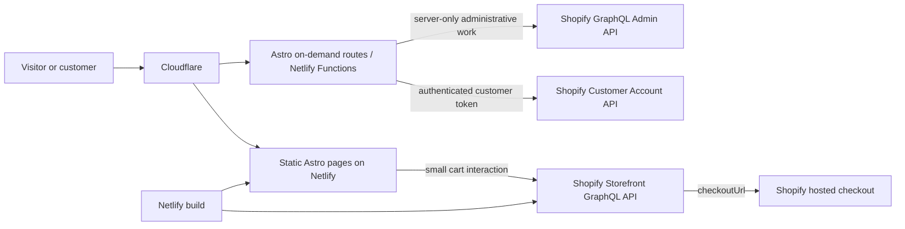

# EyEagle Shopify Headless Integration Roadmap

Architecture and implementation plan for publishing Shopify product listings on `eyeagle.ai`, keeping checkout secure, and restoring authenticated customer order details without sacrificing the site's static performance.

| Field | Value |
| --- | --- |
| Prepared for | EyEagle team |
| Version | 1.1 |
| Date | 20 July 2026 |
| Repository | `eyeagle-www` |
| Scope | Product catalog, product details, cart, checkout handoff, customer authentication, and order details |
| Status | Planning document; this document does not authorize production credentials or deployment |
| Related document | `reports/EyEagle-AI-LLM-Discoverability-Commerce-Roadmap.md` |

## Executive recommendation

Use a **hybrid headless Shopify architecture**:

- keep the blog, marketing pages, product listings, and product-detail pages as static Astro output;
- generate public product pages from the Shopify Storefront GraphQL API;
- use Shopify's Storefront Cart API for cart creation and updates;
- send the customer to Shopify's hosted checkout using the cart's `checkoutUrl`;
- use Shopify's Customer Account API and hosted authentication for private order history;
- render only account, authentication callback, and order-detail routes on demand through Netlify Functions;
- keep public pages cacheable through Cloudflare, while explicitly preventing all customer data from being cached.

This approach preserves the current site's performance and crawlability while adding commerce features in a supported way. It also limits the security-sensitive portion of the application to a small number of routes.

Do not convert the entire site to server rendering. Do not expose Shopify Admin credentials to the browser. Do not implement order lookup using only an order number, email address, phone number, or URL parameter.

## Desired customer experience

The intended public journey is:

1. A visitor discovers EyEagle through a marketing page, blog article, search engine, or AI assistant.
2. The visitor browses current products on `eyeagle.ai/products`.
3. The visitor opens a crawlable product page on `eyeagle.ai/products/[handle]`.
4. The visitor adds an available Shopify variant to a cart.
5. EyEagle obtains the Shopify cart's `checkoutUrl` and redirects the visitor to Shopify's secure hosted checkout.
6. After purchase, the customer can return to `eyeagle.ai/account` and authenticate through Shopify's hosted customer-account flow.
7. The authenticated customer can view only their own orders and fulfillment information on `eyeagle.ai/account/orders/[id]`.

The public product experience should feel like part of the main EyEagle website. Payment, fraud protection, taxes, discounts, delivery calculation, and final order creation should remain Shopify responsibilities.

## Goals

- Present Shopify-backed product listings and product details on `eyeagle.ai`.
- Preserve static HTML and a strong Lighthouse performance baseline for public routes.
- Maintain one authoritative source for product identity, price, currency, inventory, variants, and purchase status.
- Use stable product URLs that can be crawled, cited, shared, and submitted to merchant systems.
- Keep checkout on Shopify's supported hosted checkout.
- Provide secure Shopify authentication and customer-scoped order history.
- Keep private customer and order responses out of all public caches, analytics payloads, logs, and sitemaps.
- Make commerce metadata usable by search engines and AI assistants without maintaining a second catalog manually.
- Support Node.js 24, the current pnpm workflow, Astro, Netlify, and Cloudflare.

## Non-goals for the first release

- Rebuilding Shopify checkout or payment collection on `eyeagle.ai`.
- Storing card or payment details.
- Building a custom order-management system.
- Replacing Shopify Admin.
- Supporting arbitrary public lookup of an order.
- Publishing private customer or order content for search or LLM indexing.
- Building a large client-rendered single-page commerce application.
- Migrating to Hydrogen solely because Shopify provides it; the existing Astro site can use Shopify's framework-agnostic APIs.
- Adding subscriptions, complex bundles, discount authoring, or multi-warehouse operations unless the current Shopify catalog genuinely requires them.
- Reproducing Shopify product data manually in Astro content files.

## Current repository assessment

| Area | Current state | Required action |
| --- | --- | --- |
| Framework | Astro `7.1.1` with the Netlify adapter | Retain Astro and isolate on-demand rendering to private routes. |
| Rendering | `output: "static"`; `/join` already opts out of prerendering | Continue the mixed static/on-demand model. |
| Runtime | Node.js 24 and pnpm 11 are pinned | Use Node-compatible Shopify clients or a small typed `fetch` wrapper. |
| Hosting | Netlify adapter; no repository `netlify.toml` | Document runtime variables and route behavior; deployment settings currently live in Netlify. |
| Edge/CDN | `eyeagle.ai` is proxied through Cloudflare | Cache public catalog pages; bypass cache for authentication and account routes. |
| Product links | `src/data/shop.ts` stores the audit and Protection Kit Shopify URLs | Use this only during migration; replace duplicated constants with generated product data or one canonical route map. |
| Join integration | `/join` optionally uses `src/server/shopify.ts` | Migrate the helper away from legacy Admin REST before expanding its role. |
| Admin API helper | Server-only token, REST endpoints, default API version `2024-07` | Do not reuse for public catalog or orders; move genuine admin work to the current GraphQL Admin API. |
| Order details | Prototype is parked outside `src/pages` | Reuse presentation ideas only after authenticated Shopify data replaces all fixtures. |
| Prototype content | Parked components include a hard-coded name, phone number, address, plan name, and progress states | Treat all values as placeholder data; never publish them or map them to a customer without a verified source. |
| Catalog source | The public site does not fetch Shopify products | Add a typed Storefront API data layer. |
| Cart | No main-domain cart integration | Add Storefront Cart API support and Shopify checkout handoff. |
| Customer account | No authenticated Customer Account API integration | Add OAuth/OIDC discovery, session handling, and customer-scoped queries. |

### Current product URL baseline

These are the approved stable Shopify product destinations at the time of this plan:

- Bathroom safety audit: <https://shop.eyeagle.ai/products/bathroom-audit>
- Protection Kit: <https://shop.eyeagle.ai/products/eyeagle-bathroom-safety-package-audit-prevention-kit-installation-app-membership>

Preserve these as migration fallbacks until the main-domain catalog, cart, canonical strategy, and redirects are fully validated. Do not restore a session-specific Shopify checkout URL as a permanent CTA or canonical destination.

## Shopify Admin setup runbook

This section describes the Shopify-side setup required before repository implementation. Menu wording can change, so compare each step with Shopify's current official documentation before making production changes.

### There is not one universal “Shopify API key”

Shopify issues different credentials for different responsibilities. Do not substitute one for another.

| Credential | Created or viewed in | Used for | Browser-visible? |
| --- | --- | --- | --- |
| Permanent `*.myshopify.com` store domain | Shopify Admin store details | Stable API hostname and discovery | Yes |
| Storefront public access token | Headless channel → storefront → Storefront API | Public browser Storefront API calls when token-based access is needed | Yes, but least privilege |
| Storefront private access token | Headless channel → storefront → Storefront API | Build-time or server-side Storefront API calls | No |
| Customer Account API Client ID | Headless channel → storefront → Customer Account API | Customer OAuth/OIDC authorization requests | It identifies the client; treat according to selected client type |
| Customer Account API Client Secret | Same Customer Account API settings for a confidential client | Server-side code/token exchange | No |
| Admin app Client ID and Client Secret | Shopify Dev Dashboard → app → Settings | Server-to-server Admin API token acquisition and webhook verification | No |
| Short-lived Admin API access token | Requested programmatically with app credentials for an eligible own-store integration | GraphQL Admin API | No; do not commit or expose |
| Webhook HMAC secret | The installed app's client secret | Verifying Shopify HTTPS webhook deliveries | No |
| Netlify build hook | Netlify project settings | Starting an approved catalog rebuild | No |

Use the Headless channel for public commerce and customer accounts. An Admin app is optional and should exist only for real administrative needs such as the current optional join/customer-marketing flow or product webhooks. Product rendering, carts, and customer order pages do not require a broad Admin API token.

### Step 0 — Assign the required staff access

The person doing the setup needs appropriate permissions in the Shopify store:

- access to apps and sales channels;
- permission to install/manage the Headless channel;
- permission to edit products, markets, inventory, shipping, payments, policies, and customer-account settings relevant to the setup;
- app-development permission if a Dev Dashboard Admin integration is required.

Do not perform setup using a shared store-owner password. Give each administrator an individual account with only the permissions required, and require two-factor authentication.

Record the responsible people before creating credentials:

| Responsibility | Named owner |
| --- | --- |
| Shopify store owner | To be assigned |
| Product and price approval | To be assigned |
| Shopify API credentials | To be assigned |
| Netlify environment variables | To be assigned |
| Cloudflare private-route rules | To be assigned |
| Checkout and payment testing | To be assigned |
| Credential rotation and incident response | To be assigned |

### Step 1 — Record the permanent store identity

Find the store's permanent Shopify domain, for example:

```text
your-store-name.myshopify.com
```

Use that `*.myshopify.com` hostname for Shopify API endpoints and discovery. Do not use `shop.eyeagle.ai` as the API hostname merely because it is the customer-facing custom domain; the custom domain can change while the Shopify domain remains stable.

Record these non-secret values in the implementation issue or approved configuration record:

- permanent `myshopify.com` domain;
- production storefront name;
- development storefront name, if separate;
- supported market and country;
- currency;
- approved Shopify API versions;
- Protection Kit product handle and variant ID after verification.

Do not paste access tokens or client secrets into a ticket, Markdown report, chat, screenshot, or pull request.

### Step 2 — Prepare the single package product

From Shopify Admin:

1. Go to **Products**.
2. Open the Protection Kit/package product.
3. Confirm its status is **Active** only if it should be purchasable.
4. Confirm the exact customer-facing title.
5. Review the description and remove unsupported claims.
6. Confirm the price and INR currency behavior.
7. Use a compare-at price only when it represents a genuine, policy-compliant comparison.
8. Confirm the SKU and barcode/GTIN only if those identifiers genuinely exist.
9. Confirm whether the item is physical and requires shipping.
10. Add the actual package weight and customs information if relevant.
11. Decide whether Shopify should track quantity.
12. If quantity is tracked, set the correct location quantity and decide whether selling after stock reaches zero is allowed.
13. Confirm the package's variant model. If there is only one package, avoid creating artificial options.
14. Review every image, image alt text, and product-media order.
15. Review the search-engine listing title, description, and handle.
16. Save the product.

For the current approved URL, the handle is expected to remain:

```text
eyeagle-bathroom-safety-package-audit-prevention-kit-installation-app-membership
```

Changing the handle changes the main-domain target route proposed in this roadmap. Treat a handle change as a URL migration requiring redirects, canonical updates, feed updates, and link validation.

For inventory:

- if physical packages are genuinely limited, enable tracking and stop selling at zero;
- if the package is assembled on demand, inventory can remain untracked after ecommerce approval;
- if installation capacity is limited, do not pretend physical inventory represents appointment capacity—use a separate service-area or scheduling control.

Review the Bathroom Safety Audit independently. Its price, availability, and booking semantics must be resolved before publishing it as a purchasable product.

### Step 3 — Install the Headless sales channel

The Headless channel is the recommended control surface for an Astro storefront using Shopify's Storefront and Customer Account APIs.[11][12]

1. In Shopify Admin, open the Shopify App Store.
2. Find Shopify's **Headless** sales channel.
3. Install it on the store.
4. Pin the Headless channel in the Shopify Admin navigation if useful.
5. Under **Sales channels**, open **Headless**.
6. Click **Add storefront** or **Create storefront**.
7. Give it an unambiguous name, such as `EyEagle Web – Production`.
8. Create a separate storefront for development only if the team needs isolated credentials and attribution.

Each Headless storefront receives its own Storefront API credentials, but Shopify notes that Headless API permissions can be shared across the channel's storefronts. Review a permission change as potentially affecting more than one storefront.[11][12]

Do not delete a Headless storefront casually. Deleting it invalidates its API credentials.

### Step 4 — Publish the package to the Headless channel

Creating a Headless storefront does not make every draft or excluded product available automatically. Publish the approved package to the sales channel.[13]

1. In Shopify Admin, go to **Products**.
2. Open the package product.
3. In **Publishing**, click the edit/adjust control.
4. Select the **Headless** channel/storefront where appropriate.
5. Confirm any market/catalog assignment required by the store's Markets configuration.
6. Click **Done** and save.
7. Verify the intended variant is included and available to the selected market.

If the product does not appear through the Storefront API, check all of these before changing code:

- product status is Active;
- product is published to Headless;
- product is included in the market/catalog used by the Headless channel;
- the requested country context is supported;
- the variant is published and available;
- the API query uses the correct handle and store domain.

For a single-product MVP, publish only the approved package and the audit service if it has a valid purchase/booking state. Do not create a large catalog abstraction solely because Shopify supports collections.

### Step 5 — Configure markets, shipping, taxes, policies, and payments

Before testing checkout, review the commerce settings that Shopify Checkout will enforce.

#### Markets and currency

1. Go to **Settings → Markets**.
2. Confirm India or the intended market is active.
3. Confirm INR pricing and the product's inclusion in the applicable catalog.
4. Confirm whether orders outside the supported region should be blocked.
5. If regional price overrides exist, test the same country context used by the Storefront API cart.

#### Shipping and delivery

1. Go to **Settings → Shipping and delivery**.
2. Confirm the package belongs to the correct shipping profile.
3. Confirm supported delivery zones and rates.
4. Confirm package weight and any free-shipping threshold.
5. Test at least one supported and one unsupported postcode/address.

Installation coverage is not automatically the same as shipping coverage. If installation is available only in selected areas, add a verified serviceability check before checkout or clearly explain post-order qualification and cancellation terms.

#### Taxes and duties

1. Go to **Settings → Taxes and duties**.
2. Confirm the business's approved tax setup.
3. Confirm whether displayed prices include applicable tax.
4. Verify the test checkout and order record with the finance owner.

This document does not determine tax treatment. Obtain appropriate finance or tax review.

#### Store policies

1. Go to **Settings → Policies**.
2. Review refund/return, privacy, terms, shipping, cancellation, and contact information.
3. Ensure policies accurately cover physical products, audits, installation, app access, and membership if those are included.
4. Ensure the equivalent main-site policy pages remain consistent.

#### Payments

1. Go to **Settings → Payments**.
2. Confirm the active payment provider and accepted methods.
3. If Razorpay is used through Shopify, configure it as an approved third-party provider available to this store and test it within Shopify Checkout.
4. Confirm test and live modes are not confused.
5. Confirm payment capture behavior.
6. Run an end-to-end low-risk production verification only after approval.

Shopify can charge third-party transaction fees in addition to a gateway's processing fees, so the ecommerce owner should confirm the actual plan and provider costs before launch.[17]

### Step 6 — Configure Storefront API access and obtain tokens

From Shopify Admin:

1. Go to **Sales channels → Headless**.
2. Select `EyEagle Web – Production`.
3. Under **Manage API access**, choose **Manage** for **Storefront API**.
4. Review **Permissions** and click the edit control.
5. Enable only the data the implementation needs.
6. Save.
7. Copy the public token only if browser-side token-based Storefront calls will be used.
8. Copy the private token for build-time/server-side access.
9. Put both values directly into the approved secret manager or Netlify environment settings.
10. Record only a non-secret fingerprint, creation date, owner, and rotation date.

Core product, collection, search, and cart operations can use Shopify's tokenless Storefront access. Tokens are required for additional features such as product tags, metafields/metaobjects, menus, and customer-related Storefront access.[1][11]

For EyEagle's first release:

- use the private Storefront token only during the Netlify build if token-based fields are required;
- use tokenless cart access or the least-privilege public token in the browser;
- do not enable customer access through the older Storefront customer model when the Customer Account API is being used;
- do not enable product tags, menus, metaobjects, or metafields unless the page query actually needs them.

If a product metafield is required, review both the Headless Storefront permission and the metafield definition's Storefront access. A permission alone does not make private custom data safe or appropriate to publish.

### Step 7 — Verify Storefront credentials before changing the website

Use the permanent Shopify domain and a supported pinned API version. As of this document update, Shopify documentation uses `2026-07` examples; verify the current stable version immediately before implementation.

Private server/build request pattern:

```http
POST https://YOUR_STORE.myshopify.com/api/2026-07/graphql.json
Content-Type: application/json
Shopify-Storefront-Private-Token: <server-only private token>
```

Public token request pattern, only if used:

```http
POST https://YOUR_STORE.myshopify.com/api/2026-07/graphql.json
Content-Type: application/json
X-Shopify-Storefront-Access-Token: <public Storefront token>
```

Run a minimal product-by-handle query from a secure local environment:

```graphql
query ProductForVerification($handle: String!) {
  product(handle: $handle) {
    id
    handle
    title
    availableForSale
    featuredImage {
      url
      altText
      width
      height
    }
    variants(first: 10) {
      nodes {
        id
        title
        availableForSale
        price {
          amount
          currencyCode
        }
      }
    }
  }
}
```

Expected checks:

- response status is `200`;
- GraphQL `errors` is absent;
- product is not `null`;
- handle exactly matches the approved handle;
- title, price, currency, availability, variant, and image match Shopify Admin;
- the query works during a Netlify preview build without printing the token.

A GraphQL request can return HTTP `200` with application-level errors, so always validate both the HTTP response and the `errors`/`data` payload.

### Step 8 — Activate Shopify customer accounts

Customer Account API order history depends on Shopify's current customer-account model.

1. In Shopify Admin, go to **Settings → Customer accounts**.
2. Review the current account version.
3. Select **Customer accounts**, not legacy customer accounts, when the business is ready to use the passwordless hosted model.
4. Configure whether Shopify theme login links should be shown. The main Astro site will have its own account link, so avoid confusing duplicate navigation.
5. Confirm the customer-account URL/domain.
6. Save or switch only after reviewing effects on existing customers and installed apps.
7. Test login using a controlled customer email.

Shopify customer accounts use a passwordless verification flow and can show customers their orders. Existing theme customizations for legacy accounts do not automatically carry over.[14]

Do not require every customer to authenticate before checkout unless the business explicitly wants that restriction. Optional post-purchase account access is sufficient for the initial EyEagle flow.

### Step 9 — Configure Customer Account API credentials and URLs

From Shopify Admin:

1. Go to **Sales channels → Headless**.
2. Select `EyEagle Web – Production`.
3. Under **Manage API access**, choose **Manage** for **Customer Account API**.
4. Review the available client types.
5. Prefer a **Confidential** client for the Astro/Netlify implementation because the server runtime can protect a client secret.
6. Review Customer Account API permissions and enable only the customer/order access required.
7. Under **Application setup**, add the approved callback URI.
8. Add the approved logout URI.
9. Add JavaScript origins only if the implementation deliberately uses a public browser client; they might not appear for a confidential client.
10. Save.
11. Copy the Client ID.
12. Copy and securely store the Client Secret if Shopify issues one for the selected client type.

Recommended production URLs for the route plan in this document:

```text
Callback URI: https://eyeagle.ai/auth/shopify/callback
Logout URI:   https://eyeagle.ai/
```

For development, use a stable HTTPS development or tunnel hostname and add its exact callback/logout values. Avoid whitelisting every ephemeral Netlify preview URL. A fixed development domain or deploy alias is easier to secure and maintain.

The implementation should discover the authorization and Customer Account API endpoints from the Shopify storefront domain instead of hard-coding them:

```text
https://YOUR_STORE.myshopify.com/.well-known/openid-configuration
https://YOUR_STORE.myshopify.com/.well-known/customer-account-api
```

The authorization request uses Shopify's current documented scopes, including:

```text
openid email customer-account-api:full
```

The final scope and parameters must be checked against the pinned Customer Account API version. Use state, nonce, and PKCE as required by the selected client flow. Client type, callback URI, and the application's actual token-exchange behavior must agree exactly.[3][4]

### Step 10 — Add credentials to Netlify

In the Netlify project for `eyeagle.ai`:

1. Open the site's environment-variable settings.
2. Add variables to the correct production context.
3. Add separate safe values for branch/preview contexts only when those deployments are authorized to call Shopify.
4. Do not expose production customer-account or Admin credentials to arbitrary pull-request previews.
5. Trigger a clean deploy after saving build-time Storefront values.
6. Verify logs redact values.

Minimum initial variables for static package rendering:

```text
SHOPIFY_STORE_DOMAIN=YOUR_STORE.myshopify.com
SHOPIFY_STOREFRONT_API_VERSION=2026-07
SHOPIFY_STOREFRONT_PRIVATE_TOKEN=<secret, only if required>
```

Optional browser cart variables:

```text
PUBLIC_SHOPIFY_STORE_DOMAIN=YOUR_STORE.myshopify.com
PUBLIC_SHOPIFY_STOREFRONT_API_VERSION=2026-07
PUBLIC_SHOPIFY_STOREFRONT_TOKEN=<public Storefront token, only if required>
```

Customer-account variables, added only when account work begins:

```text
SHOPIFY_CUSTOMER_ACCOUNT_CLIENT_ID=<client ID>
SHOPIFY_CUSTOMER_ACCOUNT_CLIENT_SECRET=<server-only secret for confidential client>
SHOPIFY_CUSTOMER_ACCOUNT_REDIRECT_URI=https://eyeagle.ai/auth/shopify/callback
SHOPIFY_SESSION_SECRET=<independently generated server-only secret>
```

Do not invent `SHOPIFY_SESSION_SECRET` in Shopify Admin. Generate it using an approved cryptographically secure secret process and store it only in Netlify's protected environment.

### Step 11 — Create an Admin API app only if required

The public product and cart integration does not need an Admin API app. Create or migrate one only if EyEagle retains the Shopify join/customer-marketing update or needs product/inventory webhooks.

As of July 2026, Shopify says new custom apps can no longer be created in the old Shopify Admin custom-app screen. Existing Admin-created apps can continue working; new API-only integrations should use the Shopify Dev Dashboard or Shopify CLI.[15][16]

For an EyEagle-owned, API-only integration:

1. From Shopify Admin, select the store/organization menu and open **Dev Dashboard**, or go to `https://dev.shopify.com/dashboard`.
2. Open **Apps**.
3. Click **Create app**.
4. Choose **Start from Dev Dashboard**.
5. Name it clearly, for example `EyEagle Web Admin Integration`.
6. Open **Versions** and create a version.
7. For an API-only app without an embedded Admin UI, use Shopify's documented default app URL or the reviewed application URL.
8. Select the current stable Webhooks API version.
9. Request only required Admin API scopes.
10. Release the version.
11. From the app Home page, choose **Install app**.
12. Select the EyEagle production store and approve the requested scopes.
13. Open **Settings**.
14. Copy the Client ID and Client Secret into the approved secret manager/Netlify variables.

For the existing optional join flow, the likely minimum Admin scopes are:

```text
read_customers
write_customers
```

Confirm the exact GraphQL customer marketing-consent operations and required protected-customer-data access before releasing the app. Do not request `read_orders`, `write_orders`, `read_products`, or inventory scopes merely because the application also has a storefront. Customer order history should use the customer-scoped Customer Account API.

For an app created by the same organization and installed on a store that the organization owns, Shopify's current client-credentials flow uses the Dev Dashboard Client ID and Client Secret to request a short-lived Admin access token:[16]

```http
POST https://YOUR_STORE.myshopify.com/admin/oauth/access_token
Content-Type: application/x-www-form-urlencoded

grant_type=client_credentials&client_id=<id>&client_secret=<secret>
```

The application must refresh this token according to Shopify's documented expiry instead of putting a permanent new Admin access token in Netlify. Keep the client credentials server-only.

If the current `SHOPIFY_ADMIN_ACCESS_TOKEN` belongs to an older Admin-created custom app:

- inventory the app name, owner, scopes, install state, and rotation limitations;
- keep it operational only until the GraphQL migration is verified;
- do not expand its scopes casually;
- migrate `src/server/shopify.ts` from REST to GraphQL;
- remove the obsolete `2024-07` fallback;
- revoke/uninstall the legacy app after successful cutover and rollback-window approval.

### Step 12 — Configure product webhooks only when needed

For one infrequently changed package, a manual rebuild after an approved Shopify product edit is the recommended first release. This avoids unnecessary app scope, webhook complexity, and Netlify build consumption.

If automated catalog freshness becomes necessary:

1. Use the Dev Dashboard Admin app or a Shopify CLI-configured app.
2. Add only the scopes required by the selected webhook topics.
3. Configure a current Webhooks API version.
4. Subscribe to the minimum topics, potentially `products/update`, `products/delete`, and `inventory_levels/update` if inventory affects sale availability.
5. Deliver to a stable HTTPS endpoint such as `https://eyeagle.ai/api/shopify/webhooks/catalog`.
6. Release/deploy the app version or create shop-specific subscriptions through the GraphQL Admin API according to the chosen model.
7. Test delivery with Shopify's tools.

The endpoint must:

- read the unmodified raw request body;
- verify `X-Shopify-Hmac-SHA256` with the app Client Secret;
- reject invalid signatures;
- deduplicate using `X-Shopify-Webhook-Id`;
- return a success response quickly;
- coalesce bursts before triggering a Netlify build;
- never expose the private Netlify build-hook URL;
- avoid logging product/customer payloads unnecessarily.

Shopify recommends app-configured subscriptions for new apps and requires HMAC validation for HTTPS deliveries.[18][19]

Do not trigger a deploy directly from an unverified webhook body. Do not use Cloudflare caching on the webhook endpoint.

### Step 13 — Verify checkout, order attribution, and customer access

After the static page and cart are implemented:

1. Confirm the product page shows the exact Shopify title, variant, price, currency, availability, and image.
2. Create a Storefront cart with the package variant.
3. Confirm the cart cost matches the visible offer.
4. Redirect to the returned Shopify `checkoutUrl`.
5. Complete an approved test transaction.
6. Confirm the order appears in Shopify Admin.
7. Confirm the sales channel attribution is the named Headless storefront.
8. Confirm payment and capture status.
9. Confirm inventory changes as expected.
10. Confirm shipping, tax, notification, and policy links.
11. Log into customer accounts with the purchasing email.
12. Confirm the order is visible through Shopify's account experience.
13. After the Customer Account API implementation, confirm the same order is visible only to that authenticated customer on `eyeagle.ai`.
14. Cancel/refund a controlled test order and verify the intended customer-facing state.

Never treat a browser checkout success callback alone as proof of a completed order. Shopify owns the final order record.

### Step 14 — Credential rotation and revocation

For Headless Storefront and Customer Account credentials:

1. Open **Sales channels → Headless → storefront → Manage API access**.
2. Under the relevant API, choose credential rotation.
3. Generate the new credential.
4. Update Netlify production and approved preview contexts.
5. deploy and verify;
6. revoke the old credential only after all consumers have switched.

Shopify allows old and new Headless credentials to coexist during rotation until the old credential is revoked.[11][12]

For Dev Dashboard app credentials:

- use the Dev Dashboard's credential rotation process;
- account for the webhook HMAC transition window;
- update the application before revoking the old secret;
- re-test Admin token acquisition and webhooks;
- revoke access immediately if a secret is suspected compromised.

Maintain a credential register containing only metadata:

| Credential | Environment | Owner | Created | Last rotated | Next rotation | Stored in |
| --- | --- | --- | --- | --- | --- | --- |
| Storefront private token | Production | Assigned owner | Date | Date | Date | Netlify secret environment |
| Storefront public token | Production | Assigned owner | Date | Date | Date | Netlify public environment, if used |
| Customer Account client | Production | Assigned owner | Date | Date | Date | Netlify secret environment |
| Admin app credentials | Production | Assigned owner | Date | Date | Date | Netlify secret environment |
| Session secret | Production | Assigned owner | Date | Date | Date | Netlify secret environment |
| Webhook/build-hook secret | Production | Assigned owner | Date | Date | Date | Netlify secret environment |

### Shopify Admin setup completion checklist

- [ ] Required staff access and two-factor authentication are in place.
- [ ] The permanent `myshopify.com` domain is recorded without secrets.
- [ ] The package title, description, price, SKU, images, variant, shipping, and inventory state are approved.
- [ ] The package is Active and published to the intended Headless channel/market.
- [ ] India/INR market behavior is verified.
- [ ] Shipping, taxes, policies, payment provider, and capture behavior are approved.
- [ ] The Headless production storefront is created and clearly named.
- [ ] Storefront API permissions are least privilege.
- [ ] Public/private Storefront credentials are stored only in the correct Netlify contexts.
- [ ] A secure product-by-handle query returns the expected package.
- [ ] Shopify customer accounts are configured for the intended passwordless model.
- [ ] Customer Account API client type, callback URI, logout URI, permissions, and credentials are correct.
- [ ] No production customer/account secret is exposed to arbitrary preview deployments.
- [ ] An Admin API app exists only if a real administrative use case requires it.
- [ ] New Admin integration uses Dev Dashboard/GraphQL and short-lived token acquisition.
- [ ] Legacy Admin REST migration and revocation have an owner.
- [ ] Webhooks are either deliberately deferred or verified, deduplicated, rate-controlled, and monitored.
- [ ] A complete checkout produces a correctly attributed Shopify order.
- [ ] The purchasing customer can authenticate and see only their own order.
- [ ] Credential rotation and emergency revocation have been tested and documented.

## Proposed architecture



### Separation of responsibilities

| System | Owns |
| --- | --- |
| Shopify | Products, variants, prices, availability, markets, carts, checkout, customers, orders, fulfillment, refunds, and commerce policies configured in Shopify. |
| Astro repository | Public presentation, page layout, content, navigation, SEO/JSON-LD generation, and authenticated account presentation. |
| Netlify build | Fetching a public catalog snapshot and generating static routes. |
| Netlify Functions | OAuth callbacks, secure sessions, Customer Account API proxying, webhooks, and any server-only Admin API work. |
| Cloudflare | Public CDN caching, TLS/proxying, WAF, bot management, and explicit bypass for private routes. |
| Browser | Cart state identifier and limited interactive behavior; never Admin secrets or private Storefront tokens. |

## Recommended routes

| Route | Rendering | Authentication | Cache policy | Indexing |
| --- | --- | --- | --- | --- |
| `/products` | Static | None | Public Cloudflare cache | Index |
| `/products/[handle]` | Static | None | Public Cloudflare cache | Index |
| `/cart` | Static shell with small client interaction | None | Public shell; cart data private to browser | Usually `noindex` |
| `/account` | On demand | Required | `private, no-store` | `noindex` |
| `/account/orders` | On demand | Required | `private, no-store` | `noindex` |
| `/account/orders/[id]` | On demand | Required and customer-scoped | `private, no-store` | `noindex` |
| `/auth/shopify/login` | On demand | Starts authentication | `no-store` | `noindex` |
| `/auth/shopify/callback` | On demand | Completes authentication | `no-store` | `noindex` |
| `/auth/shopify/logout` | On demand | Ends session | `no-store` | `noindex` |
| `/api/shopify/cart` | Optional on-demand proxy | No customer account required | `no-store` | Not a page |
| `/api/shopify/webhooks/*` | On demand | Shopify HMAC validation | `no-store` | Not a page |

The actual route naming can follow project conventions. The important requirements are separation, authentication, cache controls, and sitemap exclusion.

## API selection

### Storefront GraphQL API

Use the Storefront API for:

- product and collection listing;
- product titles, handles, descriptions, variants, prices, images, and availability;
- selected public metafields after explicitly granting access;
- cart creation and updates;
- buyer identity and market context;
- obtaining the Shopify-hosted `checkoutUrl`.

Shopify supports tokenless access for essential products, collections, search, and cart operations. Public tokens are intended for browser contexts, and private Storefront tokens are intended for server contexts.[1][2]

Recommended EyEagle pattern:

- use a private Storefront token during the Netlify build when the required fields or metafields need it;
- use tokenless access or a least-privilege public token for unavoidable browser-side cart calls;
- never ship the private Storefront token to client JavaScript;
- request only the scopes the catalog actually needs.

### Customer Account API

Use the Customer Account API for:

- hosted passwordless customer authentication;
- customer profile information;
- customer-scoped order lists;
- order details;
- fulfillments and tracking data exposed by the API;
- refunds, returns, payment details, and metafields only when the product experience genuinely needs them.

The Customer Account API is Shopify's recommended cross-platform source for customer-scoped information. It uses OAuth 2.0/OIDC-style authentication and supports public clients with PKCE and confidential server-side clients.[3][4]

Do not build the new order experience on legacy Storefront customer access tokens unless Shopify's current documentation and the configured account model require it. Prefer the current Customer Account API and hosted authentication.

### GraphQL Admin API

Use the GraphQL Admin API only for server-side administrative operations that cannot be performed through the Storefront or Customer Account APIs. Possible examples include customer marketing-consent administration or webhook registration.

The existing `src/server/shopify.ts` uses Admin REST endpoints and defaults to `2024-07`. Shopify describes the REST Admin API as legacy, so this code should be migrated or removed before it becomes a shared integration foundation.[5]

Never use the Admin API for a browser-visible product listing. Never expose an Admin access token in a `PUBLIC_` environment variable, browser bundle, HTML page, log, error response, or repository file.

## Product catalog strategy

### Build-time catalog generation

For the current small catalog, fetch products during `pnpm build` and generate static pages. This provides:

- complete HTML on the first response;
- minimal client JavaScript;
- strong Cloudflare cacheability;
- predictable Lighthouse performance;
- crawlable product facts and structured data;
- low runtime function usage on the Netlify free plan.

Use Astro's `getStaticPaths()` for `/products/[handle]`. Fetch the list once, validate it, and pass a normalized product object to each page.

Illustrative data flow:

```text
Shopify Storefront API
        ↓
typed Shopify response
        ↓
normalizeShopifyProduct()
        ↓
EyEagle Product model
        ↓
Astro page + Product JSON-LD + product cards
```

Do not scatter raw Shopify GraphQL response shapes throughout components. The normalization layer should turn Shopify data into one internal representation.

### Suggested normalized product model

The exact types should be derived from the final GraphQL query.

```ts
type EyEagleProduct = {
  id: string;
  handle: string;
  title: string;
  description: string;
  descriptionHtml: string;
  canonicalUrl: string;
  availableForSale: boolean;
  featuredImage: ProductImage | null;
  images: ProductImage[];
  variants: ProductVariant[];
  seo: {
    title: string | null;
    description: string | null;
  };
  updatedAt: string;
};

type ProductVariant = {
  id: string;
  title: string;
  availableForSale: boolean;
  price: {
    amount: string;
    currencyCode: string;
  };
  compareAtPrice: {
    amount: string;
    currencyCode: string;
  } | null;
  selectedOptions: Array<{ name: string; value: string }>;
};

type ProductImage = {
  url: string;
  altText: string | null;
  width: number | null;
  height: number | null;
};
```

Do not use floating-point arithmetic for money. Preserve Shopify's decimal string and currency code, then format it with `Intl.NumberFormat` for display.

### Illustrative product query

This is a planning example, not a frozen API contract. Verify fields against the selected supported Shopify version before implementation.

```graphql
query ProductsForStaticBuild($first: Int!, $country: CountryCode)
@inContext(country: $country) {
  products(first: $first, sortKey: TITLE) {
    nodes {
      id
      handle
      title
      description
      descriptionHtml
      availableForSale
      updatedAt
      seo {
        title
        description
      }
      featuredImage {
        url
        altText
        width
        height
      }
      images(first: 10) {
        nodes {
          url
          altText
          width
          height
        }
      }
      variants(first: 50) {
        nodes {
          id
          title
          availableForSale
          price {
            amount
            currencyCode
          }
          compareAtPrice {
            amount
            currencyCode
          }
          selectedOptions {
            name
            value
          }
        }
      }
    }
  }
}
```

Set pagination limits according to the real catalog and implement cursor pagination before the catalog can exceed them. Failing the build is preferable to silently omitting products.

### Product freshness

Static generation means a product change is visible after the next successful deploy. For the current catalog, use one of these in order:

1. **Manual rebuild after catalog publication:** simplest and suitable while changes are infrequent.
2. **Validated Shopify webhook to a debounced build hook:** useful when product changes become routine.
3. **Short-lived dynamic offer fragment:** only if inventory changes frequently enough that build-trigger latency becomes unacceptable.

Do not trigger a full Netlify build for every low-level webhook event without rate control. A single Shopify update can emit several events, creating unnecessary free-plan usage. If webhooks are introduced, validate Shopify's HMAC, coalesce events, and document the maximum acceptable publishing delay.

The deploy must be atomic: if the Shopify fetch or validation fails, retain the previous working deploy rather than publishing incomplete product pages.

## Product image strategy

Product images should remain Shopify-hosted product assets unless there is a deliberate migration plan. For every image:

- use the source dimensions returned by Shopify;
- use useful merchant-provided alt text or add real alt text in Shopify Admin;
- request responsive widths and provide `srcset`/`sizes`;
- set explicit rendered width and height or aspect ratio;
- eagerly load only the primary above-the-fold product image;
- lazy-load below-the-fold gallery images;
- avoid downloading an original image that is much larger than its rendered size;
- keep image URLs stable enough for Cloudflare and browser caching;
- do not upload duplicate product images to an invented CDN destination.

If Astro's image pipeline proxies remote Shopify images through Netlify Image CDN, confirm allowed domains, transformation behavior, Cloudflare cache eligibility, and free-plan usage. For predictable origin usage, direct Shopify CDN responsive URLs may be preferable. Make that decision with a measured page-weight and cache test rather than by assumption.

## Cart and checkout strategy

### Use the Storefront Cart API

Shopify's older Checkout API has been retired in favor of the Storefront Cart API. Create and update a Cart, then redirect to its `checkoutUrl` when the customer chooses checkout.[6][7]

Minimum cart operations:

- `cartCreate`;
- `cartLinesAdd`;
- `cartLinesUpdate`;
- `cartLinesRemove`;
- `cartBuyerIdentityUpdate` when country or authenticated identity applies;
- cart query by ID;
- read `checkoutUrl` immediately before redirect.

### Cart state

Store only the opaque Shopify cart ID in a first-party cookie or browser storage. Do not treat local line-item state as authoritative. Re-query Shopify before rendering totals or starting checkout.

Recommended cookie characteristics when a server endpoint manages the cart:

```text
Secure; HttpOnly; SameSite=Lax; Path=/; Max-Age=<approved lifetime>
```

If JavaScript must read the cart ID directly, `HttpOnly` is not possible. Prefer a small same-origin cart endpoint if it provides a meaningful security or operational benefit. Do not add a function proxy solely for aesthetic architecture; tokenless Storefront cart operations are designed for public contexts.

### Checkout

- Redirect to the latest `checkoutUrl` returned by Shopify.
- Do not construct checkout URLs manually.
- Do not retain the previously supplied long checkout URL as a permanent CTA.
- Allow Shopify to handle payment, address validation, discounts, taxes, shipping, and the final order.
- Test return navigation and customer authentication after checkout.
- Preserve country/market context where the business supports it.

The first release can also use “View product” links to the existing Shopify pages while the main-domain cart is being built. Do not claim the headless cart is complete until variant, availability, currency, failure, and mobile behavior are tested.

## Canonical URL and migration strategy

Duplicating complete product pages across `eyeagle.ai` and `shop.eyeagle.ai` can create conflicting search, merchant, and AI signals. Decide which host owns the canonical public product page.

### Recommended target state

- `https://eyeagle.ai/products/[handle]` is the public canonical product page.
- Product listing and detail pages are generated from Shopify.
- Products are published to the Shopify Headless sales channel.
- Shopify creates the cart and hosted checkout.
- `shop.eyeagle.ai` is retained where Shopify needs a hosted commerce or account domain, but it does not compete with duplicate indexable product content.
- Merchant and AI-commerce feeds point to the canonical landing page that shows the same price and availability and provides a working purchase path.

### Safe transition

1. Keep current Shopify product pages and product URLs working.
2. Build the main-domain listing and detail pages.
3. Verify live price, availability, variants, policies, images, cart, structured data, analytics, and checkout.
4. Choose the final canonical host with ecommerce and SEO owners.
5. Update internal links, sitemaps, JSON-LD, merchant feeds, `llms.txt`, and the related LLM roadmap in one coordinated release.
6. Redirect or de-index superseded public product pages only after confirming Shopify channel and checkout behavior.
7. Monitor crawl errors, merchant disapprovals, referrals, and checkout conversion.

Do not place a canonical tag from one host to another merely to hide unresolved duplication. The selected canonical must be a complete and usable landing page.

## Customer authentication and order details

### Authentication model

Use Shopify's Customer Account API discovery endpoints rather than hard-coding authentication and API hosts. Shopify documents:

- OpenID configuration at `/.well-known/openid-configuration`;
- Customer Account API configuration at `/.well-known/customer-account-api`.[3]

The server-side flow should:

1. Discover the current authorization, token, logout, and Customer Account API endpoints.
2. Generate a cryptographically random `state` value.
3. Generate a PKCE verifier and challenge where required.
4. Store state, verifier, intended return URL, and a short expiration in a secure server-side session or encrypted, `HttpOnly` cookie.
5. Redirect the customer to Shopify's hosted authorization page.
6. Receive the authorization response on `/auth/shopify/callback`.
7. Verify state before exchanging the code.
8. Store tokens only in a protected server-side session or encrypted cookie appropriate to their size and sensitivity.
9. Refresh or reauthenticate according to Shopify's current token rules.
10. Redirect only to a validated same-origin destination.

Do not accept an arbitrary `returnTo` URL. Use a relative-path allowlist to prevent open redirects.

### Session security

- Use `Secure`, `HttpOnly`, and an appropriate `SameSite` policy.
- Rotate the session identifier at successful authentication.
- Use a server-only secret for encryption/signing.
- Set a short idle timeout and an appropriate absolute timeout.
- Clear the EyEagle session and use Shopify's discovered logout endpoint on logout.
- Do not write access tokens, authorization codes, email addresses, phone numbers, addresses, or complete order payloads to logs.
- Treat all OAuth error descriptions as untrusted input before displaying them.
- Add CSRF defenses to state-changing account actions.

### Order-list query

The order list should show only information returned for the authenticated customer. A typical list may include:

- Shopify order ID used internally by the API;
- customer-facing order number or name;
- processed date;
- financial and fulfillment status when available;
- total amount and currency;
- a representative line item;
- link to the authenticated order-detail route.

Use cursor pagination. Do not fetch an unbounded order history.

### Order-detail authorization

The Customer Account API token establishes the customer scope. The route must query the order through that customer-scoped API. It must never call the Admin API with a URL-provided ID and return the result without independently proving ownership.

Required behavior:

- unauthenticated request: redirect to login with a safe return path;
- expired session: clear session and reauthenticate;
- order not owned by customer: return a generic `404`, not evidence that another order exists;
- upstream Shopify failure: show a retry-safe support message without leaking payloads;
- successful response: send `Cache-Control: private, no-store` and `X-Robots-Tag: noindex, nofollow` as defense in depth.

### Restoring the parked prototype

The files under `parked/order-details` can guide presentation, but not data modeling or workflow truth.

Before any file returns to `src/pages`:

- remove hard-coded customer name, phone number, and address;
- replace “Gold Plan Kit” with the actual Shopify line-item title and image;
- replace the hard-coded delivery and installation timeline with states backed by real Shopify fulfillment data or a documented EyEagle operations system;
- verify whether “demo,” “walkthrough,” and “installation completed” exist in Shopify or another authorized source;
- preserve `noindex` and private cache headers;
- create empty, loading, partial-fulfillment, cancelled, refunded, and error states;
- ensure mobile expansion controls have accessible names and states;
- test with multiple orders, products, currencies, addresses, and fulfillments.

If installation progress is not stored in Shopify, do not infer it from ordinary fulfillment status. Define a separate authenticated operations data source before displaying it.

## Cloudflare and Netlify behavior

### Public routes

Public catalog HTML should be eligible for Cloudflare caching. Use a deploy-aware strategy that allows corrected price or availability to replace older HTML promptly.

Recommended principles:

- cache fingerprinted Astro assets and immutable images for a long duration;
- cache product HTML according to the accepted catalog publishing delay;
- purge or change deploy versions after a product build;
- include the complete market-relevant cache key if the page varies by country or currency;
- do not vary static pages by cookies unless unavoidable;
- measure `CF-Cache-Status`, origin requests, page weight, and HTML freshness after launch.

### Private routes

Create Cloudflare cache bypass rules for at least:

```text
/account*
/auth/*
/api/shopify/customer*
/api/shopify/webhooks/*
```

Also bypass when the authenticated session cookie is present if any otherwise-public route can include personal information.

Every private response should use:

```http
Cache-Control: private, no-store
Pragma: no-cache
X-Robots-Tag: noindex, nofollow
```

Do not use `Vary: Cookie` as a substitute for a private cache policy. Verify with repeated requests and different sessions that Cloudflare and Netlify never serve one customer's response to another.

### Netlify free-plan usage

This architecture minimizes runtime usage:

- public product requests are static and cached;
- Storefront catalog queries occur mainly during builds;
- cart calls go directly to Shopify or through a narrowly scoped endpoint;
- Netlify Functions are used primarily by authenticated customers;
- webhook-triggered builds are rate-controlled.

Track build minutes, function invocations, bandwidth, and image transformation usage after launch. Product-update frequency should determine whether webhook builds remain appropriate.

## Environment variables and secrets

Add placeholders to `.env.example` only after naming is finalized. A possible split is:

```text
# Public/build catalog identity
SHOPIFY_STORE_DOMAIN=
SHOPIFY_STOREFRONT_API_VERSION=
SHOPIFY_STOREFRONT_PRIVATE_TOKEN=

# Browser token only if required
PUBLIC_SHOPIFY_STORE_DOMAIN=
PUBLIC_SHOPIFY_STOREFRONT_API_VERSION=
PUBLIC_SHOPIFY_STOREFRONT_TOKEN=

# Customer Account API client
SHOPIFY_CUSTOMER_ACCOUNT_CLIENT_ID=
SHOPIFY_CUSTOMER_ACCOUNT_CLIENT_SECRET=
SHOPIFY_CUSTOMER_ACCOUNT_REDIRECT_URI=
SHOPIFY_SESSION_SECRET=

# Server-only administrative integration
SHOPIFY_ADMIN_API_VERSION=
SHOPIFY_ADMIN_CLIENT_ID=
SHOPIFY_ADMIN_CLIENT_SECRET=

# Legacy migration only; do not use for a new Dev Dashboard app
SHOPIFY_ADMIN_ACCESS_TOKEN=

# Webhooks/build publishing
NETLIFY_PRODUCT_BUILD_HOOK=
```

Important constraints:

- Anything prefixed with Astro's `PUBLIC_` convention is assumed visible to the browser.
- A public Storefront token is not an Admin token, but its scopes should still be minimized and rotated when needed.
- Private Storefront token, Customer Account client secret, Admin client credentials/access token, session secret, app webhook secret, and build hook are server-only.
- For a Dev Dashboard app owned by the same organization as the store, acquire the short-lived Admin API access token at runtime rather than treating it as permanent configuration.
- HTTPS webhook verification normally uses the installed Admin app's Client Secret; do not create an unrelated `SHOPIFY_WEBHOOK_SECRET` unless the selected Shopify integration explicitly issues a separate secret.
- Do not log environment-variable values.
- Configure production secrets in Netlify rather than committing them.
- Use separate development and production credentials or storefront clients.
- Document rotation and emergency revocation.

The repository currently has no `netlify.toml`; document required deployment settings in the README or add a reviewed configuration file if the team wants infrastructure behavior versioned.

## API version management

Shopify releases versioned APIs regularly and supports each stable version for a defined period. Pin an explicit supported stable version instead of using an unversioned “latest” alias.[3][8]

Recommended process:

1. Store the version in one server-side configuration module.
2. Validate that all clients use the same intended version unless an API requires a different release.
3. Subscribe to Shopify developer changelogs.
4. Review deprecation headers and logs monthly.
5. Schedule an upgrade at least one quarter before the selected version expires.
6. Run contract and checkout tests against the next version before changing production.
7. Remove the current `2024-07` fallback.

Do not silently fall back to an obsolete hard-coded version when an environment variable is missing. Production should fail fast with a clear configuration error.

## Repository implementation structure

One maintainable structure would be:

```text
src/
  components/
    commerce/
      ProductCard.astro
      ProductGallery.astro
      ProductPrice.astro
      VariantSelector.astro
      AddToCart.astro
      CartSummary.astro
    account/
      OrderCard.astro
      OrderDetails.astro
      FulfillmentTimeline.astro
  lib/
    shopify/
      config.ts
      storefront-client.ts
      customer-account-client.ts
      admin-client.ts
      queries/
      mutations/
      normalize-product.ts
      money.ts
      errors.ts
  pages/
    products/
      index.astro
      [handle].astro
    cart.astro
    account/
      index.astro
      orders/
        index.astro
        [id].astro
    auth/shopify/
      login.ts
      callback.ts
      logout.ts
    api/shopify/webhooks/
      products.ts
```

This is a suggested responsibility map, not a requirement to create every file. Keep Storefront, Customer Account, and Admin clients separate so a privileged client cannot be imported accidentally into public/browser code.

### Import boundaries

- `admin-client.ts` must only be importable from server/on-demand code.
- `customer-account-client.ts` must use authenticated server context.
- static product pages may import the build-time Storefront client.
- browser cart code may import only a clearly named public client or call a same-origin endpoint.
- shared types and money formatting must not import secrets.

Use Astro's server-only environment facilities where practical, and add lint or build guards if the project supports them.

## Product structured data and LLM alignment

Generate Product/Offer JSON-LD from the same normalized Shopify snapshot used for visible HTML. It should include only fields that are accurate and visible:

- product name;
- description;
- real images;
- brand;
- SKU, MPN, or GTIN only if assigned;
- INR price and currency;
- availability;
- canonical URL;
- item condition where appropriate;
- valid shipping or return information only when supported and visible.

Do not invent ratings, review counts, identifiers, inventory, service coverage, or offer expiry dates.

Sequence with the related LLM roadmap:

1. Continue blog crawlability, feeds, evidence, authorship, and content work now.
2. Build the Shopify-backed catalog and select canonical product URLs.
3. Generate public product structured data from Shopify.
4. Update sitemap, internal links, merchant feeds, `llms.txt`, and AI-commerce feeds after canonical routes are stable.
5. Keep account and order routes private and out of all LLM-facing resources.

Order-details integration is not a dependency for product discoverability. It can follow the catalog and cart release.

## Error handling

Create a small set of typed integration errors rather than exposing raw Shopify responses.

| Condition | Public behavior | Log behavior |
| --- | --- | --- |
| Build-time product API unavailable | Fail build; previous deploy remains live | Status, request ID, operation name; no token |
| Product missing | Static `404` or controlled redirect | Product handle and deploy context |
| Variant unavailable | Disable purchase and refresh product state | Product/variant ID and API request ID |
| Cart expired or missing | Create a new cart with user notice | Reason and anonymous correlation ID |
| Shopify checkout unavailable | Preserve cart and show retry/support action | Upstream status and correlation ID |
| Authentication denied | Return to account page with safe message | OAuth error code without sensitive query data |
| Session expired | Clear session and redirect to login | Anonymous session event |
| Order not owned by customer | Generic `404` | Security event without order details |
| Customer API unavailable | Retry-safe account error | Operation, status, request ID; no customer payload |

User-facing messages should not disclose token status, Shopify internals, whether another customer's order exists, or stack traces.

## Security checklist

- [ ] Storefront, Customer Account, and Admin responsibilities are separated.
- [ ] No Admin or private Storefront token appears in browser bundles.
- [ ] Customer authentication uses Shopify's current discovery and OAuth flow.
- [ ] OAuth state and PKCE are validated.
- [ ] Redirect destinations are allowlisted relative paths.
- [ ] Sessions use secure cookies and rotate after authentication.
- [ ] Account and order responses are `private, no-store`.
- [ ] Cloudflare bypass rules cover every private route.
- [ ] Order queries are customer-scoped through the Customer Account API.
- [ ] A URL parameter alone can never authorize an order read.
- [ ] Logs and analytics exclude tokens, codes, customer PII, addresses, and order payloads.
- [ ] Webhooks validate Shopify HMAC before any action.
- [ ] Build hooks and webhook secrets are server-only.
- [ ] State-changing routes include CSRF protection where applicable.
- [ ] Dependencies and API versions have an upgrade owner.
- [ ] Error pages do not reveal sensitive implementation details.

## Accessibility and performance requirements

### Product pages

- exactly one meaningful H1;
- product title, price, availability, and primary CTA in initial HTML;
- variant controls implemented as labeled native controls or an accessible radio group;
- unavailable choices programmatically disabled and explained;
- gallery images have meaningful alt text and predictable dimensions;
- status changes announced with an appropriate live region;
- CTA touch targets meet minimum size expectations;
- cart behavior works with keyboard and screen reader;
- no essential product detail requires hydration.

### Account and order pages

- login and logout links identify the action clearly;
- loading, error, empty, cancelled, refunded, and partial-fulfillment states are understandable;
- order status is not communicated by color alone;
- disclosure buttons include `aria-expanded` and `aria-controls`;
- delivery addresses are structured as text without unnecessary exposure;
- focus moves appropriately after navigation or error;
- order tables or lists remain usable at narrow mobile widths.

### Performance budgets

Set budgets before implementation:

- public product page ships no framework runtime unless interaction requires it;
- cart JavaScript is route-scoped and loaded only where used;
- no Shopify Admin call occurs during a public page request;
- primary product image is appropriately sized and prioritized;
- static catalog pages remain Cloudflare-cacheable;
- authenticated functions avoid unnecessary sequential API requests;
- Lighthouse public product-page performance target remains at least 95 under the project's chosen test profile.

## Testing strategy

### Unit tests

- Shopify GraphQL response normalization;
- money and currency formatting;
- canonical handle and URL generation;
- availability mapping;
- JSON-LD mapping;
- OAuth state, verifier, redirect allowlist, and session helpers;
- error sanitization;
- fulfillment-state mapping where supported.

Use fixtures with obviously fictional data. Do not copy real customer details into repository tests.

### Contract tests

Run against a development Shopify store or controlled test catalog:

- required Storefront fields exist;
- pagination retrieves the complete catalog;
- selected metafields have the required access;
- Cart API mutations return expected IDs and `checkoutUrl`;
- Customer Account discovery returns valid endpoints;
- order-list and order-detail query shapes match the pinned version;
- API deprecation warnings are absent.

Do not run destructive Admin operations against production during CI.

### Build tests

- product pages are generated for every published product intended for EyEagle;
- unpublished products are absent;
- no duplicate handles or canonical URLs exist;
- sitemap contains canonical product pages and excludes private routes;
- Product JSON-LD parses and matches visible values;
- all local and remote product images resolve;
- no private token string appears in `dist/`;
- no parked order route is accidentally published.

### End-to-end tests

Representative scenarios:

1. Browse products on desktop and mobile.
2. Select each available variant.
3. Attempt an unavailable variant.
4. Add, update, and remove cart lines.
5. Recover from an expired cart.
6. Redirect to a real Shopify test checkout.
7. Authenticate as a customer with no orders.
8. Authenticate as a customer with multiple orders.
9. View fulfilled, unfulfilled, partially fulfilled, cancelled, and refunded states that actually exist in fixtures/test data.
10. Attempt to access another customer's order ID.
11. Expire the account session and reauthenticate.
12. Confirm logout clears access.
13. Confirm Cloudflare does not cache account responses.

### Performance and cache verification

- run Lighthouse on `/products` and a representative product page at mobile and desktop sizes;
- inspect HTML to confirm primary product content is present before JavaScript;
- verify Cloudflare `HIT` behavior on eligible public assets/pages after warmup;
- verify `BYPASS` or `DYNAMIC` plus `private, no-store` on account routes;
- test different authenticated sessions to rule out cache leakage;
- monitor Netlify function duration and Shopify API latency.

## Delivery phases

### Phase 0 — Business and Shopify decisions

- [ ] Confirm which products and services should appear on the main domain.
- [ ] Resolve the Bathroom Fall Risk Assessment price and availability state.
- [ ] Confirm supported country, currency, delivery, installation, and service-area rules.
- [ ] Confirm whether Shopify uses new customer accounts and enable required Customer Account API access.
- [ ] Decide the long-term canonical product host.
- [ ] Identify product, ecommerce, security, and support owners.
- [ ] Create a development storefront or controlled test catalog.

**Exit criterion:** Product truth, target account model, and canonical direction are documented.

### Phase 1 — Integration foundation

- create separated Storefront, Customer Account, and Admin configuration modules;
- generate least-privilege Storefront credentials through Shopify's Headless channel;
- pin supported API versions;
- add safe `.env.example` placeholders;
- migrate or isolate the current Admin REST join helper;
- add typed error handling and secret-leak checks;
- document Netlify and Cloudflare configuration.

**Exit criterion:** A server-side test retrieves the intended catalog without exposing credentials, and legacy Admin REST is not used by new commerce code.

### Phase 2 — Static catalog

- implement Storefront product query and pagination;
- normalize products and variants;
- build `/products` and `/products/[handle]`;
- add responsive product images;
- generate accurate Product/Offer JSON-LD;
- add sitemap routes and descriptive internal links;
- retain current Shopify CTAs as a controlled fallback.

**Exit criterion:** Every intended product renders as complete static HTML with correct facts, images, availability, canonical, and fallback purchase path.

### Phase 3 — Cart and Shopify checkout

- implement cart creation and line operations;
- persist the cart ID safely;
- add variant selection and error states;
- redirect using Shopify's live `checkoutUrl`;
- add analytics without exposing cart/customer details;
- test mobile, market, availability, and expired-cart behavior.

**Exit criterion:** A customer can browse on `eyeagle.ai`, create a cart, and complete a test Shopify checkout.

### Phase 4 — Canonical and feed migration

- choose and deploy the final canonical product routes;
- update internal links and `src/data/shop.ts` usage;
- coordinate Shopify duplicate-page behavior;
- update sitemap, Product JSON-LD, merchant feeds, `llms.txt`, and AI-commerce submissions;
- monitor search, feed, and checkout diagnostics.

**Exit criterion:** One consistent public product URL family is used across website, structured data, feeds, and merchant systems.

### Phase 5 — Customer account foundation

- implement discovery endpoints and hosted login;
- implement callback, state/PKCE validation, sessions, refresh/relogin, and logout;
- add Cloudflare bypass and private headers;
- create an authenticated account overview without order details first;
- complete security review.

**Exit criterion:** Customers can sign in and out securely; no private response is publicly cached or indexed.

### Phase 6 — Orders and parked UI restoration

- implement customer-scoped order list and pagination;
- implement order-detail query and ownership-safe failure behavior;
- replace all parked fixtures with API-backed data;
- show fulfillment and installation steps only when backed by a documented source;
- test error, empty, partial, cancelled, refunded, and mobile states;
- complete privacy and accessibility review.

**Exit criterion:** An authenticated customer can see only their own accurate Shopify order information.

### Phase 7 — Operations and optimization

- introduce manual or debounced product rebuild triggers;
- monitor API versions and deprecations;
- establish feed, crawler, checkout, and account dashboards;
- execute the product-related phase of the LLM roadmap;
- review free-plan resource usage;
- document incident and rollback procedures.

**Exit criterion:** The integration has named operational owners, alerts, runbooks, and a measured baseline.

## Rollout and rollback

Use feature flags or route-level release controls where helpful:

- `SHOPIFY_CATALOG_ENABLED`;
- `SHOPIFY_CART_ENABLED`;
- `SHOPIFY_CUSTOMER_ACCOUNT_ENABLED`;
- `SHOPIFY_ORDER_DETAILS_ENABLED`.

Flags must be server/build variables, not a substitute for authorization.

Suggested rollout:

1. Deploy catalog pages hidden from primary navigation for internal preview.
2. Validate product truth and checkout fallback.
3. Add public navigation and monitor.
4. Enable main-domain cart for a limited test group or controlled release.
5. Switch canonical and merchant feeds only after stable checkout behavior.
6. Launch customer login.
7. Launch order list, then order details.

Rollback should be simple:

- keep stable Shopify product URLs as fallback until the migration is proven;
- disable main-domain cart and restore product-page Shopify links;
- disable account/order flags without affecting public pages;
- roll back the Netlify deploy atomically;
- revoke compromised credentials and sessions independently.

## Operational monitoring

Track:

- catalog build success and product count;
- Storefront API errors and deprecation warnings;
- product snapshot age;
- price and availability mismatches;
- add-to-cart and checkout redirect success;
- checkout conversion by canonical landing page;
- OAuth login success, denial, callback error, and session expiry;
- Customer Account API latency and failure rate;
- unauthorized order-access attempts;
- Cloudflare cache status for public and private routes;
- Netlify builds, function invocations, duration, bandwidth, and image usage;
- merchant feed rejections and URL mismatches;
- AI/search citations resolving to the correct product URL.

Alerts must use anonymous correlation IDs. Support staff should retrieve customer information through authorized systems rather than application logs.

## Ownership

| Owner | Responsibility |
| --- | --- |
| Ecommerce owner | Product truth, catalog publication, price, stock, policies, markets, and Shopify configuration. |
| Web engineering | Storefront integration, Astro pages, cart, account UI, tests, builds, and structured data. |
| Security/privacy owner | OAuth/session review, token storage, Cloudflare bypass, logging, incident response, and data retention. |
| Customer operations | Order-status wording, installation workflow, support escalation, cancellations, returns, and refunds. |
| SEO/LLM owner | Canonicals, sitemap, merchant feeds, `llms.txt`, product representation, and citation monitoring. |
| Analytics owner | Funnel events, attribution, dashboarding, and privacy-safe reporting. |
| Deployment owner | Netlify settings, environment variables, Cloudflare rules, credential rotation, and rollback. |

## Risks and controls

| Risk | Control |
| --- | --- |
| Public product data becomes stale | Rebuild on approved catalog publication; monitor snapshot age and mismatches. |
| Duplicate product pages confuse search and feeds | Make an explicit canonical-host decision and migrate all signals together. |
| Admin token leaks into browser output | Separate clients, server-only variables, bundle secret scan, and least privilege. |
| Customer sees another customer's order | Use Customer Account API scoping; never authorize by URL ID alone; return generic `404`. |
| Cloudflare caches private data | Path/cookie bypass rules, `private, no-store`, multi-session cache tests, and monitoring. |
| Netlify free usage rises | Static public pages, direct Shopify cart calls where appropriate, debounced builds, and usage alerts. |
| API version expires | Pin version, monitor deprecations, and schedule quarterly compatibility tests. |
| Shopify outage breaks site build | Fail atomically and retain previous deploy; provide operational retry. |
| Browser cart and Shopify disagree | Treat Shopify cart as authoritative and re-query before checkout. |
| Installation timeline is inaccurate | Display only states supplied by a documented Shopify or operations source. |
| Product claims conflict with Shopify | Generate page facts and structured data from one normalized catalog source. |
| LLM/merchant feeds point to old URLs | Update feeds only after canonical migration and validate destinations automatically. |

## Definition of done

The integration is complete when:

1. public product pages on the selected canonical host are generated from Shopify and contain current, visible product facts;
2. all product variants, prices, currencies, availability, images, and structured data agree with Shopify;
3. the public catalog remains static, cacheable, accessible, and within the Lighthouse performance target;
4. a customer can create a Shopify cart and reach a valid hosted checkout;
5. no Admin or private access credential exists in browser output;
6. Shopify API versions are explicit, supported, monitored, and tested;
7. customer authentication uses the current Customer Account API flow;
8. authenticated customers can view only their own orders;
9. account/order routes are absent from sitemaps, marked `noindex`, and never cached publicly;
10. placeholder order data and unsupported installation states have been removed;
11. Cloudflare and Netlify behavior has been verified using different sessions and cache states;
12. merchant feeds, structured data, internal links, sitemap, and LLM resources use the same canonical product URLs;
13. support, security, ecommerce, analytics, and deployment owners have approved the operating process;
14. rollback and credential-revocation procedures have been tested.

## Decisions required before implementation

- [ ] Should `eyeagle.ai/products/[handle]` become the final canonical product URL?
- [ ] Will Shopify product pages remain indexed during transition, be redirected, or be unpublished from the Online Store channel?
- [ ] Which products, variants, markets, and currencies are in initial scope?
- [ ] What is the correct price, availability, and booking behavior for the Bathroom Fall Risk Assessment?
- [ ] Is the Protection Kit a single product, bundle, installation service, membership, or combination in Shopify's authoritative model?
- [ ] Which product metafields are required on the public site?
- [ ] Does EyEagle use Shopify's current customer account model, and is Customer Account API access configured?
- [ ] Where does installation and demo progress live if it is not represented by Shopify fulfillment?
- [ ] What catalog publishing delay is acceptable?
- [ ] Who can rotate production Shopify, session, webhook, and build-hook credentials?

## Official references

Provider documentation must be checked again before implementation because API versions, authentication details, and program behavior can change.

1. [Shopify Storefront API reference](https://shopify.dev/docs/api/storefront/latest) — products, collections, carts, tokenless access, and public/private authentication contexts.
2. [Getting started with the Storefront API](https://shopify.dev/docs/storefronts/headless/building-with-the-storefront-api/getting-started) — Headless channel, storefront creation, tokens, and permissions.
3. [Shopify Customer Account API reference](https://shopify.dev/docs/api/customer/latest) — OAuth authentication, discovery endpoints, customer-scoped operations, and checkout authentication.
4. [Building with the Customer Account API](https://shopify.dev/docs/storefronts/headless/building-with-the-customer-account-api/index) — orders, payments, fulfillment, refunds, customer authentication, and API versioning.
5. [Shopify API authentication](https://shopify.dev/docs/api/usage/authentication) — Storefront token types and server/client handling; related Shopify documentation identifies Admin REST as legacy.
6. [Shopify Cart guide](https://shopify.dev/docs/storefronts/headless/building-with-the-storefront-api/cart) — cart lifecycle, buyer identity, and checkout flow.
7. [Migrate to the Storefront Cart API](https://shopify.dev/docs/storefronts/headless/building-with-the-storefront-api/cart/migrate-to-cart-api/index) — retirement of older Checkout API workflows.
8. [Shopify API versioning](https://shopify.dev/docs/api/usage/versioning) — stable releases, support windows, deprecations, and version migration.
9. [Astro on-demand rendering](https://docs.astro.build/en/guides/on-demand-rendering/) — static output with selected on-demand routes using an adapter.
10. [Astro on Netlify](https://docs.netlify.com/build/frameworks/framework-setup-guides/astro/) — static assets, on-demand rendering, serverless functions, and adapter behavior.
11. [Manage the Shopify Headless channel](https://shopify.dev/docs/storefronts/headless/building-with-the-storefront-api/manage-headless-channels) — adding storefronts, permissions, tokens, rotation, deletion, and order attribution.
12. [Bring your own headless stack](https://shopify.dev/docs/storefronts/headless/bring-your-own-stack/index) — Headless channel setup, Storefront and Customer Account API access, credentials, and routes.
13. [Add and update Shopify products](https://help.shopify.com/en/manual/products/add-update-products) — product data and publishing products to sales channels and markets.
14. [Set up and manage Shopify customer accounts](https://help.shopify.com/en/manual/customers/customer-accounts/new-customer-accounts/manage) — passwordless customer accounts, login links, order access, and account-version selection.
15. [Create apps using the Shopify Dev Dashboard](https://shopify.dev/docs/apps/build/dev-dashboard/create-apps-using-dev-dashboard) — current app creation, versions, scopes, installation, and credentials.
16. [Shopify client credentials grant](https://shopify.dev/docs/apps/build/authentication-authorization/access-tokens/client-credentials-grant) — server-to-server access-token acquisition for eligible own-store integrations.
17. [Shopify third-party transaction fees](https://help.shopify.com/en/manual/your-account/manage-billing/billing-charges/types-of-charges/third-party-charges/third-party-transaction-fees) — fee behavior for third-party payment providers.
18. [Manage Shopify webhook subscriptions](https://shopify.dev/docs/apps/build/webhooks/subscribe) — subscription types, versions, topics, scopes, and delivery configuration.
19. [Verify Shopify webhook deliveries](https://shopify.dev/docs/apps/build/webhooks/verify-deliveries) — raw-body HMAC verification, duplicate delivery handling, and security guidance.

## Document control

Review this roadmap whenever the Shopify account model, catalog, checkout, service workflow, canonical product host, API version, Cloudflare policy, or Netlify deployment model changes.

Implementation pull requests should link to the relevant phase and acceptance criteria. Deployment of credentials, authentication, webhooks, merchant feeds, or customer data requires the appropriate business and security approval; this document alone grants none.
