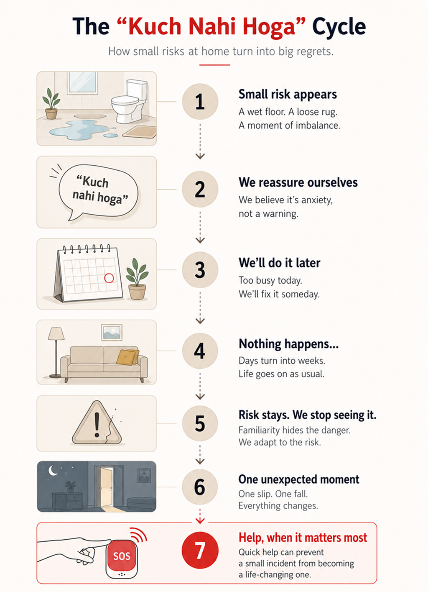

# “Kuch Nahi Hoga” – The Most Dangerous Sentence in Indian Households

“Kuch nahi hoga” is one of the most commonly spoken phrases in Indian homes. It’s said casually, often to reassure someone or to stop a conversation that feels unnecessary. A small slip in the bathroom, a moment of dizziness, a strange noise from the gas stove, everything is brushed aside with this one sentence.

What makes it dangerous isn’t the intention behind it, but the confidence with which we believe it. Over time, this belief quietly convinces us that safety concerns are overreactions rather than early warnings.

## How this mindset became normal

In many Indian households, safety is not something we talk about openly; it’s something we assume. Our parents grew up managing households without modern tools, surviving challenges with resilience and instinct. Because of that, caution today can feel excessive or even disrespectful.

This is how the “kuch nahi hoga” mentality becomes part of the family culture. It doesn’t come from neglect or carelessness; it comes from familiarity. **When nothing has gone wrong for years, it feels logical to believe nothing ever will.**

## When familiarity turns into risk

Most accidents at home don’t happen because people are careless. They happen because risk blends into routine. Slippery bathroom floors, dim staircases, elders climbing chairs to reach cupboards, or walking without support despite weak knees, these situations feel normal because they happen every day.

This Indian family risk culture teaches us to accept small dangers as unavoidable parts of life. But accidents rarely arrive dramatically. They build slowly, waiting for one tired moment, one distracted second, or one unlucky slip.

## Aging parents and unspoken vulnerability

As parents grow older, everyday activities require more effort, even if they don’t say it aloud. Night-time trips to the bathroom, bending down to pick things up, or reaching for medicines can become physically challenging.

Indian parents often downplay discomfort because they don’t want to worry their children or appear dependent. This silence, combined with the Indian household safety mindset, creates a situation where risks exist but are rarely acknowledged until something serious happens.

## Distance makes denial easier

For families <a href="/blogs/caring-from-distance" style="color:#CC0000; text-decoration:none;">living in different cities or countries</a>, reassurance often comes through phone calls and messages. Parents say they’re fine, children choose to believe them, and life moves on. Admitting that something could go wrong would mean admitting how little control we have from afar. So the “kuch nahi hoga” mentality becomes emotional protection for parents who don’t want to worry their children, and for children who don’t want to feel helpless.

## Why “kuch nahi hoga” feels comforting

This sentence survives because it reduces anxiety. It allows families to avoid difficult conversations and postpone decisions. It tells us that planning is unnecessary and that change can wait. But safety planning isn’t about expecting the worst. Locking doors doesn’t mean expecting theft, and keeping emergency numbers doesn’t mean expecting emergencies. In the same way, preparing for household risks is not fear; it’s a responsibility.

## Rethinking safety without fear

One reason safety conversations fail is that they often sound restrictive. Parents hear rules instead of reassurance, and concern instead of care. Real safety should feel supportive, not controlling. It should protect independence, not reduce it. When framed correctly, safety isn’t about stopping parents from living their lives; it’s about making sure they can continue living them with confidence.

## Where quiet support makes a difference

The best kind of safety is the kind you barely notice. It doesn’t interrupt daily life or question independence; it simply stays ready in the background. For elderly parents, that means living freely without feeling monitored. For families, it means knowing that help is always within reach. This is where <a href="https://eyeagle.ai/" style="color:#CC0000; text-decoration:none;">EyEagle</a> fits seamlessly into Indian homes. With a simple SOS option, parents can get immediate help during emergencies without panic or confusion. EyEagle stays out of the way on normal days and steps in only when it truly matters, offering reassurance without intrusion.
Because safety shouldn’t feel loud or controlling. It should feel quietly reliable.

## Love expressed through preparation

Indian families already plan deeply for the future, education, careers, weddings, and financial security. Preparing for household safety, especially for aging parents, is no different. Because the real risk isn’t thinking too much. It’s assuming nothing will ever happen.

“Kuch nahi hoga” may feel comforting today, but being prepared ensures that if something does happen, regret won’t be the loudest voice in the room.
