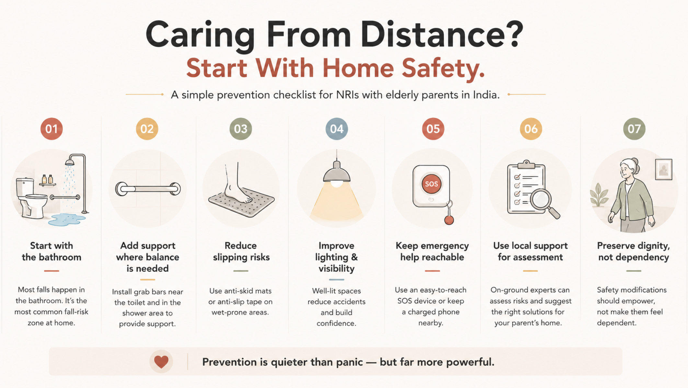

# An NRI's Journey: Caring for Mom From Singapore While Working Full-Time

Living in Singapore had always felt like a step forward in my career. The work was demanding, the pace fast, and the days packed with meetings that often stretched across time zones. Caring from distance is a reality many NRIs don’t prepare for. You move abroad for growth, but your heart remains tethered to home.

Phone calls become routine check-ins, video calls replace physical presence, and reassurance becomes something you give as much to yourself as to your parent.

I believed I was doing enough, calling daily, arranging groceries, and checking in with neighbours. Until one small incident made me realise that love and intention, on their own, were not enough.

## The Unseen Weight of Distance Care

Working full-time while caring for an ageing parent is like living two lives at once. In one, you’re a professional meeting deadlines and delivering results. In the other, you’re constantly alert, watching for missed calls, reading into tone changes, worrying about what isn’t being said.

Time zone differences don’t help. When my workday began, my mother’s day was already halfway through. When I finally had time to talk, she was often tired. I learned quickly that distance care isn’t just about logistics, it’s emotional labour.

And yet, like many NRIs, I assumed that unless there was a major emergency, things were “manageable.”

## A Small Bathroom Slip That Changed Everything

It wasn’t a dramatic fall. There was no hospital visit, no urgent midnight flight booking. Just a casual mention during a call.

“I slipped a little today,” my mother said. “Nothing happened.”

But something did happen to me.

Bathrooms are one of the <a href="https://eyeagle.ai/blogs/why-falls-are-the-biggest-threat-to-seniors" style="color:#CC0000; text-decoration:none;" target="_blank" rel="noopener noreferrer">most dangerous spaces for seniors.</a> Wet floors, smooth tiles, and the simple act of standing up or sitting down can become risky over time. What struck me wasn’t the slip itself, but how easily it could have turned serious.

This was no longer about comfort. It was about <a href="https://eyeagle.ai/protection" style="color:#CC0000; text-decoration:none;" target="_blank" rel="noopener noreferrer">bathroom safety for seniors</a> and fall prevention for elderly, real risks hiding in familiar spaces.

## Choosing Prevention Over Panic

Most families respond to accidents. I realised we needed to prevent them. Instead of waiting for a serious fall or emergency, I began researching accessible bathroom modifications and home safety solutions that could reduce risk while preserving my mother’s independence. This wasn’t about turning her home into a hospital. It was about making everyday movements safer, without making her feel old, fragile, or dependent.

## Getting the Right Help- From Miles Away

Coordinating changes from Singapore wasn’t easy. I needed people on the ground who understood senior safety, not just construction. Professionals who could assess risk, suggest practical solutions, and communicate clearly with family members abroad.

That’s when we connected with a senior safety-focused team in India. <a href="https://eyeagle.ai" style="color:#CC0000; text-decoration:none;" target="_blank" rel="noopener noreferrer">EyEagle</a>, who approached the situation differently. They didn’t start by listing products. They started by understanding my mother’s daily routine, her mobility challenges, and the spaces she used most. From that distance, having someone who understood senior risk made all the difference.

## What Changed After the Modifications

The changes themselves were simple, but their impact was profound.

### Bathroom Safety Improvements

The bathroom was addressed first. Grab bars were installed where balance was most needed. Anti-skid flooring reduced the fear of slipping. Small adjustments, thoughtfully placed, transformed the space from risky to reassuring. These bathroom safety for seniors improvements didn’t restrict her movements; they supported them.

### Supporting Mobility at Home

Beyond the bathroom, subtle mobility support devices for the elderly were introduced. Nothing intrusive. Just enough support to reduce strain and increase confidence while moving around the house. The goal wasn’t to remind her of limitations, but to quietly remove obstacles.

## When Caring From Distance Became Less Fearful

Something shifted after that. Our phone calls changed. There was less anxiety in her voice, and less in mine. I stopped imagining worst-case scenarios during work hours. She stopped feeling the need to downplay her struggles. Caring from distance no longer felt like a constant state of alert. It became manageable. And perhaps most importantly, my mother felt safer without feeling “watched.”

## Lessons Every NRI Caregiver Should Know

Distance teaches you things you don’t expect. If I could speak to every NRI caring for parents back home, I would say this:

- Don’t wait for a serious fall to take action
- Bathrooms are the first place to address
- Home safety modifications are about dignity, not dependency
- Local expertise makes remote care possible
- Prevention is quieter, but far more powerful than reaction

Caring from a distance isn’t about doing everything yourself. It’s about building the right systems around your parent.

## Distance Doesn’t Reduce Responsibility- It Redefines It

Living abroad doesn’t mean caring less. It means caring differently. I may not be physically present every day, but knowing my mother’s home supports her safety gives me peace that no daily phone call ever could. Her independence remains intact. Her confidence has returned. And my worry has softened into trust.

Caring from a distance is never easy. But with thoughtful planning, local support, and the right safety modifications, it is possible to protect not just our parents’ bodies, but their sense of home.
