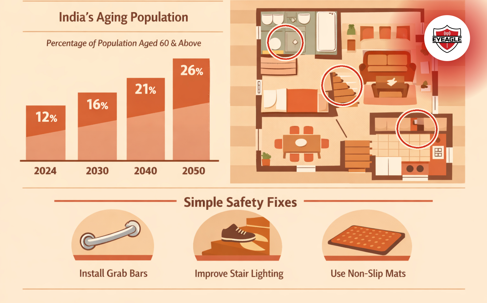

# India’s Aging Reality: Why Home Safety Must Evolve with Our Seniors

India is aging faster than most of us realize. With longer lifespans, smaller families, and more seniors choosing to live independently, our homes now carry responsibilities they were never designed for. Home safety for seniors in India is no longer a luxury; it’s an urgent necessity for a population aging without adequate support systems.

## A New India, A New Aging Reality

Older adults today are living in environments very different from the joint-family homes of the past. High-rise apartments, compact layouts, slippery tiles, and cluttered storage create silent dangers for seniors who already face mobility challenges in old age.

Add to that busy working families, adult children living in other cities, and healthcare access that isn’t always immediate, and you begin to see why safety inside the home matters more than ever.

India’s seniors want freedom, dignity, and independence, but their homes must evolve to support that independence.

## The Hidden Risks Inside Indian Homes

Most families don’t realize this: the majority of senior injuries in India happen inside their own homes. And these are not dramatic accidents; they’re small slips, missteps, and moments of imbalance that can change a life in seconds.

Common high-risk zones include:

- **Slippery bathroom floors** (the #1 danger)
- Uneven tiles or narrow thresholds
- Poorly lit hallways
- Cluttered walk spaces
- Low seating or deep sofas
- Stairs without railings
- Wet balconies

Even a moment of dizziness can become a fall when the environment isn’t built to support aging bodies.

## Falls: The Silent Epidemic We Don’t Discuss

Falls are now one of the leading causes of severe injuries among Indian seniors. A hip fracture or head injury can take months to heal, and often, independence never fully returns. That’s why senior citizen safety India, especially <a href="https://eyeagle.ai/" style="color:#CC0000; text-decoration:none;" target="_blank" rel="noopener noreferrer">fall prevention for seniors</a>, has to be a household priority, not something we address only after an accident.

To stop this silent epidemic, families must understand that preventing slips and falls is not about restricting movement; it’s about enabling safe movement.

Simple upgrades like better lighting, handrails, non-slip flooring, raised toilet seats, and easier-to-use taps can transform a dangerous home into a supportive one.

## How Homes Must Evolve for India’s Seniors

A safer home doesn’t always need an expensive renovation. It needs intention, empathy, and smarter design choices:

- Install **non-slip mats** in bathrooms
- Add **grab bars** near showers and toilets
- Use motion-sensor lights in passages
- Keep floors clutter-free
- Replace deep chairs with raised seating
- Rearrange essentials at a reachable height
- Ensure good lighting in staircases
- Remove loose wires, rugs, and obstacles
- Use anti-skid footwear indoors

Bathrooms remain the highest-risk zone for elderly falls. Installing supports like <a href="https://shop.eyeagle.ai/" style="color:#CC0000; text-decoration:none;" target="_blank" rel="noopener noreferrer">EyEagle’s bathroom safety fittings</a> is a practical, affordable step that immediately reduces danger.

These changes support mobility, prevent accidents, and give the elderly safety at home.

## The Way Forward

India’s elderly population is growing fast, but our homes haven’t kept pace. Aging with dignity requires spaces that protect, empower, and adapt. Home safety for seniors in India isn’t about making homes restrictive; it’s about making them kinder.
Safer homes mean fewer falls, more confidence, and more years lived on one’s own terms.

With simple awareness and thoughtful precautions, every Indian family can create a safer, more dignified environment for the elders who raised them.
