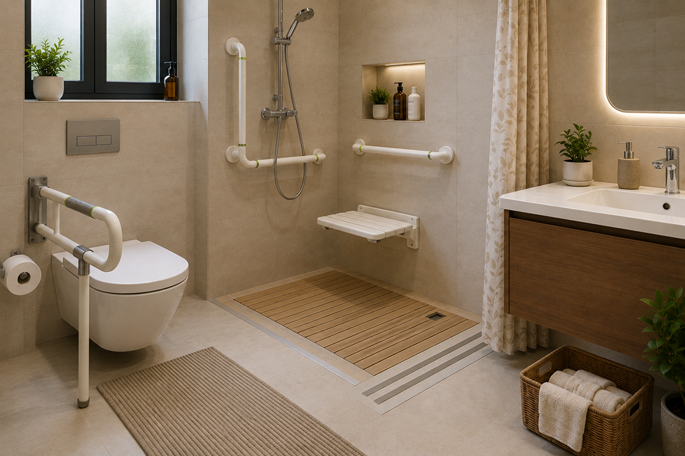
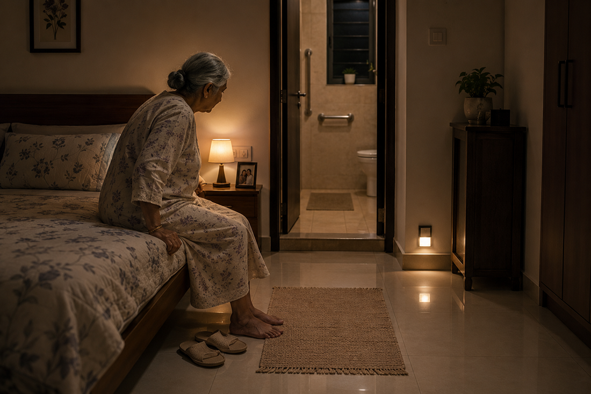
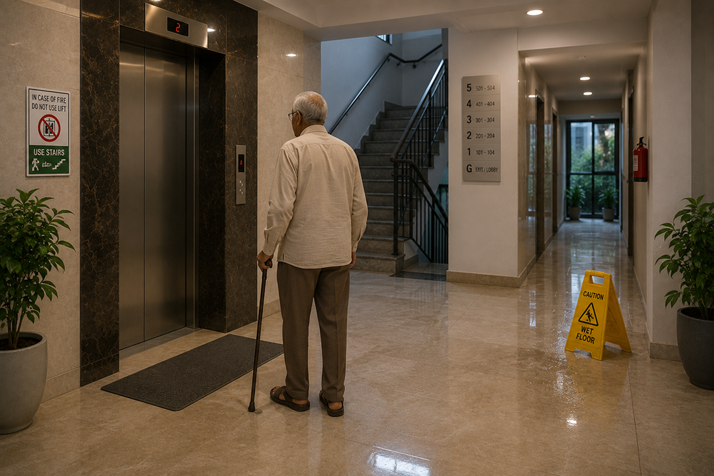
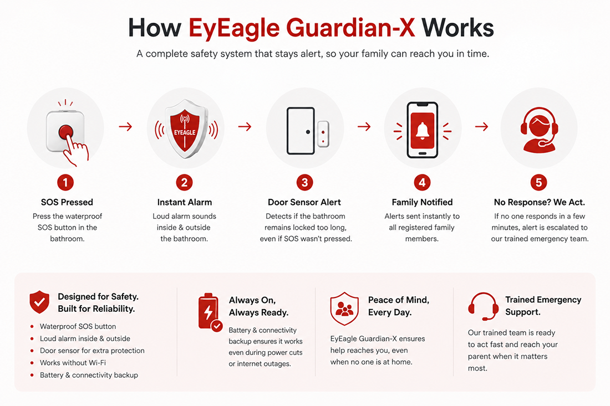
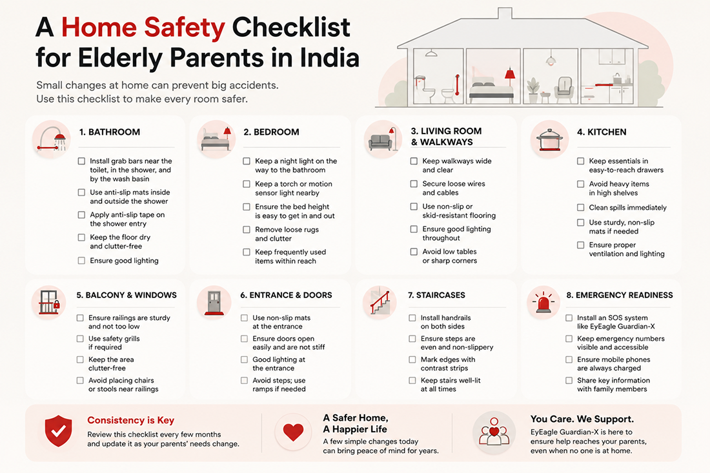

# Apartment Living After 60: How Small Risks Can Turn Into Big Emergencies

Your parents live in a good apartment. A guard sits at the gate, the lift works most days, and housekeeping mops the floors every morning. It looks safe. But apartment safety for elderly India is not about how new or clean a building looks. It comes down to details most of us never notice: the height of a step, the grip on a tile, the light in a hallway at 2 a.m.

Senior citizen apartment safety depends on seeing the flat the way your aging parent sees it, not the way you see it during a weekend visit. Once you look closely, small risks show up in every room, and each one can grow into a real emergency. This piece covers every part of the apartment, from the bathroom to the lift lobby, and ends with a simple checklist you can start on this month.

## Why Your Parents' Apartment Feels Safer Than It Is

A modern apartment creates a false sense of security. Smooth granite floors look clean, but they turn slippery the moment water touches them. A lift feels convenient, but its doors close faster than an older person can move through them. A guard at the gate cannot see what happens inside a locked flat on the fourth floor.

Most apartments in India are built for young, able-bodied residents. Door thresholds sit raised off the floor. Switchboards are placed high on the wall. Bathroom floors slope towards the drain, which helps water flow but works against bare feet. None of this was designed with a 65-year-old in mind, and that gap is where senior citizen safety in flats in India starts to break down.

These risks don't look dangerous on their own. They only become obvious once something goes wrong. So the first step towards real apartment fall risk elderly prevention is simple: stop assuming the building is doing the safety work for you. It isn't. That part stays with the family.

## The Bathroom - Where Most Accidents Happen

Ask any doctor which room sends the most elderly patients to hospital, and the answer is nearly always the same: the bathroom. Wet floors, hard tiles, and nothing to hold onto make it the riskiest room in any Indian home, apartment or independent house.

### What makes Indian bathrooms especially risky

- Floors stay wet for hours after a shower, especially with bucket bathing.
- Most bathrooms have no grab bar near the toilet, shower area, or wash basin.
- Geysers and switches sit within reach of wet hands.
- Bathroom doors open inward, which blocks rescue if someone falls near the door.

None of this needs a full renovation. A few targeted flat modifications for senior parents make a real difference. A grab bar near the toilet, inside the shower, and by the wash basin gives your parents something sturdy to hold at exactly the moment they need it. Anti-slip mats with drainage gaps keep water from pooling under the feet, and anti-slip tape on the shower entry adds grip without changing how the bathroom looks.

One detail decides whether these fixes actually work: installation quality. A grab bar drilled into hollow plaster instead of the wall's actual load-bearing point can come loose under weight, which is more dangerous than having no bar at all, because your parent leans on it expecting support. This is the exact gap <a href="https://eyeagle.ai/protection" style="color:#CC0000; text-decoration:none;">EyEagle's Bathroom Protection Kit</a> is built around. Their technicians install every bar and then push their full body weight against it on the spot, with photos to prove it holds, so you're not trusting a guess on something your parent's safety depends on.

## The Bedroom: A Quiet Source of Apartment Fall Risk for Elderly Parents

Night-time <a href="https://eyeagle.ai/blogs/falls-kill-more-seniors-than-you-think" style="color:#CC0000; text-decoration:none;">bathroom trips cause a large share of falls</a> among elderly people at home. Your parent wakes at 2 a.m., half asleep, and crosses a dark room to reach the door. That single walk carries more risk than almost anything else in a full day.

### Common bedroom hazards

- Beds that sit too high or too low, making it hard to sit or stand safely.
- No night lamp, forcing a walk through complete darkness.
- Loose bedside rugs that slide underfoot.
- Side tables or chargers sitting in the direct path to the door.
- Slippery open-back slippers kept beside the bed.

Small changes fix most of this. A soft night lamp near the door, a bed height where feet reach the floor without effort, and a clear, straight path to the bathroom cut this risk down sharply. Swap loose rugs for ones with a non-slip backing, or clear them from the walking path altogether. None of it takes more than an afternoon.

## The Living Room and Kitchen: Everyday Dangers

Living rooms and kitchens don't look risky, which is exactly why they catch people off guard. These are rooms your parents cross dozens of times a day, often without thinking, and familiarity is what makes people careless.

### Living room risks

- Coffee tables and low stools sitting in walking paths.
- Loose carpets or doormats without grip backing.
- Trailing wires from TV units or chargers across the floor.
- Sofas that are too soft or too low to get up from easily.

### Kitchen risks

- Wet floors near the sink and washing area.
- Everyday items stored on high shelves, needing a stool to reach.
- Gas stove knobs that are stiff or hard to grip with weaker hands.
- Weak lighting near the counter and stove.

Walk through both rooms as if you were seeing them for the first time. Move anything sitting in a walking path. Bring everyday items down to waist height so no one has to climb for a jar of tea leaves. A rubber-backed mat near the kitchen sink and a brighter light near the stove close out most of what's left.

## High Rise Safety for Elderly Parents: Beyond the Front Door

Apartment safety doesn't stop at the front door. The lift lobby, the staircase, the driveway, and the walk to the garbage room are all part of your parent's daily movement, and none of it sits within your direct control as a family.

### Shared-space risks families often miss

- Wet, freshly mopped lobby floors with no warning sign.
- Lift doors that close faster than an elderly person can step through.
- Uneven driveway surfaces, speed bumps, and gaps near parking.
- Staircases used during power cuts, often with weak emergency lighting.
- Ramps built for wheelchairs and trolleys, not for a walking stick.

You can't renovate common areas the way you renovate a flat, but you can push for changes. Ask your building's RWA to extend the lift door's closing delay. Request a non-slip mat at the lobby entrance and near the lift. Report broken staircase lights as soon as you spot them, and encourage your parents to wait for the lift instead of taking the stairs during a power cut, since backup lighting in older buildings is rarely dependable.

## When a Fall Does Happen: The Apartment Response Gap

Even a well-modified apartment cannot prevent every fall. A sudden dip in blood pressure, a moment of dizziness, or a slip on a wet tile can happen even when every precaution is already in place. What matters just as much as prevention is how fast someone finds out and reaches your parents afterwards.

In an apartment, this gap is wider than most families realise. Neighbours may not hear a call for help through a closed door. Domestic help may only arrive later in the day. If your parent spends long stretches alone, a fall in the bathroom, with the door locked from inside, can go unnoticed for hours.

This is where a dedicated system like <a href="https://eyeagle.ai/device" style="color:#CC0000; text-decoration:none;">EyEagle's Guardian-X</a> earns its place. It puts a waterproof SOS button inside the bathroom, sounds an alarm both inside and outside the room, and carries a door sensor that flags it if the bathroom stays locked longer than usual, even if the button was never pressed. Every registered family member gets an alert on their phone the moment it triggers, and if no one responds within a few minutes, the alert moves on to a trained emergency team automatically. It runs on its own battery and connectivity too, so a power cut or a Wi-Fi outage doesn't leave your parents cut off at the exact moment they need help. Prevention lowers the odds of a fall. A system like this lowers what that fall ends up costing.

## A Home Safety Checklist for Elderly Parents in India

You don't need to fix everything in one sitting. A focused weekend, or a few hours spread across a month, clears out most of the risk in your parents' apartment. Use this home safety checklist for elderly India as a starting point.

### Walk through every room: Week 1

- Walk the full apartment slowly, looking only for slipping and tripping hazards.
- Note every loose rug, trailing wire, and low piece of furniture in a walking path.
- Check the lighting in every hallway, bedroom, and bathroom, especially at night.

### Fix the bathroom first:Week 2

- Install grab bars near the toilet, shower, and wash basin, tested properly for weight.
- Add anti-slip mats and tape in the shower and near the sink.
- Move the geyser switch away from areas that get wet.

### Fix the bedroom and living spaces:Week 3

- Add a night lamp near the bedroom door.
- Remove or secure loose rugs across the apartment.
- Lower frequently used kitchen and cupboard items to waist height.

### Ongoing: Build a response plan

- Save emergency numbers, including the nearest hospital, on the speed dial.
- Talk to your building's RWA about lift timing and common-area safety.
- Book a free home safety assessment to catch what you might miss on your own.

If planning all this on your own feels like a lot, EyEagle offers a <a href="https://eyeagle.ai/" style="color:#CC0000; text-decoration:none;">free bathroom safety assessment</a>. A trained EyEagle squad visits the apartment, points out the exact fall-risk areas, and puts together a plan built around that specific bathroom, not a generic one. It just gives you a clear, expert view of what to fix first, and in what order.

## Closing Thoughts

Your parents' apartment can look modern and well-kept and still hide risks that only surface after an accident. Most of these risks cost little to fix and take even less time. A grab bar here, a night lamp there, a conversation with the RWA about the lift, and a clear plan for what happens if something does go wrong. That's most of what real apartment safety for elderly India comes down to.

You can't be there every hour of every day. But with a few of the right changes in place, the apartment can look out for your parents on the hours you can't.

## Faq

### Can I install grab bars in a rented apartment?

Yes, but check your rental agreement and get your landlord's permission before drilling or making permanent changes. But in case you go for EyEagle: our professional installation will help prevent damage to walls or tiles. And later, if you shift out, the team will support you to shift the setup, but you have to be our subscriber.

### Do I need RWA approval for safety modifications in common areas?

Usually, yes. Modifications to shared spaces such as staircases, corridors, lobbies or driveways may require RWA or society approval. For changes inside your flat, check your society rules and rental agreement, especially if they involve structural or external alterations.

### What's the safest floor for elderly parents to live on?

Lower floors are safer, mainly because they cut dependence on the lift during power cuts. The ground or first floor works well if stairs are ever needed.

### How often should we do a home safety check?

Every three to six months, and again after any change in your parent's health or mobility.

### Are Indian bathroom designs inherently unsafe for elderly parents?

Largely, yes. Sloped wet-and-dry floors and missing grab bars are common. Targeted fixes like grab bars and anti-slip surfaces solve most of it without a renovation.

### What's the single most important modification we should make?

A properly tested grab bar in the bathroom, near the toilet, and inside the shower. It addresses the highest fall risk in the home directly.

### How much does it cost to make an apartment senior-safe in India?

There is no fixed cost. It depends on the apartment and the level of safety required. Basic changes can improve everyday safety, while a more complete solution should also provide emergency detection and response. **EyEagle brings these layers together in one practical, reasonable, affordable senior safety system.**
