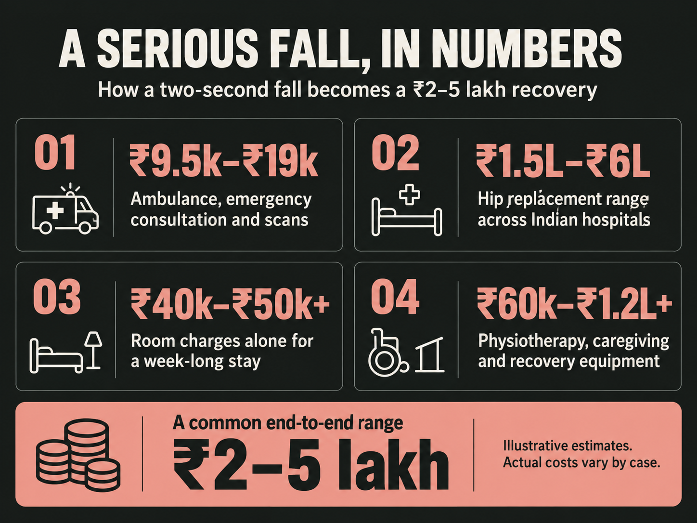
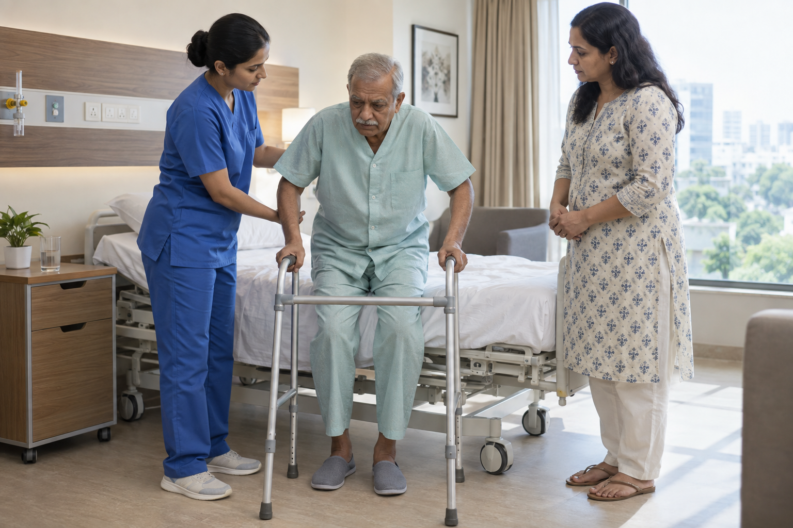
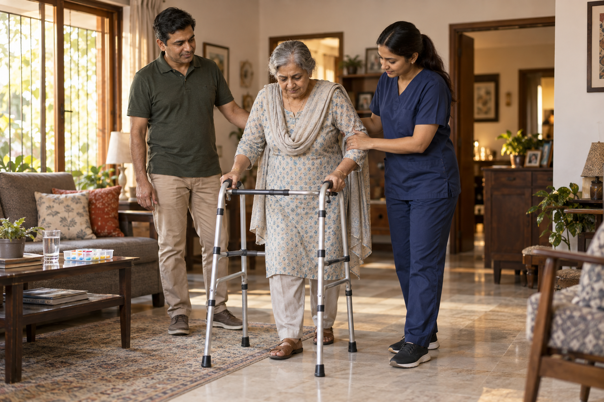
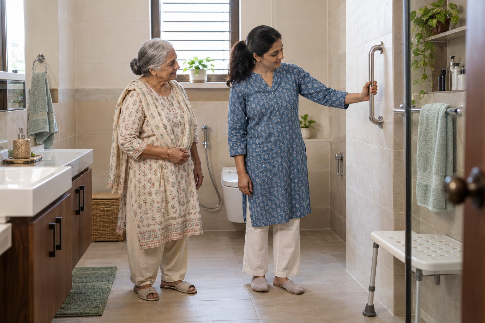

# The True Cost of a Senior Fall in India: ₹2–5 Lakh and Counting

Ask any family that has been through it, and they'll tell you the same thing: nobody budgets for a fall. You budget for school fees, for weddings, for the occasional home renovation. A fall isn't on that list until it happens, and suddenly it's the only line item that matters. A fall that lasts two seconds can lead to an ambulance ride, emergency scans, surgery, a week in hospital, months of physiotherapy, and a caregiver at home. What initially looks like a simple accident can become a ₹2–5 lakh expense before recovery is complete. The exact amount varies depending on the injury, hospital, city, treatment, and recovery time. A complicated fracture or prolonged hospitalisation can cost considerably more. Once you understand the cost of a senior fall in India, the financial argument for prevention becomes much easier to evaluate.

## The Fall Itself Costs Almost Nothing

The moment itself is free. A slip on a wet bathroom floor, a missed step off the veranda, a stumble while reaching for something on a low shelf- none of it costs a rupee. That's part of why falls are so easy to underestimate. No invoice covers the two seconds it takes to lose balance.

The bill starts the moment someone calls for help. An ambulance in a metro city typically runs ₹1,500–₹4,000, more if it needs to be equipped with oxygen or a stretcher team. The emergency room consultation, X-rays, and often a CT scan to confirm the type of fracture add another ₹8,000–₹15,000, usually before anyone has even chosen a hospital for the actual treatment. This is the part families rarely think about in advance: the first few hours after a fall already cost more than most households' monthly grocery bill, and the surgery hasn't even been scheduled yet.

## What a Hip Fracture Actually Costs: The Breakdown

A hip fracture is one of the most serious injuries an older adult can experience after a fall. Treatment can involve surgery, hospitalisation, and months of rehabilitation. To understand the hip fracture treatment cost India, it helps to break the expense into three major stages: surgery, hospitalisation, and post-discharge care.

### The Surgery

The surgery is usually the largest single medical expense. Depending on the fracture type and location, doctors may recommend fixation with plates and screws, a partial hip replacement, or a total hip replacement.

Hip surgery costs India vary significantly based on the procedure, hospital, surgeon, city, and implant. A total hip replacement can typically range from around ₹1.5 lakh to ₹6 lakh across Indian hospitals, with many private-hospital packages falling around ₹2.5–₹3.8 lakh for a standard implant. The implant itself can make a significant difference to the final bill. Certain premium implant materials can add substantially to the procedure cost.

Location matters too. Private hospitals in Tier-1 cities can charge considerably more than comparable hospitals in Tier-2 cities. So when someone searches for the **hip replacement cost in India**, there isn't one universal number. The realistic answer is a range. And the surgery is only the beginning.

### The Hospital Stay

Hip surgery rarely means going home the same day. Older patients may need several days of monitoring after surgery, particularly when they have other age-related health concerns. Hospital stays for elderly hip-fracture patients can commonly extend to around 6–11 days, depending on the patient's condition and whether complications occur. Private hospital room charges can range from approximately ₹3,000–₹8,000 a day for a general room, with higher charges for more specialised rooms.
A week-long stay can therefore push room charges alone beyond ₹40,000–₹50,000. Then come the additional expenses:

- Nursing charges
- Medicines
- Surgical consumables
- Diagnostic tests
- Doctor consultations
- Physiotherapy
- Monitoring and other hospital services

This is where elderly hospitalization costs in India can quickly become substantial. A family may initially prepare for a surgery costing ₹2–3 lakh, only to discover that the final hospital bill is significantly higher once all associated charges are included.

### Post-Discharge Care

This is the expense families often underestimate the most. The patient may leave the hospital, but the recovery isn't over. Physiotherapy is usually necessary to rebuild strength, improve mobility, and help the person regain confidence while walking.

Home physiotherapy can cost around ₹800–₹2,000 per visit. If therapy is needed three to five times a week for six to eight weeks, the total can become a significant expense. Then there is caregiving. A home caregiver or attendant can cost approximately ₹18,000–₹35,000 a month through a verified agency. Skilled nursing support can cost considerably more.

Families may also need to purchase:

- A walker
- A wheelchair
- A pressure-relief mattress
- Bathroom safety equipment
- Medicines
- Mobility aids
- Other recovery equipment

Over two or three months, post-discharge care alone can add ₹60,000–₹1.2 lakh or more. That is why the fall recovery cost elderly people is much higher than the initial hospital bill suggests.

### What the Full Bill Can Look Like

| Cost Component                         |           Typical Range |
| -------------------------------------- | ----------------------: |
| Ambulance, ER visit, X-ray/CT scan     |         ₹10,000–₹20,000 |
| Surgery, implant, OT and surgeon's fee |     ₹1,50,000–₹4,50,000 |
| Hospital stay, 5–10 days               |         ₹40,000–₹90,000 |
| Physiotherapy, 6–8 weeks               |         ₹25,000–₹60,000 |
| Home caregiver/nursing, 2–3 months     |       ₹40,000–₹1,00,000 |
| Equipment and ongoing medication       |         ₹15,000–₹30,000 |
| **Typical total**                      | **₹2,00,000–₹5,00,000** |

A straightforward case may therefore cost around ₹2–5 lakh from the initial emergency response through recovery. But this shouldn't be treated as a maximum. A longer hospital stay, infection, complications, revision surgery, or extended nursing care can push the bill much higher. The important point is that the cost of a Senior Fall in India doesn't end when the patient leaves the operating theatre.

## What Insurance Actually Covers - And What It Doesn't

Health insurance can make a major difference after a serious fall. But having insurance doesn't necessarily mean the family will pay nothing. The amount actually covered depends on the policy's terms, exclusions, limits, and co-payment requirements.

### Room Rent Limits

Some health insurance policies have room-rent limits. For example, a policy may reimburse only up to a specified amount per day. If the family chooses a room above that limit, the financial impact can extend beyond the room itself depending on the policy's terms. This is why checking room-rent eligibility before an emergency matters.

### Co-Payments

Some senior-citizen health insurance policies include a mandatory co-payment. If the policy has a 20% co-pay and the eligible claim is ₹3 lakh, the family could be responsible for ₹60,000. That amount can be significant when combined with expenses that aren't covered by the policy.

### Waiting Periods and Pre-Existing Conditions

Health insurance policies can also have waiting periods for certain pre-existing conditions. Conditions associated with bone health or mobility may have specific policy terms that families need to understand before a claim occurs. This doesn't make insurance unhelpful. Quite the opposite.

Insurance remains an important part of preparing for medical emergencies. But it shouldn't be mistaken for complete financial protection against every expense associated with a fall. The safest approach is to understand exactly what the policy covers before an emergency occurs.

## The Costs No One Talks About

The hospital bill is the obvious expense. But some of the largest cost of a senior fall in India never appear on the hospital invoice.

### Lost Income

Someone usually has to become the caregiver. An adult child may take leave from work, reduce working hours or travel from another city to help a parent. For an NRI family, the cost may involve flights, extended stays, and time away from work. Even a few weeks away from a job can represent a substantial financial cost.

### Home Modifications

Ironically, many families install safety equipment only after the accident. Grab bars, ramps, raised toilet seats, improved lighting, and non-slip flooring may become urgent purchases during recovery. These modifications can be much easier to plan and budget for before an accident than after a ₹2–5 lakh medical bill.

### Caregiver Burden

A serious fall can effectively create a second patient in the family. The person recovering from the injury needs support, while the caregiver may experience physical exhaustion, emotional stress, and disruption to their own routine. That burden may not have a line item on the hospital invoice, but it has a real impact on a family's time and finances.

### Loss of Independence

There is another cost that is harder to measure. After a serious fall, some older adults become afraid of falling again. They may stop walking around the house independently, avoid going outside, or become increasingly dependent on family members. Reduced mobility can affect strength, confidence, and quality of life. So the fall recovery cost for elderly people isn't simply a number on a medical bill. It can affect the entire household.

There is also a more serious health consideration. Studies of elderly hip-fracture patients have reported significant mortality within the year following surgery, with outcomes varying based on age and existing health conditions.

That doesn't mean a hip fracture automatically leads to a poor outcome. Early treatment, appropriate medical care, rehabilitation, & strong family support all matter. But it reinforces one important point: A fall isn't only a financial event. It is a health event with financial consequences attached.

## What Prevention Actually Costs

Now compare the potential expense with the cost of prevention. Basic home fall-prevention measures can include:

- Bathroom grab bars
- Non-slip mats
- Better lighting
- Safer flooring
- Handrails
- Raised toilet seats
- Clear walking paths
- Emergency alert systems

Depending on the size of the home and the level of protection required, these measures can cost roughly ₹15,000–₹35,000 as a one-time investment. Compare that with a potential ₹2–5 lakh recovery bill. The difference is significant.

A ₹30,000 prevention investment represents roughly 6%–15% of a ₹2–5 lakh fall-related expense. That doesn't mean spending ₹30,000 guarantees that a fall won't happen. It doesn't. No safety product can honestly make that promise. The purpose of prevention is to reduce avoidable risks and make the home safer. And there is an important financial principle behind this:

**You don't install safety measures because you know a fall will happen. You install them because you don't know whether it will.**

For a family considering whether prevention is "worth ₹30,000," that is the real calculation. The question isn't: "Will my parent definitely fall?" It is: "Am I comfortable taking the financial and health risk of finding out?"

## When Prevention Doesn't Prevent - The Response Case

Even a carefully designed home cannot eliminate every fall. <a href="https://eyeagle.ai/blogs/balance-problems-in-elderly" style="color:#CC0000; text-decoration:none;">Older adults may lose balance</a> because of medication side effects, weakness, poor vision, underlying conditions, or simply an unexpected movement. That is why fall prevention has a second half: **what happens when prevention fails?**

A fall becomes more dangerous when nobody knows it has happened.

Consider two situations.

- In the first, a senior falls in the bathroom while a family member is nearby. Help arrives almost immediately.

- In the second, the same senior falls while alone and cannot reach the phone. The family discovers what happened several hours later.

The injury may be identical. The circumstances after the injury are not.

Fast access to help can make an important difference in an emergency. It can help families act sooner rather than losing valuable time simply discovering that something has gone wrong. This is where monitored safety systems become part of the prevention conversation.

<a href="https://eyeagle.ai/" style="color:#CC0000; text-decoration:none;">EyEagle's bathroom safety systems</a> are designed around both sides of the problem: reducing environmental risks through measures such as safer bathroom surfaces and grab bars, while also providing a way to alert family or caregivers when something goes wrong. The goal isn't to promise that a fall will never happen.

The goal is simpler:

**Make the fall less likely. And if it happens anyway, make sure someone knows.**

## Prevention Is Cheaper Than Recovery

Nobody wants to think about a parent falling. But avoiding the conversation doesn't eliminate the risk. A senior fall can begin with a two-second accident and turn into months of medical treatment, physiotherapy, caregiving, and financial pressure.

The cost of a senior fall in India can easily reach ₹2–5 lakh in a serious case, and the number can rise when complications or prolonged recovery are involved. Insurance can help. Good medical care can help. Family support can help.

But prevention gives families something else: the opportunity to reduce the risk before the emergency begins. A safer bathroom, better lighting, reliable support, and faster access to help may seem like small investments today. Compared with a ₹2–5 lakh recovery bill, they are worth taking seriously.

**Disclaimer:** The information provided in this article is for general informational and educational purposes only and should not be considered medical, financial, insurance, or legal advice. The costs mentioned are approximate estimates based on commonly reported expenses and may vary significantly depending on the injury, treatment required, hospital, city, surgeon, implant, insurance policy, recovery period, and other individual circumstances. Actual medical and caregiving costs may be higher or lower than the ranges mentioned.

## FAQ

### Does health insurance cover the full cost of a hip fracture in India?

Partially, in most cases. Insurance typically covers the surgery itself, but room rent caps, mandatory co-payments on senior citizen plans, and waiting periods on related pre-existing conditions like osteoporosis often leave families paying 20–40% of the total bill out of pocket.

### How much does hip replacement surgery cost in India right now?

Most private-hospital packages for a single total hip replacement fall between ₹2.5 lakh and ₹3.8 lakh, though the full range across India spans roughly ₹1.5 lakh to ₹6 lakh depending on the city, implant type, and hospital.

### What does post-discharge care actually include, and how much does it add up to?

Physiotherapy, a home caregiver or nurse, mobility equipment, and ongoing medication together typically add ₹80,000–₹1,80,000 over two to three months of recovery, often the single most underestimated part of the total cost.

### Is spending on fall prevention actually worth it financially?

For most households, yes. A one-time investment of ₹15,000–₹35,000 in bathroom safety and home modifications is a small fraction of the ₹2–5 lakh a serious fall typically costs to treat and recover from, and it reduces the odds of that cost ever being incurred.

### How much does a home caregiver cost after a senior's fall in India?

A verified agency caregiver for daily support during recovery typically costs ₹18,000–₹35,000 a month, rising to ₹40,000–₹60,000 a month if skilled nursing care is required rather than general assistance.
