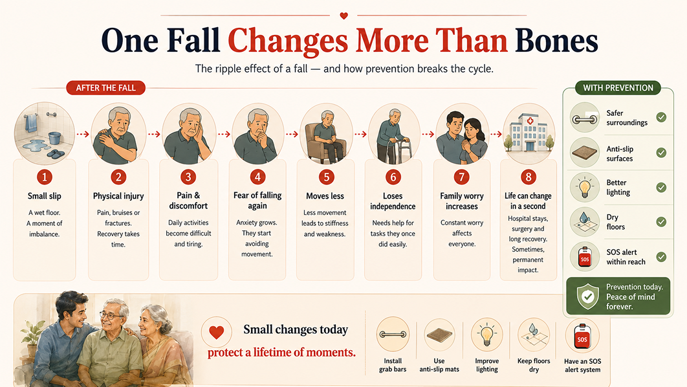

# The Day Dad Fell: How One Accident Became Our Wake-Up Call

There are days that divide your life into before and after. For us, it was the day my Dad fell. It was a normal weekday morning. Amma was in the kitchen. Dad had gone to take a shower. Nothing unusual. Nothing dramatic. Just routine. Then we heard a loud noise. Followed by silence.

When we rushed in, he was on the bathroom floor, confused and in pain, trying to sit up but unable to. The tiles were slightly wet. That’s all it took. One small slip turned into an elderly fall accident at home, and it shook us more than we expected. At that moment, we weren’t thinking about statistics or safety guidelines. We were just scared!

## It Happened in the “Safest” Place

The bathroom is where we feel most private and comfortable. But for seniors, it is often the most dangerous space in the house. <a href="http://eyeagle.ai/blogs/falls-kill-more-seniors-than-you-think" style="color:#CC0000; text-decoration:none;">Bathroom falls among elderly people are extremely common.</a> The reasons are simple:

- Wet and slippery floors
- Smooth tiles with no grip
- No support bars to hold
- Sudden dizziness while standing

Dad had always been steady on his feet. But age changes things quietly. Balance weakens. Knees don’t respond as quickly. Reflexes slow down. We didn’t notice those small changes. We only saw the fall.

## The Injury Was Visible. The Fear Was Not.

Thankfully, Dad didn’t fracture anything. Just a deep bruise and a lot of pain. Physically, he healed in a few weeks. Emotionally, he didn’t.

After that day, he started walking more carefully. Too carefully. He would touch the walls while moving. He avoided going to the bathroom unless someone was nearby. At night, he hesitated before getting out of bed. This is something people don’t talk about enough. An elderly fall accident at home doesn’t just hurt the body. It affects confidence. When seniors lose confidence in their balance, they begin limiting movement. They sit more. Walk less. Avoid stairs. And slowly, their independence starts shrinking. That’s when we understood that this wasn’t “just a slip.” It was a wake-up call.

## We Thought Our Home Was Safe

We live in a normal, well-maintained house. Clean floors. Proper lighting. No major issues. But when we started observing carefully, we noticed many risks:

- Loose rugs in the hall
- Dim light near the staircase
- No grab bars in the bathroom
- Slippery bathroom tiles
- A small step near the bathroom entrance

None of these seemed dangerous earlier. But when you look at them through the lens of elderly fall risk at home, everything looks different. Home safety for elderly parents is not about building a hospital-like environment.<a href="https://eyeagle.ai/blogs/how-to-make-your-home-safe" style="color:#CC0000; text-decoration:none;"> It is about making small, thoughtful changes</a> that reduce risk without reducing comfort.

## Why Bathrooms Are So Risky for Seniors

Bathrooms combine three risky elements: water, hard surfaces, and limited space. Even a healthy adult can slip on soap or water. For seniors, the danger is greater because:

- Blood pressure may drop suddenly when standing
- Joint stiffness affects balance
- Vision may not be as sharp
- Reaction time slows down

<a href="https://eyeagle.ai/" style="color:#CC0000; text-decoration:none;">Bathroom safety for seniors</a> should never be ignored. Simple improvements can make a huge difference:

- Install strong grab bars near the toilet and shower
- Use anti-slip mats inside and outside the shower
- Ensure the floor is always dry
- Improve lighting
- Keep toiletries within easy reach

These are not expensive changes. But they can prevent life-changing injuries. And if you’re looking for reliable support, <a href="https://eyeagle.ai/protection" style="color:#CC0000; text-decoration:none;">EyEagle bathroom safety fittings</a> are designed to add that extra layer of security, quietly protecting your loved ones while helping them move confidently at home.

## The Guilt That Followed

After the fall, one thought kept coming back to me: “We should have done something earlier.” That guilt is common. Many families don’t think seriously about fall prevention for senior citizens until something actually happens. We assume:

- They’ve been fine so far.
- It won’t happen in our house.
- We’ll handle it if something happens.

But falls don’t give warnings. An elderly fall accident at home can lead to fractures, surgeries, long recovery periods, and in some cases, permanent mobility issues. Even when the injury is minor, the emotional impact is heavy.

The truth is simple: prevention is always easier than recovery.

We decided not to wait for a second accident. Fall prevention for senior citizens is not one big solution. It is a series of small, consistent steps. And those steps gave us something valuable, peace of mind.

## The Hard Question: What If No One Is Home?

This was the most uncomfortable part.

We cannot be home 24/7. We have work, responsibilities, errands.

What if Dad fell again when no one was around?
 And couldn’t reach his phone?
 What if Amma didn’t hear him?

That fear is very real for families with aging parents. We knew we needed more than regular phone calls and check-ins, so we started looking into safety devices for elderly parents. While researching online and comparing different options, we came across <a href="https://eyeagle.ai/" style="color:#CC0000; text-decoration:none;">EyEagle.</a> Their team first visited our home for a bathroom safety assessment and suggested simple safety additions based on Dad's needs, including grab bars, anti-slip solutions, and an SOS emergency button.

We decided to go ahead with their recommendations. The SOS button was installed inside the bathroom, within easy reach. If Dad ever feels dizzy, slips, or needs help, all he has to do is press it. The moment the button is pressed, an alarm rings and an alert is sent instantly through the <a href="https://eyeagle.ai/app" style="color:#CC0000; text-decoration:none;">EyEagle App</a> to all connected family members. We receive real-time notifications on our phones so we can respond immediately. What gave us even more peace of mind was this: if family members fail to respond to the alert, EyEagle's emergency response team steps in. They coordinate the situation and ensure help reaches the home quickly. That backup support matters, especially during working hours or late nights when phones can be missed.

It's not about replacing care. It's about extending it beyond the walls of the house. After installing it, Dad actually felt more confident. He knew that even if none of us were nearby, he was never truly alone. Help was always within reach, and that made all the difference.

## If You’re Reading This, Don’t Wait

If your parents are aging and still active, this is the best time to act. Walk through your home today and look at it differently. Ask yourself:

- Is the bathroom safe?
- Is the lighting bright enough?
- Are there tripping hazards?
- Do they have quick access to help in an emergency?

You don’t need a complete renovation. Just awareness and action. Because once an elderly fall accident at home happens, the emotional impact stays with the whole family.

## The Day That Changed Us

The day Dad fell scared us. But it also opened our eyes. It pushed us to have conversations we had been postponing. It made us more attentive, responsible and prepared. We cannot stop our parents from aging. But we can make their environment safer. And sometimes, love looks like grab bars in the bathroom. Sometimes, it looks like better lighting. Sometimes, it looks like a small device that ensures help is never far away.

If you’ve been thinking about improving bathroom safety for seniors or exploring safety devices for elderly parents, take this as your gentle reminder. Don’t wait for a fall to become your wake-up call.

Prevention is not overreacting. It is caring, in the most practical way possible.
