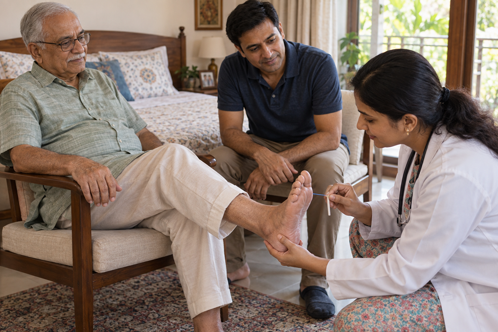
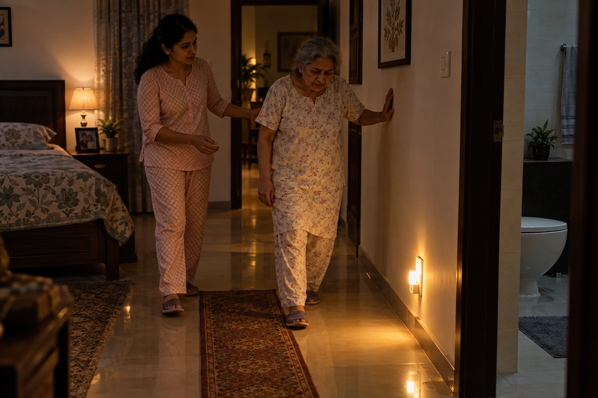
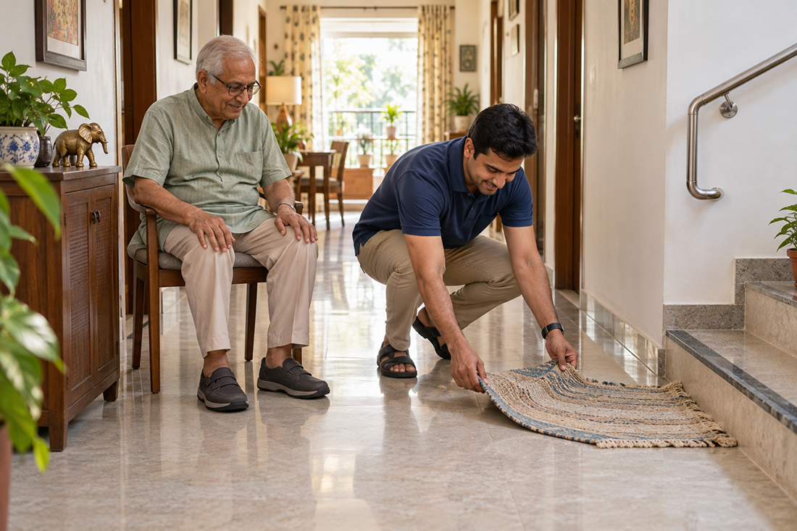
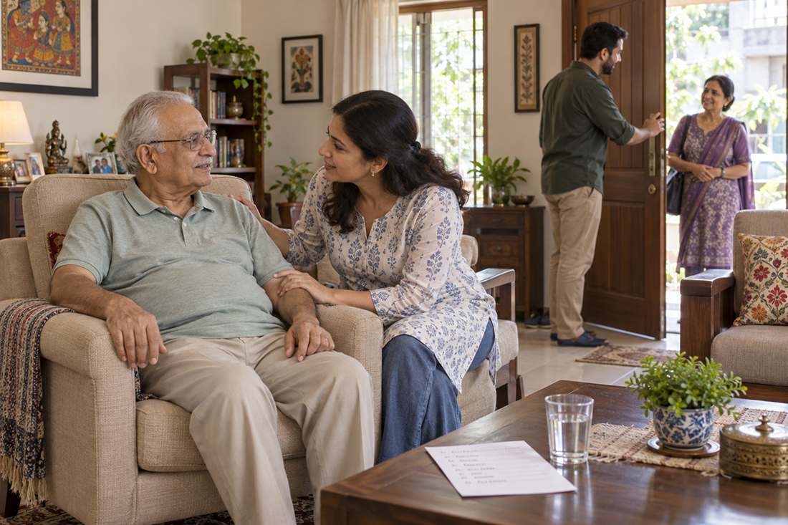

# Diabetes and Falls in Elderly: Why India's 100 Million Diabetics Need Extra Floor Safety

Most families know that diabetes can affect the eyes, kidneys, heart, and blood vessels. But another connection often goes unnoticed: diabetes and falls in elderly people. If your parent has lived with diabetes for years, you may already help with medicines, diet, doctor visits, and blood sugar checks. You may even have noticed that your mother walks more carefully than before. Perhaps she says her feet feel numb. Maybe your father has started holding the wall while walking at night.

These signs can be easy to dismiss as part of aging. But diabetes can affect the nerves in the feet, vision, muscle strength and balance. Low blood sugar can also cause dizziness, confusion or weakness. Together, these problems can make a simple walk across the house much less safe. For an adult child caring for a diabetic parent, this changes the question.

It is not only, "Is their blood sugar under control?"

It is also, "Can they safely feel the floor beneath their feet?"

## Diabetes Doesn't Just Affect Sugar; It Affects the Floor Under Your Parent's Feet

One of the most common long-term complications of diabetes is nerve damage. This is often called **diabetic peripheral neuropathy in India.** The nerves in the feet and lower legs are especially vulnerable. Over time, a person may develop tingling, burning, weakness, or numbness. That numbness matters when your parents walk.

A healthy foot constantly sends information to the brain. It helps a person know whether the floor is hard, uneven, slippery, or tilted. When sensation is reduced, some of that information is lost. Your parent may not notice a small change in the floor. They may not feel that one foot is placed differently from the other. They may also struggle to sense where their feet are when walking in poor light. This is one reason **diabetes fall risk in seniors** deserves more attention.

The problem is not simply that diabetes and falls in elderly makes someone "weak." It can change how safely they interact with their surroundings.

## The Five Ways Diabetes Raises Fall Risk

### 1. Numbness Can Make Walking Less Stable

Numbness in feet elderly shouldn't always be blamed on age. Long-term high blood sugar can damage nerves. When the feet lose sensation, your parent may not feel the floor properly. This can make walking on uneven surfaces harder. It can also make it more difficult to recover after a small stumble.

Watch for signs such as:

- Tingling or burning in the feet
- Reduced feeling in the toes
- Feeling as though the feet are "asleep"
- Trouble knowing where the feet are while walking
- Increased unsteadiness
- Avoiding stairs or uneven ground

If your parent regularly describes these symptoms, mention them during their next medical appointment.

### 2. Low Blood Sugar Can Cause Sudden Falls

Diabetes does not only create problems when blood sugar is high. Hypoglycemia in elderly people can also increase the risk of a fall. Low blood sugar may cause sweating, shaking, hunger, dizziness, weakness, confusion, or difficulty concentrating. In more serious cases, a person can lose consciousness.

Imagine your parent getting up at night to use the bathroom. If their blood sugar is low, they may feel dizzy or confused before they have even reached the hallway. That can turn a routine movement into a fall. If your parent takes medicines that can cause low blood sugar, ask their doctor what symptoms to watch for and what to do when they occur.

**_Do not change diabetes medication doses without medical advice._**

### 3. Vision Problems Can Hide Hazards

Diabetes can affect the eyes. Some people develop diabetic retinopathy or other vision problems. Poor vision makes common household hazards harder to spot. A loose mat. A step between rooms. A wet bathroom floor. A cable across the hallway. Your parent may see these hazards too late.

Vision and foot sensation can also become a difficult combination. If the feet cannot feel the floor properly and the eyes cannot see it clearly, the brain receives less information about where the body is standing.

<a href="https://eyeagle.ai/blogs/importance-of-regular-vision-checks" style="color:#CC0000; text-decoration:none;">Importance of Regular Vision Checks for Fall Prevention</a>

### 4. Weakness Can Affect Balance

Diabetes can occur alongside other health problems that affect movement and strength. Older adults may also lose muscle strength as they age. If a parent already has reduced sensation in their feet, weaker legs can make it harder to correct a loss of balance.

Getting up from a chair may become slower. Climbing stairs may require more effort. Turning quickly may feel uncomfortable. These changes are worth noticing early rather than waiting for a major fall.

<a href="https://eyeagle.ai/blogs/mobility-tips-for-seniors" style="color:#CC0000; text-decoration:none;">Gentle Mobility Tips to Increase your muscle strength</a>

### 5. Diabetes Often Comes With Other Risk Factors

A diabetic parent may also take several medicines for blood pressure, heart problems, or other conditions. Some medicines can cause dizziness or changes in blood pressure. Other health problems can affect walking, strength, or coordination. This is why **diabetic neuropathy in elderly people in India** should not be viewed in isolation. Fall risk often comes from several small problems adding up.

- A little numbness.
- A little poor vision.
- A little weakness.
- A slippery bathroom floor.

Together, they can create a serious risk.

## Why India Makes This Worse

Diabetes and falls in elderly are a major health concern in India, with a very large number of people living with the condition. But the fall-risk conversation often receives far less attention than blood sugar, diet, and medication. The home environment can also create challenges. Many Indian homes have:

- Marble or polished stone flooring
- Slippery bathroom tiles
- Loose rugs and mats
- Uneven thresholds between rooms
- Stairs without secure handrails
- Poor lighting in hallways
- Clutter around beds and walking paths
- Raised bathroom or balcony thresholds
- Footwear that does not fit securely

For a person with normal sensation and good balance, some of these hazards may be manageable. For a diabetic senior with numb feet or poor vision, they can be much more dangerous. There is also a common family habit worth changing: treating a fall as something that "just happens at this age." <a href="https://eyeagle.ai/blogs/falls-kill-more-seniors-than-you-think" style="color:#CC0000; text-decoration:none;">Age can increase fall risk.</a> But a new change in walking, repeated stumbling or a fall should not automatically be dismissed as ageing.

## How to Check If Your Parent Is Already at Elevated Risk

You do not need to wait for a serious fall to start paying attention. Start by observing how your parent moves around the home. Ask yourself:

- **Do they hold furniture or walls while walking?** This can be an early sign that they do not feel steady.
- **Do they complain about numbness or tingling in their feet?** This may indicate nerve problems that need medical assessment.
- **Have they stumbled recently?** Even a stumble without an injury is worth noticing.
- **Do they get dizzy when they stand up?** Tell their doctor, especially if it happens regularly.
- **Do they have trouble seeing steps or objects on the floor?** Vision problems can increase fall risk.
- **Do they avoid walking at night?** Poor lighting can make an already difficult situation worse.
- **Do they have trouble getting up from a chair?** Difficulty standing may point to reduced lower-body strength.
- **Do they wear loose slippers around the house?** Footwear can make a meaningful difference to stability.

If you answered "yes" to several of these questions, it is worth discussing fall risk with your parent's doctor. You can
also consider a 24/7 emergency response system like <a href="https://eyeagle.ai/" style="color:#CC0000; text-decoration:none;">EyEagle</a> for your parents’ home. With EyEagle’s safety assessment, you can also identify the risk factors that need attention.

## What Home Safety Should Look Like for a Diabetic Parent

You do not need to turn the house into a hospital. The goal is simple: make the path your parent uses every day easier to see, feel, and walk through safely.

### Keep Walking Areas Clear

Remove unnecessary furniture, boxes, wires, and other objects from common walking paths. Pay special attention to the route between the bedroom and bathroom.

### Be Careful With Rugs and Mats

Loose rugs can move underfoot. If a mat is necessary, make sure it is firmly secured and does not curl at the edges.

### Improve Bathroom Safety

Bathrooms are one of the most important areas to check. Use suitable non-slip surfaces. Keep the floor dry when possible. Consider enhancements wherever necessary. For an added layer of protection, there is EyEagle. <a href="https://eyeagle.ai/protection" style="color:#CC0000; text-decoration:none;">EyEagle offers safety installments</a> like grab bars, hand rails, anti-slip mats and tapes as part of its package to make bathroom usage for elderly safer and better.

### Improve Lighting

Good lighting matters even more when your parent has vision problems or reduced sensation in their feet. Use brighter lighting on stairs, hallways, and bathroom routes. A night light can help your parent see the path without walking through a dark room.

### Look at Footwear

**Foot care for diabetic elderly people** involves more than checking for cuts. Shoes should fit properly and provide a secure base. Avoid walking barefoot if your parent has reduced sensation in their feet. Loose slippers that slide easily can also be a problem.

### Check the Floor Itself

Look for:

- Uneven flooring
- Raised edges
- Broken tiles
- Slippery surfaces
- Sudden changes in floor height
- Cables crossing walking paths

The safer the walking surface, the less your parent has to compensate for reduced balance or sensation.

## The Emergency That Diabetics Face Alone

One of the most worrying situations is a fall that happens when nobody is around. Your parent may fall while getting out of bed at night. They may fall in the bathroom. They may become dizzy because of low blood sugar. If they cannot get up or reach a phone, a small accident can become a prolonged emergency. This is particularly important for parents who live alone or spend several hours alone during the day.

For such situations, having a response system can add an important layer of protection. That is where EyEagle comes in. EyEagle combines connected devices, family alerts and a 24/7 human emergency response system to help your parents get the support they need, even when you are far away.

<a href="https://eyeagle.ai/solution" style="color:#CC0000; text-decoration:none;">Learn more about EyEagle.</a>

## A Practical Plan for Diabetic Fall Prevention

Fall prevention works best when the family treats it as part of everyday diabetes and fall in elderly care.

### Step 1: Notice the Signs

Pay attention to numbness, tingling, dizziness, weakness, vision changes and changes in walking. Do not ignore repeated small stumbles.

### Step 2: Tell the Doctor

Mention falls and balance problems during diabetes appointments. Ask whether your parent's medicines, blood sugar levels, vision, nerve function or other conditions could be contributing to the problem.

### Step 3: Check the Feet

Look at your parent's feet regularly for cuts, blisters, swelling, redness or other changes. If sensation is reduced, they may not notice an injury themselves. Seek medical advice about any wound that does not look normal or is not healing.

### Step 4: Make the Home Safer

Start with the areas your parent uses most.

- Clear the bedroom-to-bathroom route.
- Secure loose mats.
- Improve lighting.
- Check stairs and bathroom floors.
- Remove trip hazards.

### Step 5: Review Footwear

Make sure shoes and indoor footwear fit securely. Avoid footwear that slips off easily.

### Step 6: Have a Fall Plan

Decide what your parent should do if they fall. Keep a phone or emergency contact method within easy reach. If they hit their head, have severe pain, cannot stand, lose consciousness or seem confused after a fall, seek urgent medical care.

### Step 7: Keep the Conversation Going

Do not make this a one-time house inspection. Your parent's walking ability can change over time. Recheck the home whenever their vision, balance, strength, or sensation changes.

## Conclusion

For years, families have learned to watch diabetes through numbers: blood sugar readings, HbA1c results, and medication schedules. Those numbers matter. But when you are caring for an ageing parent with diabetes, look beyond the glucose meter too. Watch how they walk. Ask whether they can feel their feet. Notice whether they hold the wall. Check whether they can see the step in front of them. Then look at the floor beneath them.

Diabetes and falls in elderly people are connected in ways many families do not realise. A safer home cannot remove every risk, but it can remove many avoidable ones. For the adult child who has spent years helping a parent manage diabetes, fall prevention is simply another part of looking after them.

### **Disclaimer**

**_This article is intended for general informational and educational purposes only. It is not a substitute for professional medical advice, diagnosis, or treatment. Every person's health and diabetes management needs are different. If you or your family member experiences symptoms such as repeated falls, dizziness, numbness, weakness, vision changes, low blood sugar, or any other concerning symptoms, consult a qualified healthcare professional for appropriate evaluation and advice. Do not start, stop, or change any medication or treatment based solely on the information provided in this article. In an emergency or after a serious fall or injury, seek immediate medical attention._**

## FAQ

### Can diabetes increase the risk of falls in elderly people?

Yes. Diabetes can contribute to fall risk through nerve damage, reduced sensation in the feet, vision problems, low blood sugar, weakness, and other related health issues.

### How does diabetic neuropathy cause falls?

Diabetic neuropathy can reduce sensation in the feet and legs. A person may have difficulty feeling the floor or knowing exactly where their feet are. This can make walking and recovering from a stumble more difficult.

### Is numbness in the feet normal in elderly people with diabetes?

Numbness should not simply be considered a normal part of ageing. It can be a sign of nerve damage. A doctor should assess persistent numbness, tingling or burning in the feet.

### What is diabetic peripheral neuropathy?

Diabetic peripheral neuropathy is nerve damage linked to diabetes. It commonly affects the feet and legs. Symptoms can include numbness, tingling, burning, pain, or reduced sensation.

### Can low blood sugar cause an elderly person to fall?

Yes. Low blood sugar can cause dizziness, weakness, confusion, shaking and poor coordination. In severe cases, it can cause loss of consciousness.

### What should I do if my diabetic parent keeps stumbling?

Do not ignore repeated stumbling. Talk to their doctor about it. Their vision, foot sensation, balance, medicines, blood sugar levels, and muscle strength may all need to be considered.

### What are the best home safety changes for a diabetic senior?

Start with the basics: remove trip hazards, secure loose rugs, improve lighting, make the bathroom safer, keep walking paths clear, and check that footwear fits securely.

### Should a diabetic elderly person walk barefoot at home?

If your parent has reduced sensation in their feet, walking barefoot can make it easier to miss injuries or step on something harmful. Ask their healthcare professional what footwear is most suitable for them.

### How often should a diabetic senior check their feet?

Regular foot checks are important, especially when sensation is reduced. Your parent's healthcare professional can advise how often they should have their feet examined and what changes require medical attention.

### Can a fall be a sign that diabetes is getting worse?

A fall does not automatically mean that diabetes is worsening. However, a new fall or repeated loss of balance deserves attention. Diabetes-related nerve, vision, or blood sugar problems may be contributing, along with other causes.
