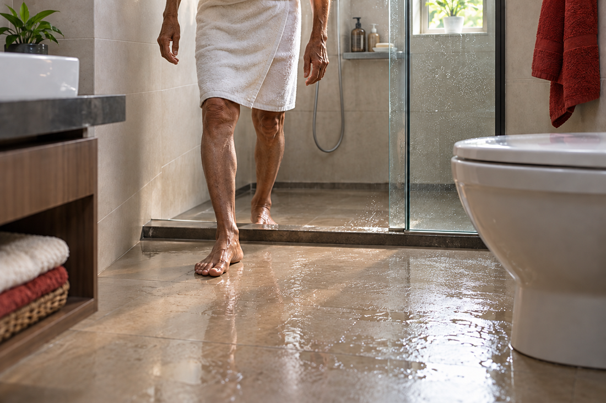
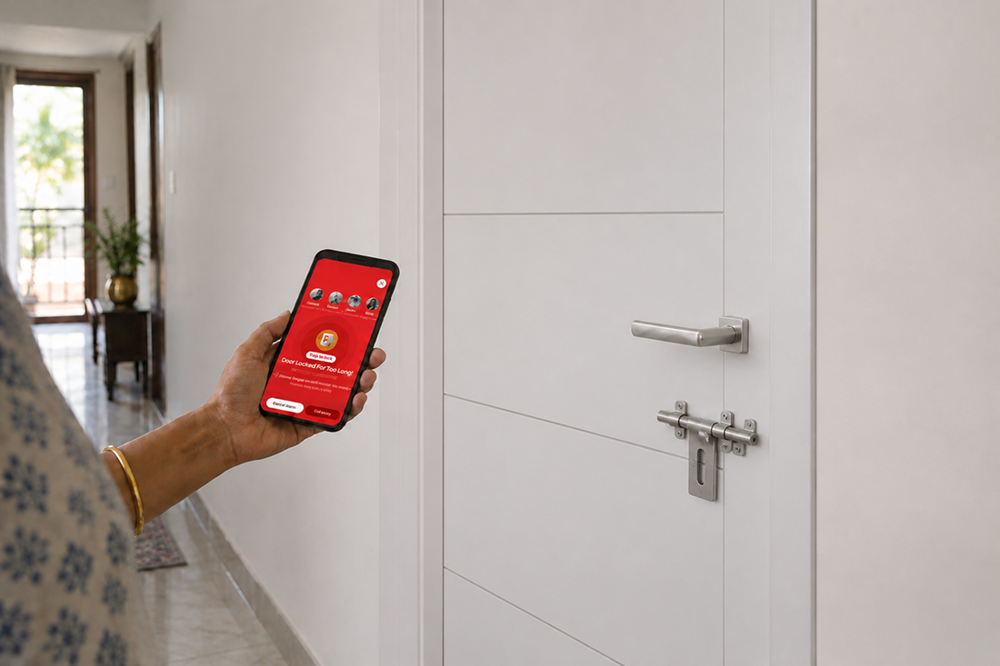

# You track food deliveries, but not your parents’ safety

We live in a time where everything is trackable. From the moment you place a food order, you can see exactly where it is, how far it has traveled, and when it will reach you. We use technology for convenience, comfort, and control, yet when it comes to protecting our aging parents, tools like an <a href="https://eyeagle.ai/" style="color:#CC0000; text-decoration:none;">elderly fall detection system</a> or a bathroom emergency alert solution are often not even considered.

You get notifications when your cab is nearby, when your package leaves the warehouse, and even when someone views your social media story. Technology keeps us constantly updated about the smallest details of our daily lives. But there is one thing many of us do not actively monitor: the <a href="https://eyeagle.ai/blogs/how-to-ensure-safety-for-parents-living-alone" style="color:#CC0000; text-decoration:none;">safety of our aging parents at home.</a> Especially in the one room where the risk is highest, the bathroom.

## The hidden danger inside the bathroom

Bathrooms are designed for functionality, not safety. The combination of smooth tiles, water on the floor, soap residue, and hard surfaces makes them one of the most hazardous spaces for older adults. As people age, their balance, muscle strength, and reflexes naturally decline. Even a small misstep can result in a serious fall. For younger individuals, a slip may cause minor bruising. For elderly parents, it can lead to fractures, head injuries, or long-term mobility issues.

This is why fall prevention for elderly parents must begin with understanding where the risk truly lies. A fall in the bathroom is not just an accident. It can be a life-changing event.

## Why bathroom falls are more serious than you think

Many families underestimate <a href="https://eyeagle.ai/blogs/falls-kill-more-seniors-than-you-think" style="color:#CC0000; text-decoration:none;">how dangerous a fall can be for seniors.</a> The injury itself is concerning, but what often makes the situation worse is the delay in getting help. If an elderly person falls and cannot get up, the time spent lying on the floor can lead to serious complications such as dehydration, internal injuries, or shock. In medical situations, early response can significantly reduce the severity of outcomes. Unfortunately, bathrooms are private spaces. Doors are closed. Noise may not travel far. If your parent lives alone or spends long periods unattended, a fall can go unnoticed for hours.

This is where an elderly fall detection system becomes critically important.

## Independence should not mean vulnerability

Many aging parents deeply value their independence. They want to manage their own routines, maintain their dignity, and continue living comfortably in their own homes. As children, we respect that independence. At the same time, we worry. We do not want to invade their privacy. We do not want to make them feel dependent. But we also cannot ignore the risks that come with aging.

<a href="https://eyeagle.ai/device" style="color:#CC0000; text-decoration:none;">Modern bathroom safety solutions for the elderly</a> allow families to balance both concerns. They offer protection without constant supervision. There are no intrusive cameras or uncomfortable monitoring systems. Instead, there are intelligent technologies designed to detect emergencies and alert caregivers immediately.

## Prevention is essential, but so is timely response

Many families start by improving bathroom safety with preventive measures. They install sturdy grab bars, place anti-slip mats, use raised toilet seats, and ensure proper lighting. These upgrades are extremely important and form the foundation of <a href="https://eyeagle.ai/blogs/how-to-make-your-home-safe" style="color:#CC0000; text-decoration:none;">fall prevention for elderly parents.</a> A safer bathroom environment significantly reduces the risk of slips and injuries. Preventive products like grab bars and anti-skid solutions play a crucial role in supporting stability and confidence.

However, even with the best precautions in place, emergencies can still happen. An elderly parent may feel dizzy. They may experience weakness. They may slip, feel unwell, or simply be unable to unlock the door. In such situations, the biggest danger is not just the incident, but the delay in response.

This is where a smart bathroom emergency alert system becomes essential.

## How Eyeagle smartlock adds a critical layer of protection

EyEagle’s SmartLock system is designed to detect when a bathroom door remains locked for an unusually long period. If the door stays locked beyond a preset time, the system instantly sends an alert to caregivers or family members.

This approach respects privacy while ensuring safety. If everything is normal, there are no interruptions. If something is wrong, help is notified immediately.

## The emotional reality of distance

In today’s world, <a href="https://eyeagle.ai/blogs/caring-for-elderly-parents-while-working-abroad" style="color:#CC0000; text-decoration:none;">many children live far away from their parents</a> due to work or personal commitments. You may call them daily. They may reassure you that everything is fine. But accidents do not schedule themselves around phone calls. Between two conversations, a fall can happen. The fear is not just that your parent might slip. The deeper fear is that you would not know in time. This silent uncertainty is what makes families anxious.

<a href="https://eyeagle.ai/device" style="color:#CC0000; text-decoration:none;">A bathroom safety alarm for elderly individuals</a> provides reassurance. It ensures that if something goes wrong, you are informed immediately. You do not have to rely solely on hope or routine check-ins.

## A shift in how we think about responsibility

Caring for aging parents today looks different from how it did a generation ago. Families are more geographically dispersed. Work schedules are demanding. Physical presence is not always possible. However, responsibility has evolved alongside technology. If we use technology to track deliveries, monitor fitness, and manage finances, it makes sense to use it for something far more important: the safety of the people who raised us. <a href="https://eyeagle.ai/device" style="color:#CC0000; text-decoration:none;">Installing a fall detection device for seniors</a> is not an overreaction. It is a thoughtful step toward proactive care.

It says, “I may not be there every minute, but I have ensured that help will reach you when needed.”

## Do not wait for the first fall

Many families only consider safety upgrades after a serious accident. Unfortunately, recovery from falls becomes harder with age. Even a single incident can lead to reduced confidence, limited mobility, and increased dependence. The goal should not be to react after an emergency. The goal should be to prevent complications before they occur.

An elderly fall detection system, a smart lock, does not eliminate every risk, but it drastically reduces the danger of delayed assistance. That alone can save lives.

## The question that matters

We have normalised tracking everything in our daily lives. The real question is simple: if we can track a food delivery in real time, why would we not track something far more valuable, our parents’ safety? Bathroom falls are silent and sudden. But with the right elderly bathroom safety solutions in place, they do not have to become tragedies.

**Technology has made protection possible. The decision to use it is ours.**
