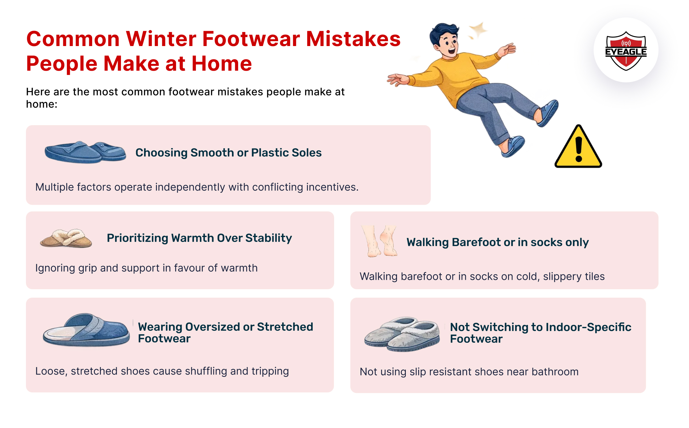

# Why Footwear Choice Matters More in Winter?

Winter changes many things in our daily lives. Mornings feel colder, floors stay damp longer, and movements become a little hurried as we try to escape the chill. Yet, one detail most people overlook during this season is what they wear on their feet, especially indoors. While winter jackets and scarves get attention, footwear often doesn’t, even though it plays a critical role in preventing slips and falls at home. When winter arrives, safety risks quietly increase, not just outdoors, but inside our homes as well. Understanding winter footwear safety is essential to protecting ourselves and our families, particularly elderly parents and children.

## How Winter Increases Slip-and-Fall Risks Indoors

Many people associate winter accidents with icy roads or wet pavements outside. In reality, a large number of <a href="https://eyeagle.ai/blogs/why-falls-are-the-biggest-threat-to-seniors" style="color:#CC0000; text-decoration:none;" target="_blank" rel="noopener noreferrer">winter-related accidents happen inside homes</a>. During colder months, moisture tends to linger longer on floors due to reduced ventilation and lower temperatures. Bathrooms, kitchens, and tiled hallways become particularly risky. Common winter factors that increase fall risk indoors include:

- Wet slippers or socks entering the house
- Condensation on tiled floors
- Cold surfaces that reduce natural grip
- Rushed movements during chilly mornings or nights

These small changes in the environment significantly raise the chances of slipping, making winter slip and fall prevention a necessity rather than an option.

## Common Winter Footwear Mistakes People Make at Home

Here are the **most common footwear mistakes people make in winter**, especially indoors and around bathrooms:

- Choosing **smooth or plastic soles** that lose grip on cold floor
- Using **worn-out winter slippers** with flattened soles
- Prioritising **warmth over stability**, ignoring grip and support
- Walking barefoot or in **socks only** on cold, slippery tiles
- Wearing **oversized or stretched footwear** that causes shuffling
- Not switching to **indoor-specific footwear** near bathrooms and bedrooms

These choices might seem harmless, but during winter, they significantly reduce stability. Choosing safe footwear for winter indoors is just as important as choosing the right shoes outside.

## Bathrooms: The Most Dangerous Space in Winter

Bathrooms are already one of the <a href="https://eyeagle.ai/blogs/falls-kill-more-seniors-than-you-think" style="color:#CC0000; text-decoration:none;" target="_blank" rel="noopener noreferrer">most accident-prone areas in a home</a>. During winter, the risk multiplies. Steam from hot water creates condensation, while floors stay wet longer due to low temperatures. Combined with smooth tiles, this creates an ideal environment for slips.

Wet bathroom floors are a leading cause of winter-related falls. Even a momentary loss of balance near the toilet or shower can result in serious injuries. This makes bathroom safety in winter a critical concern for every household.

Support grab bars near toilets and inside showers help maintain balance during sitting, standing, and bathing. Anti-skid mats and thoughtfully designed safety fittings further improve stability. <a href="https://eyeagle.ai/solution" style="color:#CC0000; text-decoration:none;" target="_blank" rel="noopener noreferrer">The EyEagle bathroom safety fittings</a> are designed to blend seamlessly into homes while offering dependable support, making everyday movements safer, particularly during winter.

## Why Seniors Face Higher Risk During Winter

Elderly individuals are particularly vulnerable during colder months. <a href="https://eyeagle.ai/blogs/balance-problems-in-elderly" style="color:#CC0000; text-decoration:none;" target="_blank" rel="noopener noreferrer">Age-related factors</a> such as reduced muscle strength, joint stiffness, and slower reflexes become more pronounced in winter. Cold temperatures can further limit mobility, making balance recovery difficult after a slip.

Statistics consistently show an increase in falls among seniors in winter, many of which occur at home. What makes these incidents more concerning is that recovery can take longer, and complications can be more severe.

Ensuring safety for elderly during winter requires <a href="https://eyeagle.ai/blogs/step-by-step-bathroom-safety-tips-for-seniors" style="color:#CC0000; text-decoration:none;" target="_blank" rel="noopener noreferrer">thoughtful preventive steps</a>, starting with appropriate footwear and extending to home safety measures.

## What Makes Footwear “Winter-Safe” Indoors

Not all footwear is created equal, especially during winter. There are specific choices that one needs to follow when choosing winter footwear for indoor use. Here are some pointers to keep in mind:

- Anti-skid or textured soles for better grip
- Proper heel support to improve balance
- A snug fit that prevents slipping off
- Materials that resist moisture absorption
- Choose closed-back, slip-resistant footwear for indoors during winter
- Avoid loose slippers or worn-out soles that reduce grip on cold floors
- Replace footwear once soles become smooth or uneven

Such footwear reduces the likelihood of slipping on damp surfaces and helps maintain stability during movement. Investing in the right indoor footwear is a simple yet powerful step toward preventing slips during winter.

## Simple Winter Footwear Safety Habits That Make a Big Difference

Small daily habits can have a major impact on winter safety:

- Change wet slippers immediately after use
- Keep bathroom floors dry and well-lit
- Avoid rushing during early mornings or late nights
- Ensure seniors always wear proper indoor footwear
- Keep a dedicated indoor pair near the bed and bathroom

These habits reinforce winter safety at home and help prevent accidents before they occur.

## Safety Is a Daily Choice

Most winter accidents don’t happen suddenly; they build up through small, overlooked risks. A slippery floor, the wrong pair of slippers, or a rushed step can quickly turn into an avoidable injury. Awareness and preparation are far more effective than reacting after an accident occurs.

Winter footwear choices may seem minor, but they influence every step we take indoors during this season.

## Conclusion: Walk Safer This Winter

Winter demands a shift in how we think about safety, especially at home. From choosing the right indoor footwear to improving bathroom safety, every small decision matters. Winter footwear safety is not just about comfort; it’s about balance, prevention, and care for ourselves and our loved ones.

By combining proper footwear with thoughtful home safety measures, we can reduce winter-related accidents and move through the season with greater confidence and peace of mind. After all, the goal isn’t just to get through winter, but to do so safely.
