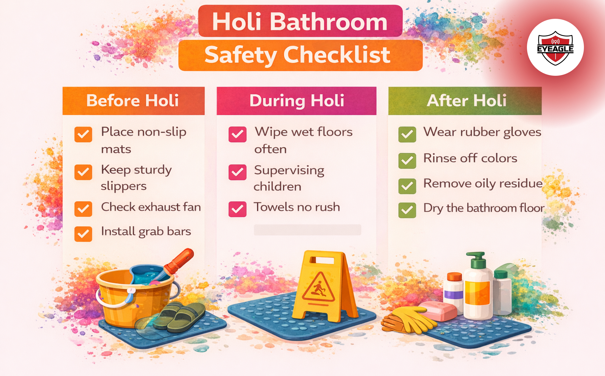

# Safe Holi: Don’t Let Slippery Bathrooms Ruin the Celebration

Holi is one of the most joyful festivals in India, a vibrant celebration of colors, laughter, music, and togetherness. From playful water fights to buckets of bright gulal, the day is filled with excitement for children, adults, and elders alike. But once the celebrations wind down, an unexpected danger quietly enters many homes: slippery bathrooms. In the rush to wash off colors, bathrooms often become waterlogged, stained with powders and oils, and dangerously slick. Unfortunately, what begins as festive fun can quickly turn into painful injuries. Practicing Holi safety at home means not just enjoying the festival responsibly outdoors, but also ensuring your home remains accident-free afterwards.

Let’s explore how you can prevent slippery bathroom accidents and keep your loved ones safe this Holi.

## The Hidden Risk After the Colors Fade

During Holi, most families head straight to the bathroom after hours of playing with colors. Showers run longer than usual. Buckets overflow. Wet clothes pile up. Colored powders mix with water and oil-based dyes, forming a thin, slippery layer on tiles.

This creates a perfect environment for:

- Slippery bathroom accidents
- Falls on wet tiles
- Injuries to elderly family members
- Children slipping while rushing in and out

**Bathrooms are already one of the most accident-prone areas in any home.** Add water, soap, oil-based colors, hurried movement, and the risk increases significantly. Being aware of wet bathroom floor safety can prevent unnecessary injuries during what should be a happy occasion.

## Why Bathrooms Become Extra Slippery During Holi

**1. Oil-Based Colors**

Many people apply coconut or mustard oil before playing Holi to protect their skin. When washed off, the oil coats bathroom floors and tiles, reducing friction.

**2. Excess Water Usage**

Multiple back-to-back showers mean the floor rarely gets time to dry.

**3. Colored Powders + Water Mix**

Dry gulal turns into a muddy, slick paste when mixed with water.

**4. Rushing & Excitement**

Children often run in and out of the bathroom, increasing the chance of slipping.

Understanding these risks is the first step toward effective bathroom fall prevention.

## Who is Most at Risk?

While everyone is vulnerable, certain family members need extra attention:

- Elderly parents or grandparents
- Young children
- Pregnant women
- Anyone recovering from injury or surgery

For them, a simple slip can result in fractures, head injuries, or long recovery periods. That’s why preventing falls at home during Holi is especially important.

## Holi Bathroom Safety Tips Every Family Should Follow

Here are practical and easy-to-implement Holi bathroom safety tips to ensure your celebration doesn’t end in the emergency room.

**1. Place Anti-Slip Mats**

Keep rubber anti-slip mats both inside and outside the bathroom. Ensure they have a proper grip at the base.

**2. Wipe Between Showers**

After each person finishes bathing, quickly wipe down the floor with a mop or wiper. Do not wait until the end of the day.

**3. Use Bathroom Slippers**

Encourage everyone to wear non-slip bathroom footwear instead of walking barefoot.

**4. Improve Ventilation**

Keep windows open or exhaust fans running to help the floor dry faster.

**5. Install Grab Bars**

If you have elderly family members, grab bars near showers and toilets can significantly reduce the risk of bathroom falls.

**6. Keep Towels Within Reach**

Avoid stretching or stepping out with wet feet to grab a towel from another room.

**7. Supervise Children**

Make sure children don’t run into wet bathrooms unattended.

These small steps can significantly improve safety on wet bathroom floors during festival time.

## Post-Holi Cleaning Safety: What Most People Overlook

After everyone has bathed, the real work begins, cleaning up the aftermath. Practicing post-Holi cleaning safety is just as important as preventing accidents during the festival itself.

**Be Careful While Scrubbing**

Colored stains often require vigorous scrubbing. Make sure you:

- Wear rubber gloves
- Use a stable footing
- Avoid climbing on slippery surfaces

**Use Proper Cleaning Agents**

Some chemical cleaners can make floors temporarily more slippery before rinsing. Always rinse thoroughly.

**Dry Completely**

Do not leave the bathroom damp overnight. A dry floor is essential for bathroom fall prevention.

**Dispose of Wet Clothes Safely**

Don’t leave wet, color-soaked clothes scattered on the floor.

## Prevent Falls at Home During Holi: Beyond the Bathroom

Holi safety at home isn’t limited to bathrooms. Consider these additional areas:

- Balconies where water balloons are used
- Staircases with wet footprints
- Living rooms with spilled water
- Terraces where water play happens

Creating a safe home environment during festivals reflects proactive care for your family.

## Building a Culture of Safety at Home

Festivals are about celebration, but also about responsibility. Often, accidents happen not because of major negligence, but because of small oversights:

- “It will dry on its own.”
- “It’s just a little water.”
- “Nothing will happen.”

However, most household slips are avoidable. A few preventive measures can save weeks of pain, hospital visits, and emotional stress.

Making Holi safety at home a family conversation helps everyone stay mindful.

## Quick Holi Bathroom Safety Checklist

Before Holi:

- Keep anti-slip mats ready
- Arrange bathroom slippers
- Check exhaust fans
- Ensure grab bars are secure

During Holi:

- Wipe floors between showers
- Supervise kids
- Avoid rushing

After Holi:

- Deep clean safely
- Dry floors completely
- Remove oil residue thoroughly

This simple checklist can significantly reduce slippery bathroom accidents.

## When Prevention Matters the Most

Festivals bring families together, grandparents playing with grandchildren, parents laughing with kids, and friends sharing memories. Protecting that joy means looking beyond the visible excitement and identifying hidden risks.

A fall in the bathroom may seem like a small incident, but it can have <a href="https://eyeagle.ai/blogs/falls-kill-more-seniors-than-you-think" style="color:#CC0000; text-decoration:none;" target="_blank" rel="noopener noreferrer">serious consequences</a>, especially for elderly loved ones. Practicing thoughtful bathroom fall prevention ensures the only memories from Holi are colorful and happy ones.

To add protection at our homes, solutions like the <a href="https://eyeagle.ai/" style="color:#CC0000; text-decoration:none;" target="_blank" rel="noopener noreferrer">EyEagle Bathroom Prevention Kit</a> are designed to reduce slip risks and enhance bathroom safety at home.

## Final Thoughts

Holi is a celebration of life, color, and unity. Don’t let a preventable accident overshadow the spirit of the festival.

By focusing on:

- Wet bathroom floor safety
- Holi bathroom safety tips
- Post-Holi cleaning safety
- Preventing falls at home during Holi

You create a safer, happier environment for everyone. This year, along with colors and sweets, gift your family something even more valuable: safety.

Wishing you a joyful and accident-free Holi.
