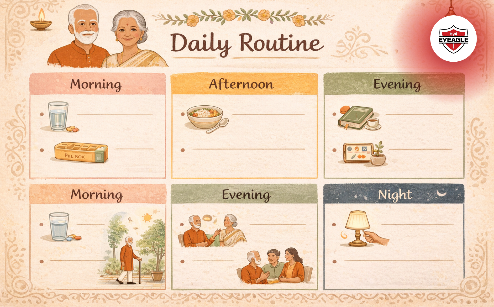

# Why protecting our elders at home matters more than ever

In every Indian home, elders are the silent pillars who hold together generations with their wisdom, values, and experiences. Their presence brings a sense of warmth, **kabhi khushi** through their laughter, affection, and stories, and **kabhi gham** through the challenges that come with aging. As they grow older, their needs evolve, and the responsibility of caring for them gradually shifts onto the younger members of the family.

Today, with busy schedules and fast-paced lifestyles, it’s easy to overlook the small changes in their health, mobility, or emotional state. But protecting our elders at home is more than just monitoring their safety. It is about ensuring they feel respected, supported, and truly at home. Creating a safe and nurturing environment allows them to live & thrive physically, emotionally, and socially.

## Understanding the needs of aging parents

As parents age, their physical abilities, cognitive functions, and emotional needs change. Some may face mobility issues, chronic health conditions, memory challenges, or social isolation. Recognizing these shifts early helps families provide timely support.

Caring for aging parents at home requires a blend of caregiving, patience, and thoughtful planning. A little awareness goes a long way in preventing accidents and promoting overall elderly health and wellness.

## Creating a safe home environment for elders

A home is meant to be a sanctuary. But for seniors, everyday spaces can become risky without proper support. A well-designed and <a href="https://eyeagle.ai/blogs/how-to-make-your-home-safe" style="color:#CC0000; text-decoration:none;" target="_blank" rel="noopener noreferrer">safe home environment for elders</a> reduces hazards and boosts independence.

### 1. Fall-prevention strategies for seniors

Falls are the most common cause of injury in older adults. To minimize risks:

- Ensure adequate lighting in hallways, staircases, and bathrooms.

- Remove loose rugs and clutter from floors.

- Install grab bars in bathrooms and anti-slip mats near wet areas.

For enhanced protection, consider using <a href="https://eyeagle.ai/" style="color:#CC0000; text-decoration:none;" target="_blank" rel="noopener noreferrer">EyEagle bathroom safety fittings</a> such as anti-slip mats & grab bars, designed specifically to prevent bathroom falls.

- Add handrails on both sides of staircases.

- Place frequently used items at reachable heights to avoid bending or climbing.

- Encourage the use of supportive footwear.

Small changes can prevent big accidents.

### 2. Regular medical check-ups

<a href="https://eyeagle.ai/blogs/regular-health-checkups-for-seniors" style="color:#CC0000; text-decoration:none;" target="_blank" rel="noopener noreferrer">Schedule routine health assessments</a> to keep track of:

- Blood pressure, sugar levels, and cholesterol

- Vision and hearing

- Bone density

- Medication management

Maintain an updated health file with doctor contacts, prescriptions, and emergency numbers.

### 3. Medication management

Seniors often struggle with remembering doses or timings. To simplify:

- Use pill organizers or reminder apps

- Label medicines clearly

- Conduct periodic medication reviews with a doctor

- Ensure medicines are stored safely but easily accessible

### 4. Encourage social interaction

Loneliness can lead to depression, anxiety, and cognitive decline. Help elders stay engaged by:

- Inviting relatives and friends regularly
- Encouraging community gatherings or senior clubs
- Allowing them to participate in family decisions
- Scheduling calls with long-distance relatives

### 5. Respect their identity and choices

Aging can sometimes make elders feel sidelined. Empower them by:

- Asking for their opinions
- Allowing them to make daily choices
- Respecting their routines and preferences
- Celebrating traditions and involving them in rituals

Love and dignity uplift their spirit more than anything else.

### 6. Assistive devices and home modifications

Simple tools can transform daily living:

- Walking sticks or walkers
- Raised toilet seats
- Non-slip footwear
- Adjustable beds
- Motion-sensor lights

These support safe movement without diminishing autonomy.

### 7. Create a daily care routine

A structured routine ensures seniors feel secure and reduces stress for caregivers. Include:

- Meal timings
- Medication reminders
- Physical activities
- Rest periods
- Entertainment or hobbies

### 8. Nutrition for elderly health

Healthy eating supports energy, immunity, and mood.

- Include whole grains, fruits, vegetables, nuts, and protein-rich foods.
- Offer easy-to-digest meals.
- Ensure proper hydration.
- Customize diets based on medical conditions.

<a href="https://eyeagle.ai/blogs/diet-and-nutrition-in-healthy-aging/" style="color:#CC0000; text-decoration:none;" target="_blank" rel="noopener noreferrer">Know more about the role of diet and nutrition in healthy aging</a>

### 9. Divide tasks mindfully

Identify responsibilities based on strengths:

- One member handles medical visits
- Another manages finances
- Someone takes charge of meals and daily monitoring
- Younger members can be involved in companionship

Balanced caregiving prevents burnout.

### 10. Recognize caregiver stress

Family caregivers often forget to care for themselves.
Watch for signs of:

- Fatigue
- Irritability
- Stress or emotional strain

Encourage breaks, support groups, and self-care practices.

## Building a home filled with Khushi, not Gham

Caring for our elders is one of the most meaningful responsibilities we carry as a family. Their presence fills our homes with warmth, wisdom, and a connection to our roots. Yet, aging brings its own set of challenges, physical limitations, emotional needs, and moments of vulnerability. Balancing these realities is where the true essence of **Kabhi Khushi Kabhie Gham** comes alive: moments of joy and togetherness, intertwined with the quiet duty of protection and care.

By creating a safe home environment for elders, supporting their health, listening to their emotions, and involving the whole family in caregiving, we build a life of comfort and dignity for them. Small daily acts, helping them walk safely, encouraging conversations, ensuring nutritious meals, or simply sitting beside them, carry deep emotional value.

In the end, protecting our elders at home is not about grand gestures; it’s about presence, patience, and consistent compassion. When we honour their needs and cherish their presence, we create a home where they feel safe, valued, and truly loved.

Because caring for them today ensures their blessings and wisdom continue to guide us tomorrow. That is the heart of family caregiving. That is the harmony of Khushi and Gham, a bond strengthened by love, respect, and gratitude.
