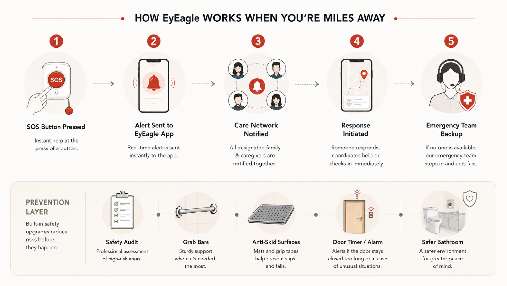

# How EyEagle Works When You’re Miles Away

Distance has become a normal part of modern life. Careers take us to new cities, children move abroad, and families often live hundreds, or even thousands, of kilometers apart. But one worry never really goes away: Are our aging parents safe at home when we’re not around? A missed call. A phone switched off for too long. A news story about an elderly fall. These moments can quickly turn into anxiety, especially when you’re far away and can’t check in physically. This is where smart safety for aging parents is no longer a luxury; it’s a necessity. Technologies like the <a href="https://eyeagle.ai/" style="color:#CC0000; text-decoration:none;" target="_blank" rel="noopener noreferrer">EyEagle fall alert device</a> are designed specifically for families who want peace of mind without invading their loved one’s independence.

Let’s explore how EyEagle works behind the scenes to keep elderly loved ones safe, connected, and protected, even when you’re miles away.

## What EyEagle Actually Does

EyEagle is not a wearable fall detector, nor an automatic fall-detection sensor system. Instead, it is a comprehensive bathroom safety system built around an emergency alert and response ecosystem.

### 1. Emergency SOS Button for Immediate Alerts

At the heart of EyEagle’s safety mechanism is the SOS button. Strategically placed in high-risk areas (like the bathroom), this button allows seniors to instantly send an alert if they experience a fall, slip, or any emergency that requires help.

Rather than relying on the person’s ability to reach a phone during an emergency, this one-touch button provides an intuitive and quick way to call for assistance, critical when every second counts.

### 2. Real-Time Alerts Through the EyEagle App

When the emergency SOS button is pressed, the system sends real-time alerts via the <a href="https://eyeagle.ai/app" style="color:#CC0000; text-decoration:none;" target="_blank" rel="noopener noreferrer">EyEagle mobile app</a> to all designated caregivers, family members, or emergency contacts. Even if you’re miles away, you receive instant notification of an emergency, so you can act immediately, coordinate support, or alert medical services. This alert system is the core of smart safety for aging parents: you no longer have to wonder whether they’re okay, you know, as soon as something happens.

### 3. Integrated Emergency Response Team

EyEagle goes beyond alerting family members. If caregivers aren’t available, its professional emergency response team steps in. The safety specialists will coordinate urgently the needed assistance, including reaching the home or contacting emergency services.

This “backup safety net” is invaluable for remote caregiving because you can’t always be online or immediately available to respond.

### 4. Proactive Home Safety Features

EyEagle doesn’t just alert; it also helps prevent accidents from happening in the first place:

- Professional safety audit of the bathroom.
- Installation of non-slip mats and grip tapes.
- High-visibility grab bars.
- Smart door timers and alarm triggers.

These physical safety upgrades drastically reduce the risk of slips and falls, especially in bathrooms, where many accidents occur. Safety by design is a core principle that sets EyEagle apart from devices that only alert after something goes wrong. Unlike many wearable or sensor-based products, the <a href="https://eyeagle.ai/device" style="color:#CC0000; text-decoration:none;" target="_blank" rel="noopener noreferrer">EyEagle fall alert device</a> focuses on immediate, user-initiated emergency alerts combined with professional response and home safety enhancements.

## Connected Care Through EyEagle App

<a href="https://eyeagle.ai/app" style="color:#CC0000; text-decoration:none;" target="_blank" rel="noopener noreferrer">EyeEagle App</a> is the companion mobile app that connects multiple family members and caregivers into a single safety network.
Through the app, you can:

- Add multiple caregivers (family, friends, professional caregivers).
- Get instant alerts and notifications.
- Coordinate responses or pass the alert to the emergency team.
- Customize who gets notified based on your preferences.

## Why This Matters for Families Living Far Apart

When you live far away from your elderly loved ones, seeing them daily isn’t possible. Traditional safety measures, such as phones, check-ins, or occasional visits, are not enough in emergencies.

### Instant Awareness

Immediate alerts ensure that critical situations are known the moment they happen.

### Coordinated Response

Family members and caregivers receive simultaneous alerts and can act together quickly.

### Professional Backup

If no one responds, EyEagle’s trained emergency team mobilizes assistance.

### Accident Prevention

By redesigning at-risk areas in the home, EyEagle reduces the chance of incidents before they occur.

Together, these capabilities help bridge the physical distance, so safety and care remain constant even when you’re not physically present.

## How EyEagle Compares With Other Safety Tech

Many elderly fall prevention technology systems today rely on wearable sensors or automatic fall detection, which may not always be accurate or accessible, especially for seniors who forget to wear them. What sets EyEagle apart is that it:

- Uses manual SOS alerts rather than complex sensors.
- Integrates physical safety improvements directly into the home.
- Provides a coordinated care network for alerts and responses.
- Includes real professional emergency response support.

This makes it one of the best elderly home safety systems for families who want both prevention and reliable emergency support.

## Final Thoughts: Peace of Mind From Any Distance

Caring for aging parents while living miles away doesn’t have to mean constant worry. With systems like EyEagle, you gain:

- Real-time emergency alerts
- Remote coordination with family and caregivers
- Professional emergency response backup
- Enhanced home safety features
- Confidence that help is always close at hand

Today’s caregiving doesn’t require you to be physically present 24/7, but it does require dependable technology that keeps your loved ones safe, supported, and connected, regardless of your location. By combining an easy-to-use SOS system, remote caregiver coordination, and professional emergency response, the EyEagle fall alert device offers a dependable solution for families managing elderly care from a distance.

EyEagle is that lifeline, bringing smart safety and peace of mind to families everywhere.
