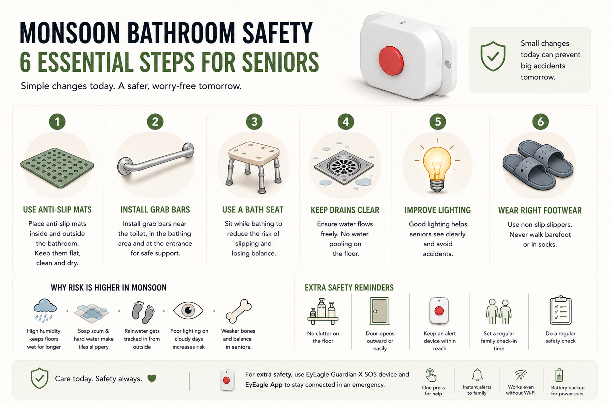

## Monsoon-Proof Your Indian Bathroom: A Senior's Survival Guide for the Rainy Season

The monsoon is here. The air smells fresh. The streets feel cool. But inside your bathroom, something quietly dangerous is happening. Every year, thousands of elderly Indians fall in their bathrooms during the rainy season. The floors get wetter. The humidity stays high. Water tracks in from the corridor. A single wrong step can change everything. If you have an elderly parent at home, or if you are a senior yourself, the monsoon bathroom safety guide is for you. We will walk you through every corner of your bathroom and show you exactly what to fix before the rains catch you off guard.

Let us get started.

## Why Monsoon Is the Most Dangerous Time for Seniors in the Bathroom

You may wonder, the bathroom is always wet. Why is the monsoon any different?

Here is the truth. Monsoon changes your bathroom in ways you may not notice right away.

- Humidity levels often exceed 80% in most Indian cities during July and August.
- Floors stay damp even after someone dries them because moisture hangs in the air.
- Soap scum and hard water deposits build up more quickly, making tiles extra slippery.
- People track rainwater from outside, making the area near the bathroom entrance especially wet.

For seniors, these conditions are serious. <a href="/blogs/balance-problems-in-elderly" style="color:#CC0000; text-decoration:none;">Older adults already have reduced balance</a>, slower reflexes, and weaker bones. A fall that a younger person shakes off can send an elderly person to the hospital with a hip fracture.

> According to Indian health data, <a href="/blogs/falls-kill-more-seniors-than-you-think" style="color:#CC0000; text-decoration:none;"> bathroom falls are one of the leading causes</a> of injury-related hospitalisation in adults above 60. Most of these falls happen in the monsoon months.

### Start Here: A Room-by-Room Safety Walk

Before you buy anything, walk through the bathroom with fresh eyes. Look at it the way a safety expert would. Ask yourself, if the floor were completely wet right now, where would someone slip?

### The Entrance Zone

This is the highest-risk spot during monsoon bathroom safety checks. Rainwater, wet slippers, and tracked-in mud all gather here.

- Is there a threshold or a small step? That becomes a trip hazard when wet.
- Is there enough space for a senior to turn and close the door without stepping on a wet patch?
- Does the floor outside the bathroom collect water after someone bathes?

### The Floor

The floor is where elderly accidents on wet floors happen. During the monsoon, inspect it carefully.

- Check if the slope runs toward the drain. If water pools anywhere, that is a danger zone.
- Look at old tiles. Smooth, polished tiles become nearly frictionless when wet. These need immediate attention.
- Check if any tiles are cracked or lifted at the edge. A raised edge catches toes.

### The Bathing Area

Whether your elderly family member uses a shower, a bucket, or a seated bath, the bathing area needs support.

- Is there something solid to hold while standing up after a bath? Many seniors grip the tap; this is dangerous. Taps can break or bend.
- Is there a sturdy stool or bath seat available? Sitting while bathing reduces the risk of losing balance significantly.
- Can the senior reach all the soap, shampoo, and water controls without stretching dangerously?

### The Toilet Area

Getting up from a low toilet seat is one of the most physically demanding movements for an elderly person. Add a wet floor, and the risk multiplies.

- Is there a grab bar near the toilet? If not, this is your top priority.
- Is the toilet seat at a comfortable height? A seat riser can help.
- Is the floor around the toilet free of clutter, like extra buckets and mugs that create a trip hazard?

## The Slippery Bathroom Monsoon Fix List: What to Do This Week

Once you have walked through the bathroom, it is time to act. Here are the changes that make the biggest difference for rainy season home safety in India. You can tackle most of these yourself in a weekend.

### 1. Lay Anti-Slip Mats, But Choose the Right Ones

Not all anti-slip mats are equal. During the monsoon, many mats curl at the edges or slide on wet tiles.

Look for a slatted mat with a rubber base that lets water drain through while your feet rest on a textured top. Replace mats that have lost their grip. Place one mat inside the bathing zone and one just outside the door.

**A useful tip:** let the mat dry fully before folding or storing it. Damp mats stored in corners grow mould and weaken faster.

### 2. Install Grab Bars. This Is Non-Negotiable

<a href="/protection" style="color:#CC0000; text-decoration:none;">Grab bars</a> are the single most effective way to prevent wet floor elderly falls. They give seniors something solid and fixed to hold as they stand, sit, turn, and move.

Install them in at least three spots:

- Near the toilet, on the side where the senior used to push up
- Inside the shower or bathing zone, at shoulder height
- Near the bathroom entrance, to help with stepping in and out

Make sure bars are fixed into the wall studs or with proper rawl plugs. A poorly fixed bar that gives way is worse than no bar at all.

For added peace of mind, EyEagle also offers the <a href="/device" style="color:#CC0000; text-decoration:none;">Guardian-X Alarm Device</a> and the <a href="/app" style="color:#CC0000; text-decoration:none;">EyEagle App</a>, allowing seniors to send an SOS alert instantly while notifying family members in real time during an emergency.

> EyEagle offers a professional bathroom safety audit and installs premium grab bars based on where YOUR senior actually moves. It is not a one-size-fits-all kit; it is tailored to your home

### 3. Add a Shower Stool or Bath Seat

A bath seat gives seniors the option to sit while bathing. This removes the need to balance on one leg while rinsing off. It also prevents the sudden dizziness that some elderly people feel when bending down.

Look for plastic stools with rubber feet. Avoid wooden stools that absorb water and become slippery when wet. Make sure the stool is steady before the senior puts weight on it.

### 4. Improve Your Drainage, Do Not Ignore Water Pooling

During the monsoon, drains that usually cope with fine particles get overwhelmed. If water stands on your bathroom floor even for a few minutes, it is a slippery bathroom monsoon accident waiting to happen.

Clear your drain of soap residue and hair every week. If the floor slopes away from the drain, call a plumber. This is a structural issue that no mat can fix.

### 5. Fix Your Lighting

Good lighting matters more during the monsoon. Cloudy skies make bathrooms dimmer than usual, even during the day. Seniors with poor eyesight cannot see a wet patch if the bathroom is poorly lit.

Replace any dead bulbs immediately. If your bathroom has a small ventilation window, make sure it lets in light rather than just air. Consider adding a small night light near the bathroom door; many falls happen during early morning trips in low light.

### 6. Declutter Immediately

Extra buckets, cleaning products kept near the shower, and a stool that sits in the path between the door and toilet, these all create hazards. During the monsoon, keep the bathroom floor as clear as possible.

Move everything off the floor that does not absolutely need to be there. Give every item a hook, a shelf, or a caddy. A clean floor is a safer floor.

### 7. Use Non-Slip Bathroom Slippers

Regular rubber slippers become dangerously slippery on wet tiles. Choose bathroom slippers with textured, anti-slip soles. Make sure they fit properly; slippers that are too large cause shuffling, which is a major fall risk for elderly people.

Keep a separate pair of dry slippers outside the bathroom and wet slippers inside. Never let an elderly person walk into the bathroom in socks.

## What to Do If Your Senior Lives Alone

This section is especially important for families where an elderly parent stays alone during the day, or full-time. A bathroom fall when no one is around is one of the most frightening scenarios for any family. The senior may be unable to reach their phone. They may be in pain. Help may take hours to arrive.

### Set Up a Check-In System

Call your parent at a fixed time every morning and evening. Keep it consistent. If they do not answer, have a neighbour who can physically check in. Make sure your parent have a fully charged phone within reach at all times, including inside the bathroom.

### Consider a Dedicated Alert Device

A basic phone is not enough in a fall situation. An elderly person who falls may not be able to reach their phone, unlock it, and dial a number while in pain on a wet floor.

This is exactly the gap that
<a href="/device" style="color:#CC0000; text-decoration:none;">EyEagle's Guardian-X</a> device is designed to fill. It is a one-press SOS button that triggers a loud alarm and instantly notifies family members through the EyEagle app. It works even without Wi-Fi and has a battery backup in case of power cuts, which are common during Indian monsoons.

### Share Emergency Information With Neighbours

Tell at least one trusted neighbour that your parent lives alone. Share your number with them. Ask them to listen for any unusual sounds. This is an old community safety habit in India that works; revive it.

<a href="https://shop.eyeagle.ai/products/eyeagle-bathroom-safety-package-audit-prevention-kit-installation-app-membership" style="color:#CC0000; text-decoration:none;" target="_blank" rel="noopener noreferrer">Ensure your parents' safety, if they are living alone</a>

## A Quick Monsoon Bathroom Safety Checklist for Seniors

Print this out and stick it on the inside of your bathroom cabinet or fridge.

- Anti-slip mats, checks, and suction cups are working
- Grab bar near toilet, installed and tested for firmness
- Grab bar in the bathing zone, at the right height
- Bath stool, present and rubber feet checked
- The drain is cleaned, and water flows away without pooling
- Lighting, all bulbs working, night light in the corridor
- Bathroom floor, clear of clutter and extra items
- Bathroom slippers, anti-slip sole, correct size
- Monsoon wet footwear, stored away from the bathroom door
- Emergency alert device, charged and working
- Family check-in time, set and communicated

## When DIY Is Not Enough: Getting Professional Help

Some bathroom safety problems cannot be fixed with a mat and a stool. If your bathroom has any of these issues, you need a professional assessment:

- Floor that slopes away from the drain, water pools near walls or corners
- Tiles that are extremely smooth or glazed, very high slippery bathroom monsoon risk
- No solid wall near the toilet for grab bar installation
- Cramped layout that forces the senior to twist or turn in tight spaces

EyEagle provides an <a href="https://shop.eyeagle.ai/products/bathroom-audit" style="color:#CC0000; text-decoration:none;" target="_blank" rel="noopener noreferrer">in-home bathroom safety audit</a> by trained professionals. They assess the actual risk in your bathroom, not a generic checklist. Based on that, they install the right combination of safety hardware. Families across India have used this service to finally feel confident about leaving a parent alone at home.

## Final Thoughts: Act Before the Rains Do

The monsoon does not wait. And bathroom falls do not give a warning.

The steps in this guide are not complicated. They do not require a renovation. Most can be done in a weekend with readily available products. But the difference they make is enormous, for the senior who lives more confidently, and for the family that worries less.

Start with the checklist. Walk through the bathroom today. Fix what you can right now. And for anything you cannot fix yourself, get a professional to look at it.

Along with simple bathroom safety upgrades, solutions like the **EyEagle App** and **Guardian-X Alarm Device** provide an additional layer of protection by connecting seniors with their loved ones during emergencies, making independent living safer and more reassuring.

Monsoon bathroom safety is not a luxury. For Indian seniors, it is essential. This rainy season, choose to act before something goes wrong.

> **Is your bathroom ready for monsoon?** EyEagle offers a free safety consultation and professional bathroom audit for Indian homes. <a href="https://shop.eyeagle.ai/products/bathroom-audit" style="color:#CC0000; text-decoration:none;" target="_blank" rel="noopener noreferrer">Book your EyEagle safety audit</a> and give your family peace of mind this rainy season.
