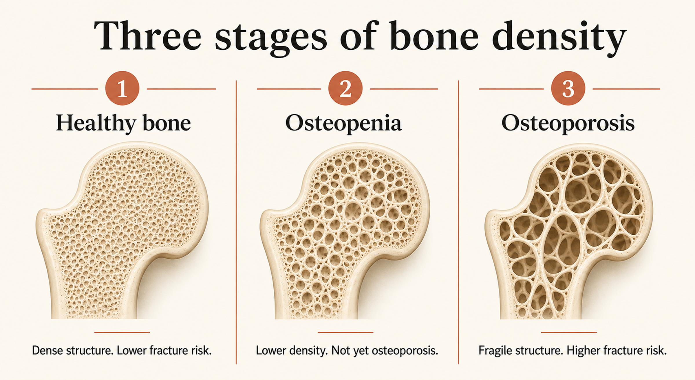
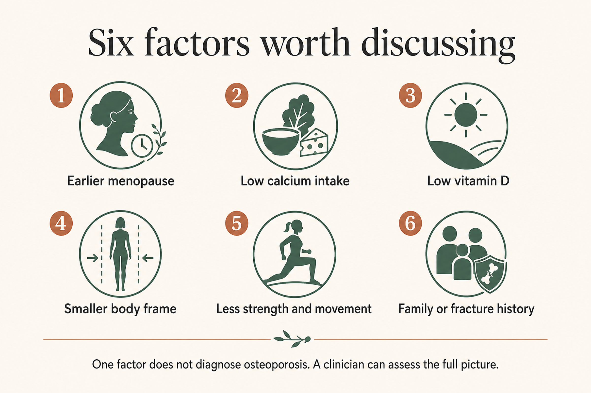
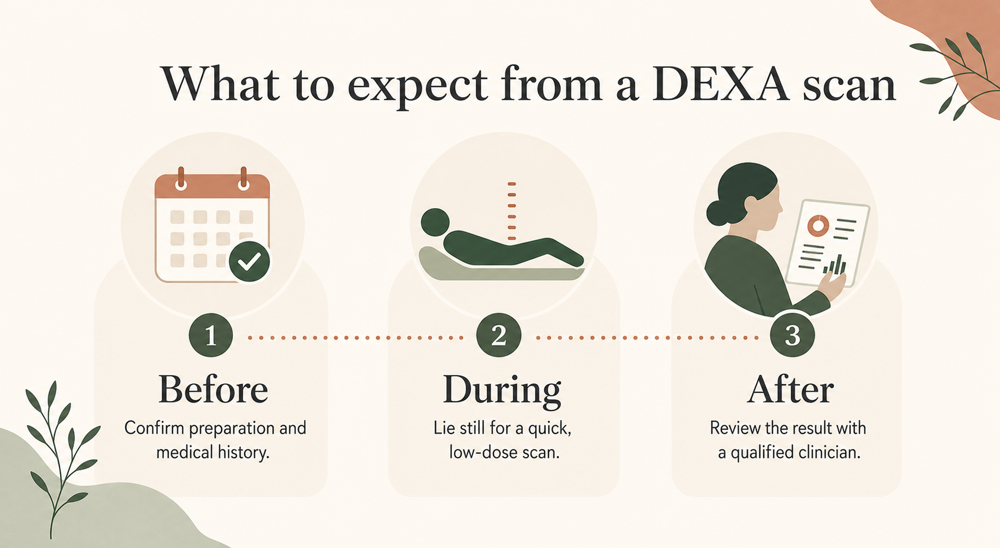
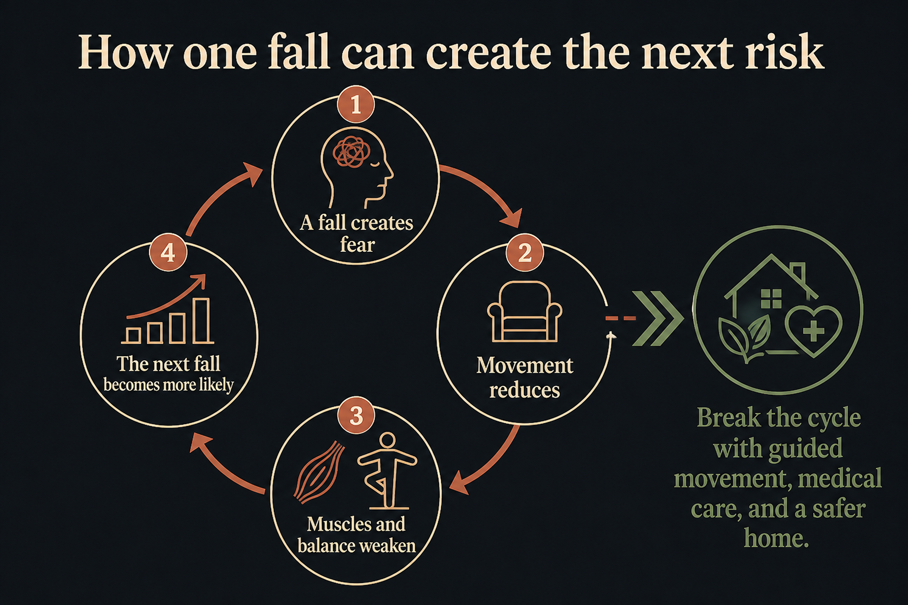

# Osteoporosis in Indian Women: The Hidden Fall Risk After 50

A small fall should not lead to a major fracture. Yet, this is a reality for many families across India. An elderly mother slips while getting out of bed. A grandmother loses her balance in the bathroom. What appears to be a minor accident suddenly turns into a fractured hip or spine. The family is left wondering how such a simple fall caused such a serious injury. In many cases, the answer is **osteoporosis**.

Osteoporosis slowly weakens the bones over many years. It usually develops without pain or obvious warning signs. Many women continue their daily routine without realizing their bones have become fragile. They often discover the condition only after suffering a fracture.

## What Osteoporosis Actually Is

Bones may look hard and solid, but they are living tissues. Throughout life, the body constantly removes old bone and replaces it with new bone. During childhood and early adulthood, new bone forms faster than old bone breaks down. This keeps the skeleton strong.

As women grow older, especially after menopause, this balance begins to change. Bone loss starts happening faster than bone formation. Gradually, bones lose their strength, become thinner, and develop tiny spaces inside them. Doctors call this condition osteoporosis.

Think of healthy bone as a strong honeycomb with small holes. In osteoporosis, these holes become much larger. The bones become lighter, weaker, and more likely to break, even after a minor fall.

One of the biggest challenges is that osteoporosis develops silently. Most women do not experience pain or discomfort in the early stages. They continue their daily activities without knowing their bones have become fragile.

Doctors generally classify bone health into three stages:

- **Healthy bone:** Normal bone density with a low risk of fractures.
- **Osteopenia:** Bone density is lower than normal but has not reached osteoporosis.
- **Osteoporosis:** Bone density has fallen significantly, increasing the risk of fractures.

The condition can affect any bone in the body. However, fractures most commonly occur in the hip, spine, and wrist because these areas bear much of the body's weight during daily activities.

### How Bone Loss Happens Over Time

Bone health begins much earlier than most people realise. Women usually reach their highest bone mass during their late twenties. After the age of 35, bone loss starts gradually. During this stage, maintaining a healthy diet and staying physically active becomes even more important.

The biggest change occurs after menopause. As estrogen levels decline, the body loses bone much faster than before. The first five to ten years after menopause often see the fastest decline in bone density.

## Why Indian Women Are Hit Harder and Earlier

Every woman loses some bone density with age. However, several factors make Indian women more likely to develop osteoporosis earlier than expected. Understanding these osteoporosis symptoms in women India allows families to take preventive action before serious bone loss begins.

### The Calcium Gap in Indian Diets

Calcium is one of the most important nutrients for healthy bones. Unfortunately, many women do not consume enough calcium every day. Busy schedules, skipping meals, smaller food portions, or avoiding dairy products can all reduce calcium intake over time. Many women prioritise feeding their families while neglecting their own nutritional needs. This habit, repeated over several years, gradually weakens the bones.

Good sources of calcium include:

- Milk
- Curd
- Paneer
- Ragi
- Sesame seeds
- Green leafy vegetables
- Calcium-fortified foods

Including these foods regularly supports stronger bones throughout life.

<a href="https://eyeagle.ai/blogs/diet-and-nutrition-in-healthy-aging" style="color:#CC0000; text-decoration:none;">The Role of Diet and Nutrition in Healthy Aging</a>

### The Vitamin D Paradox

India receives plenty of sunshine, yet **vitamin D deficiency in Indian women** remains surprisingly common. Vitamin D helps the body absorb calcium. Without enough vitamin D, even a calcium-rich diet cannot fully protect the bones. Several lifestyle

changes contribute to this problem. Many women:

- Spend most of the day indoors.
- Work in offices.
- Avoid direct sunlight.
- Travel in covered vehicles.

As a result, many women develop vitamin D deficiency without noticing any symptoms. A simple blood test can help identify low vitamin D levels if a doctor suspects a deficiency.

### Earlier Menopause Means Faster Bone Loss

Estrogen plays a major role in maintaining bone density. Before menopause, this hormone helps protect the bones. After menopause, estrogen levels drop sharply, causing bone loss to speed up. Women who experience menopause earlier than average have a greater lifetime risk of osteoporosis because bone loss begins sooner.

Taking care of bone health before menopause is just as important as managing it afterwards.

### Smaller Body Frames

Many Indian women naturally have smaller body frames. Smaller bones contain less bone mass. Once bone loss begins, women with lower bone reserves may develop osteoporosis earlier than those with larger bone structures.

Building muscle strength through regular exercise becomes especially important because stronger muscles improve balance and support the skeleton.

### Lifestyle Changes That Affect Bone Health

Modern lifestyles have also increased the risk of osteoporosis. Many women spend long hours sitting at desks. Physical activity has reduced significantly compared to previous generations. Instead of walking, people often rely on cars or two-wheelers for short distances. Processed foods, irregular meal timings, and lower protein intake also affect bone health.

These habits may not show immediate effects, but over many years, they can contribute to weaker bones and reduced muscle strength.

### The Cultural Silence Around Women's Health

Many women continue caring for everyone else while ignoring their own health. Back pain is often dismissed as tiredness. Height loss is accepted as a normal part of ageing. Posture changes go unnoticed because they happen gradually. Instead of discussing these concerns with a doctor, many women continue living with them until a fracture forces them to seek medical help.

Families can change this pattern by encouraging open conversations about bone health and regular health check-ups.

## The Signs That Aren't Really Signs

Osteoporosis is often called a silent disease because it rarely causes symptoms in its early stages. Still, the body sometimes gives subtle clues that should not be ignored. Recognising these **osteoporosis symptoms in women in India** early can help prevent serious fractures.

### Height Loss

Has your mother become slightly shorter over the past few years? Small compression fractures in the spine can gradually reduce height. Even losing two or three centimetres deserves medical attention.

### Stooped Posture

A rounded upper back can develop when weakened spinal bones slowly collapse. Many people believe this is simply part of ageing. However, osteoporosis may also cause these posture changes.

### Frequent Back Pain

Persistent pain between the shoulder blades or in the middle of the back may indicate tiny fractures in the spine. Back pain has many possible causes, but recurring pain should never be ignored.

### Changes in Dental Health

Bone loss can also affect the jaw. Some women notice receding gums, loose teeth, or dentures that no longer fit properly. While dental problems have many causes, declining bone density can also contribute. Regular dental check-ups may help identify these concerns early.

### Weak Grip Strength

Opening jars, carrying grocery bags, or lifting kitchen utensils may become more difficult over time. Reduced muscle strength often accompanies declining bone health, making everyday tasks harder.

## Getting Tested – The DEXA Scan in India

The only reliable way to diagnose osteoporosis is through proper medical evaluation. Doctors usually recommend a DEXA scan, also known as a bone density test, to measure bone strength. A **DEXA scan** uses very low-dose X-rays to calculate bone mineral density. The procedure is painless, non-invasive, and usually takes only 10 to 20 minutes. Most women can return to their daily activities immediately afterwards. Doctors may recommend a DEXA scan if a woman:

- Is 65 years or older
- Reached menopause early
- Has experienced a fracture after a minor fall
- Has a family history of osteoporosis
- Has certain medical conditions affecting bone health
- Takes long-term medications that weaken bones

Many families also ask about the **bone density test cost in India**. The **DEXA scan cost India** generally ranges between **₹1,500 and ₹4,500**, depending on the city, hospital, and diagnostic centre. Early diagnosis allows doctors to recommend treatment before fractures occur, helping women protect their mobility and independence.

## The Fall Connection - Why This Changes Everything

Osteoporosis weakens the bones, but a fall is often what causes a fracture. This is why doctors focus not only on improving bone health but also on preventing falls. Imagine two women of the same age slipping on a wet bathroom floor. One has healthy bones, while the other has osteoporosis. The first woman may walk away with only a few bruises. The second woman may suffer a fractured hip or spine from the same fall.

This difference shows why osteoporosis deserves attention before an accident happens. The **hip fracture risk in women in India** increases significantly when bone density decreases. A hip fracture is more than just a broken bone. It can affect mobility, independence, and confidence. Recovery may take several months and often requires surgery, physiotherapy, and support from family members. Falls also have an emotional impact. Many elderly women become afraid of walking after experiencing a fall. They avoid stairs, stop going for walks, and spend more time sitting indoors. As physical activity decreases, muscles become weaker, balance worsens, and the chances of another fall increase. This creates a cycle that becomes difficult to break.

Breaking this cycle requires attention to both bone health and home safety. Stronger bones reduce the risk of fractures, while a safer environment lowers the chances of falling in the first place.

## Where Fractures Actually Happen

Osteoporosis can weaken every bone in the body. However, certain areas are more likely to fracture because they absorb greater force during everyday activities and falls.

### Hip

Hip fractures are among the most serious complications of osteoporosis. A fractured hip can make standing, walking, climbing stairs, or even getting out of bed extremely difficult. Most women require surgery, followed by months of rehabilitation and physiotherapy. Recovery often depends on family support, especially during the first few months.

### Spine

Spinal fractures can develop quietly. Sometimes, women do not even remember falling. Simple activities like bending to lift a bucket, coughing forcefully, or picking up groceries may cause a weakened vertebra to collapse. Spinal fractures can lead to:

- Persistent back pain
- Loss of height
- Stooped posture
- Difficulty standing for long periods
- Reduced flexibility

Multiple spinal fractures may also affect breathing because they reduce chest expansion.

### Wrist

When people lose balance, they instinctively stretch out their hands to protect themselves. This natural reaction places significant force on the wrist, making it one of the earliest fracture sites in osteoporosis.

## Prevention You Can Start This Week

Growing older is natural, but losing bone strength does not have to be. Many small lifestyle changes can help protect bones, improve balance, and reduce the risk of falls. The earlier these habits begin, the greater their long-term benefits.

### Eat for Stronger Bones

A balanced diet forms the foundation of good bone health. Calcium is essential because it helps maintain bone strength throughout life. Include calcium-rich foods such as:

- Milk
- Curd
- Paneer
- Ragi
- Sesame seeds
- Green leafy vegetables
- Soy products
- Calcium-fortified foods

Protein is equally important because muscles protect and support the skeleton. Good protein sources include:

- Eggs
- Fish
- Chicken
- Dal
- Beans
- Lentils
- Soy products
- Dairy products

Bones also require other nutrients.

- Magnesium from nuts and seeds supports bone formation.
- Vitamin K, found in leafy vegetables, helps improve bone metabolism.
- Zinc from legumes and whole grains contributes to bone repair.

Instead of depending only on supplements, try to <a href="https://eyeagle.ai/blogs/diet-and-nutrition-in-healthy-aging" style="color:#CC0000; text-decoration:none;">meet most nutritional needs</a> through a balanced diet. Speak to your healthcare provider before starting calcium or vitamin D supplements.

### Spend Time in Sunlight

Morning sunlight is one of the best natural sources of vitamin D. Just 15 to 30 minutes of sunlight exposure several days a week may help improve vitamin D production, depending on your skin type and local weather conditions. Vitamin D allows the body to absorb calcium more effectively. Women with low vitamin D levels should consult a doctor, who may recommend blood tests or supplements if needed.

### Stay Physically Active

Exercise benefits both bones and muscles. Weight-bearing activities encourage bones to remain strong because they work against gravity.

Simple exercises include:

- Walking
- Climbing stairs
- Dancing
- Light jogging (if medically appropriate)
- Resistance band exercises
- Bodyweight exercises
- Light strength training

<a href="https://eyeagle.ai/blogs/balance-problems-in-elderly" style="color:#CC0000; text-decoration:none;">Balance exercises are equally important</a>. Yoga, Tai Chi, and supervised balance training improve coordination, posture, and flexibility. Better balance reduces the chances of falling. Even thirty minutes of moderate physical activity most days of the week can improve bone health and overall fitness.

**_Always consult your healthcare provider before starting a new exercise routine, especially if osteoporosis has already been diagnosed._**

### Make Your Home Safer

Many falls happen inside the home during routine activities.

Bathrooms, bedrooms, kitchens, and staircases deserve special attention because they are used every day.

Simple improvements can greatly reduce fall risks.

Consider these safety measures:

- Install grab bars near toilets and inside bathrooms.
- Place anti-slip mats in wet areas.
- Keep hallways well lit.
- Remove loose rugs.
- Secure electrical wires against walls.
- Keep frequently used items within easy reach.
- Use footwear with good grip.
- Clean spills immediately.

<a href="https://eyeagle.ai/blogs/new-year-safer-home-safety-tips" style="color:#CC0000; text-decoration:none;">Detailed guide on how to make your home safer</a>

These changes do not limit independence. Instead, they help elderly family members move around with greater confidence.

Some families also choose additional safety measures such as emergency alert systems or smart monitoring solutions. While these cannot prevent falls, they can ensure quicker assistance during an emergency. Solutions like <a href="https://eyeagle.ai/" style="color:#CC0000; text-decoration:none;">EyEagle</a> can provide an added layer of safety by helping families respond quickly if a fall occurs.

## If Your Mother Already Has Osteoporosis, What Changes Today?

An osteoporosis diagnosis can feel overwhelming for both the woman and her family. Fortunately, many women continue living active and independent lives with proper care. The first step is following your doctor's treatment plan. Regular follow-up appointments help monitor bone health and adjust medications if necessary.

Daily habits also matter. Encourage balanced meals that provide enough calcium, protein, and other essential nutrients. Support <a href="https://eyeagle.ai/blogs/mobility-tips-for-seniors" style="color:#CC0000; text-decoration:none;">regular physical activity through exercises</a> recommended by healthcare professionals. Pay attention to changes in walking speed, posture, or balance. Even small changes may indicate that additional support is needed.

Take another look around the home. Ask yourself:

- Is the bathroom floor slippery?
- Are handrails sturdy?
- Are there enough lights for night-time movement?
- Can frequently used items be reached without climbing?

Simple improvements often reduce everyday risks. <a href="https://eyeagle.ai/blogs/importance-of-open-conversations-about-aging" style="color:#CC0000; text-decoration:none;">Emotional support is equally important</a>. Many women lose confidence after experiencing a fracture. They become afraid of walking outdoors or participating in activities they once enjoyed. Family encouragement helps restore confidence. Celebrate small milestones, encourage safe movement, and remind your loved one that staying active supports both physical and emotional well-being.

## Conclusion

Osteoporosis often develops quietly, but its effects can change a person's life in an instant. A simple slip in the bathroom or a minor fall at home can result in a fracture that affects mobility, independence, and confidence for months or even years.

Understanding osteoporosis in Indian women is the first step toward prevention. Recognising the risk factors, identifying early warning signs, and getting a bone density test at the right time can help detect bone loss before fractures occur.

Healthy eating, regular exercise, adequate vitamin D, and maintaining muscle strength all play an important role in protecting bones. At the same time, creating a safer home environment is equally important because preventing falls is one of the most effective ways to reduce fracture risk.

## FAQ

**At what age should Indian women get their first bone density test?**

Doctors generally recommend a bone density test for women aged 65 and above. However, women with early menopause, a family history of osteoporosis, previous fractures, or other risk factors may need screening earlier.

**How much does a DEXA scan cost in India?**

The DEXA scan cost in India usually ranges between **₹1,500 and ₹4,500**, depending on the city, hospital, and diagnostic centre.

**Is osteoporosis reversible?**

Osteoporosis is a long-term condition, but early diagnosis, medical treatment, healthy nutrition, and regular exercise can slow bone loss and reduce fracture risk.

**Can vegetarian Indian women get enough calcium?**

Yes. Milk, curd, paneer, ragi, sesame seeds, soy products, green leafy vegetables, and calcium-fortified foods are excellent vegetarian sources of calcium.

**Can osteoporosis cause back pain?**

Yes. Small compression fractures in the spine can cause persistent back pain, loss of height, and a stooped posture. Any ongoing or unexplained back pain should be evaluated by a healthcare professional.

**Does taking calcium tablets alone prevent osteoporosis?**

No. Calcium is only one part of maintaining healthy bones. Bone health also depends on vitamin D, protein, exercise, hormones, and overall nutrition. Always consult a healthcare professional before starting supplements.

**Can exercise be safe for women with osteoporosis?**

Yes. Low-impact, weight-bearing, and balance exercises can strengthen bones and muscles while reducing the risk of falls. However, exercises should be chosen based on a healthcare provider's advice, especially for women with severe osteoporosis.

**Disclaimer:** This is not medical advice. The information in this article is for educational purposes only. It is not intended to be a substitute for professional medical advice, diagnosis, or treatment.

Always seek the advice of your physician or other qualified health provider with any questions you may have regarding a medical condition. Do not disregard professional medical advice or delay in seeking it because of something you have read in this article.

EyEagle and the authors of this article are not responsible for any adverse effects or consequences resulting from the use of the information contained in this article.
