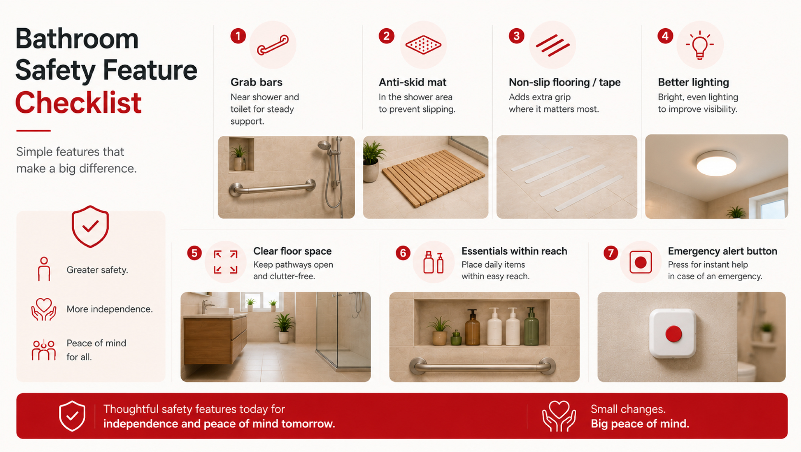

## What Changed When We Added Bathroom Safety Features to Our Home

For years, our bathroom looked perfectly fine. Clean tiles, a sturdy door, good lighting, nothing seemed “unsafe” at first glance. Like many families, we assumed that accidents only happen when someone is careless. But the truth is, bathrooms don’t announce danger. They quietly become risky over time, especially as our loved ones age. It wasn’t until a small but frightening incident that we truly understood the importance of bathroom safety features. What followed wasn’t a dramatic renovation, but a series of simple, thoughtful changes. And those changes ultimately transformed not just the bathroom, but also how safe and confident our home felt every single day.

## The Moment That Made Us Pause

One morning, my father slipped slightly while stepping out of the shower. He didn’t fall completely; he caught the wall just in time, but the look on his face stayed with us. It wasn’t pain. It was fear.

That moment made us realize something important: bathroom accidents don’t always end in injuries, but <a href="/blogs/how-fear-of-falling-affects-mental-health" style="color:#CC0000; text-decoration:none;">they always leave behind anxiety</a>. After that incident, he became hesitant. He rushed showers. He avoided bathing when no one was home. A space meant for privacy and comfort had quietly turned into a place of worry.

That’s when we started thinking seriously about <a href="/device" style="color:#CC0000; text-decoration:none;">bathroom fall prevention</a> and senior home safety modifications, not as “elderly solutions,” but as family safety measures.

## Why Bathrooms Are Riskier Than We Think

Bathrooms combine three dangerous elements: **water, smooth surfaces, and movement**. Even young, healthy people slip sometimes. For seniors, the risk multiplies due to:

- Reduced balance
- Joint stiffness
- Slower reaction times
- Weaker grip strength

What surprised us most was how normal our bathroom hazards were. Wet tiles after a shower. No solid support near the toilet. A slippery floor mat that moved more than it helped. These are exactly the kind of everyday issues that bathroom safety improvements aim to fix. And once you start noticing them, you realize how common they are in almost every home.

## The Bathroom Safety Features We Chose (And Why)

We didn’t want to turn our bathroom into a hospital-like space. Our goal was simple: <a href="/blogs/how-to-make-your-home-safe" style="color:#CC0000; text-decoration:none;">reduce fall risk while keeping the bathroom comfortable and familiar</a>.

### Shower Grab Bars – Support That Builds Confidence

The first thing we installed was shower grab bars. Not towel rods. Not temporary suction handles. Proper, wall-mounted grab bars are designed to support body weight.

We placed one inside the shower and another near the toilet. The difference was immediate. My father no longer felt the need to rush. He had something solid to hold while standing, turning, or sitting down.

The bathroom grab bars installation itself was quick, but the impact was huge. It restored confidence, something no medication or warning sign ever could.

### Non-Slip Flooring and Slip-Resistant Mats

Our bathroom tiles looked beautiful, but became dangerously slippery when wet. Instead of replacing all tiles, we opted for non-slip flooring solutions and high-quality slip-resistant mats. We placed mats:

- Just outside the shower
- Near the sink
- At the bathroom entrance

Unlike the old mats that curled up or slid around, these stayed firmly in place. This simple change alone contributed significantly to fall risk reduction, especially during early morning and late-night bathroom visits.

### Small Layout Changes That Made a Big Difference

Some of the most effective home bathroom safety modifications didn’t involve buying anything new. We:

- Moved frequently used items within easy reach
- Improved lighting near the mirror and shower
- Removed unnecessary stools and clutter

These changes reduced bending, stretching, and awkward movements, all common causes of bathroom slips.

## How We Discovered EyEagle - A Smarter Way to Keep Bathrooms Safe

As we researched reliable ways to make our bathroom safer beyond just grab bars and mats, one solution that really stood out was <a href="/" style="color:#CC0000; text-decoration:none;">EyEagle</a>. Unlike ordinary products you might pick up off the shelf, EyEagle offers a <a href="https://shop.eyeagle.ai/products/eyeagle-bathroom-safety-package-audit-prevention-kit-installation-app-membership" style="color:#CC0000; text-decoration:none;" target="_blank" rel="noopener noreferrer">comprehensive bathroom safety system</a> that tackles not just fall prevention, but real-time emergency awareness and response as well.

What impressed us most was the thoughtful approach: they start with a bathroom audit to mark all the ways in which a bathroom is unsafe or may have potential danger points. Then comes prevention by installing non-slip surfaces, sturdy grab bars, and anti-skid mats, but they don’t stop there. Their system also includes a smart alert alarm technology. This alarm, when pressed, can immediately notify caregivers or family members <a href="/app" style="color:#CC0000; text-decoration:none;">through an app</a> if something goes wrong, even if you’re far away.

For us, that blend of everyday safety improvements and peace-of-mind technology felt like the best of both worlds. It wasn’t just about reducing risk; it was about creating a safer, more responsive environment where everyone in the family could feel confident and secure in one of the most fall-prone spaces in the house.

## What Actually Changed After These Improvements

This was the part we didn’t expect. After adding these bathroom safety features, the biggest change wasn’t physical; it was emotional.

- My father stopped calling out for help unless truly needed.
- He regained independence during bathing.
- We stopped listening anxiously for sounds from the bathroom.
- Night-time bathroom trips became calmer and safer.

The bathroom went back to being a private space, not a shared concern. These improvements quietly gave everyone peace of mind.

## Supporting Aging in Place Without Making It Obvious

Many people associate senior home safety modifications with loss of independence. Our experience showed the opposite. By making the bathroom safer, we actually helped my father stay independent longer. He didn’t feel watched or restricted. He felt supported. This is what aging in place should look like: subtle safety that blends into daily life. No labels. No stigma. Just smart design choices that respect dignity.

## Lessons We Learned Along the Way

- Don’t wait for a serious accident to take action.
- Safety features don’t have to look clinical.
- Small changes can prevent major injuries.
- Every home benefits, not just senior households.

Even younger family members noticed the difference. Slippery floors stopped being an issue. Everyone felt more secure.

## Final Thoughts: A Safer Bathroom Changed More Than We Expected

Adding bathroom safety features changed our home in quiet but meaningful ways. It reduced fear, restored confidence and allowed our loved one to live with dignity and independence. Bathrooms may seem ordinary, but they deserve attention, especially if you want your home to grow safely with your family. You don’t need a major renovation. You just need awareness, intention, and a few smart choices.

Sometimes, the most powerful changes are the ones that simply make everyday life feel safer.
