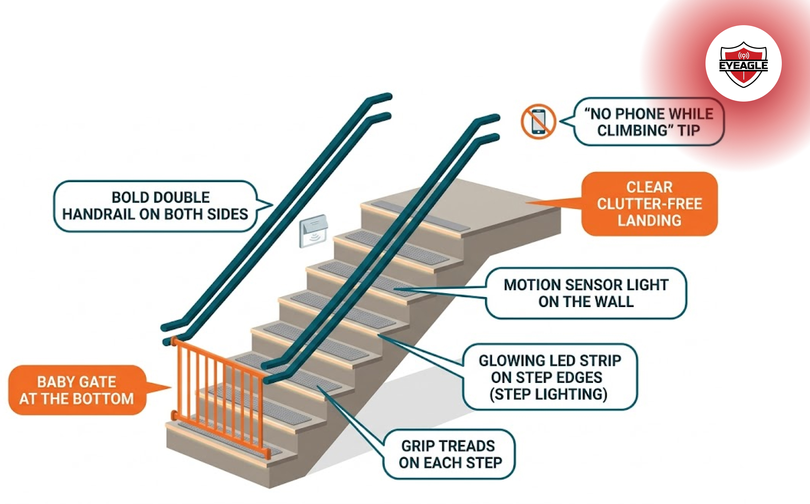

# Stairway Safety: Simple Fixes to Prevent Accidents

Stairways are among the most common places where home accidents occur, yet people rarely pay attention to them until something goes wrong. Whether you live with children, seniors, or simply climb stairs multiple times a day, improving stairway safety is one of the smartest steps you can take to protect your family. Many falls happen not because the stairs are dangerous by design, but because small hazards go unnoticed for months.

This guide explains practical, affordable, and effective ways to make your stairway safer, starting today. We will explore why stair accidents happen, the most useful stair safety tips, senior-specific improvements, and everyday habits that prevent slips and falls. With a few simple changes, you can turn one of the riskiest spots in the house into one of the safest.

## Why Stairway Accidents Happen: The Hidden Causes You Don’t Notice

Most people believe they will never fall on their own stairs because they “know their home well.” But **familiarity doesn’t prevent slips; awareness does**. Understanding the common causes of stairway falls helps you fix issues before they turn into accidents.

### 1. Poor Visibility

Dim lighting makes it difficult to judge step depth, especially at night. Many falls happen because people simply miss a step or misjudge its height due to shadows or unclear edges.

### 2. Slippery or Uneven Steps

Highly polished tiles, worn-out wooden steps, loose carpeting, and uneven surfaces dramatically increase the risk of slipping. Even small cracks or lifted edges can make someone lose balance instantly.

### 3. Clutter on Stairs

Stairs should never be used as temporary storage. Bags, toys, books, chargers, or laundry create tripping hazards that are easy to overlook but extremely dangerous.

### 4. Weak or Missing Handrails

Handrails are essential for balance, especially for seniors. A shaky or improperly installed handrail provides a false sense of security.

### 5. Age-Related Mobility Decline

Vision issues, slower reflexes, weaker grip, and reduced balance make climbing stairs harder for older adults. This makes senior stair safety a critical priority in every home.

## Simple and Effective Stair Safety Tips You Can Start Today

Improving stairway safety doesn’t require expensive renovations. Small fixes make a massive difference. These stair safety tips are practical, affordable, and proven to reduce accidents.

### 1. Improve Lighting for Better Visibility

Good lighting is one of the most effective ways to prevent stair accidents.

- Install bright overhead lights along the stairway.
- Use motion-sensor lights for night-time safety.
- Add LED strips or step lights to highlight each stair.

Bright, even lighting ensures you never misjudge a step again.

### 2. Add Non-Slip Solutions

For strong slip and fall prevention on stairs, apply one or more of these:

- Anti-skid treads
- Non-slip tape
- Textured stair paint (especially for outdoor stairs)

These additions increase grip and reduce the chance of slipping even when surfaces are wet.

### 3. Keep Stairs Completely Clutter-Free

Adopt a simple rule: nothing stays on the stairs.

If you need temporary storage, place baskets or shelves near the staircase instead of on it.

### 4. Strengthen or Add Handrails

A strong handrail significantly reduces your risk of falling. Ideally, you should have:

- Handrails on both sides
- Rails that are sturdy, smooth, and easy to grip
- Properly reinforced brackets

Handrails are not optional, they’re lifesaving.

### 5. Repair Uneven or Damaged Steps

Never ignore cracks, loose tiles, or shaky steps. Fixing them immediately prevents long-term risk. Even tiny imperfections can cause sudden missteps. These improvements are simple, but they dramatically increase home stairway safety for everyone in the household.

## Staircase Safety Improvements You Can Do Right Now

If you want quick, practical ways to boost staircase safety improvements, here are fixes you can finish in a single day.

### 1. Install Anti-Slip Mats or Treads

One of the fastest ways to upgrade stair safety. Choose durable, high-traction materials for the best results.

### 2. Upgrade Your Railings

If your current railings feel thin or loose, replace them with stronger, grip-friendly options.

### 3. Improve Landing Zone Safety

Poorly lit or cluttered landings increase fall risk. Add lights, clear obstacles, and ensure grab bars are accessible.

### 4. Use Baby Gates (if You Have Kids)

Install gates at both the top and bottom of staircases to prevent accidents involving toddlers.

### 5. Follow a Routine Stairway Check

Set a monthly habit:

- Clean dust and moisture
- Tighten screws on railings
- Look for cracks or shifts in steps
- Replace weak bulbs

## Behavioural Habits That Prevent Stair Accidents

Even the safest staircase becomes dangerous if used carelessly. These habits are critical to prevent stair accidents.

### 1. Don’t Use Your Phone While Climbing

Scrolling while climbing stairs causes thousands of injuries every year.

### 2. Avoid Slippery Footwear

Socks, smooth sandals, and wet shoes increase the risk of slipping. Grip socks or barefoot climbing are safer options.

### 3. Use Handrails Every Single Time

Even if the staircase is familiar, always hold the rail. Most falls happen on the stairs people use daily.

### 4. Don’t Carry Bulky Items That Block Your View

Take two trips. It’s better than risking a fall.

## Conclusion

Stairway safety doesn’t demand major renovations or heavy spending. Most accidents happen due to small, fixable issues, poor lighting, slippery steps, clutter, or weak railings. By focusing on simple improvements and consistent habits, you can dramatically reduce the risk of slips, trips, and falls in your home.

Whether you live with seniors, children, or simply want a safer environment, these straightforward steps make a meaningful difference. Start with one small change today. Every improvement you make moves your home closer to reliable, long-term safety and ensures your stairway remains a place of movement, not danger.
