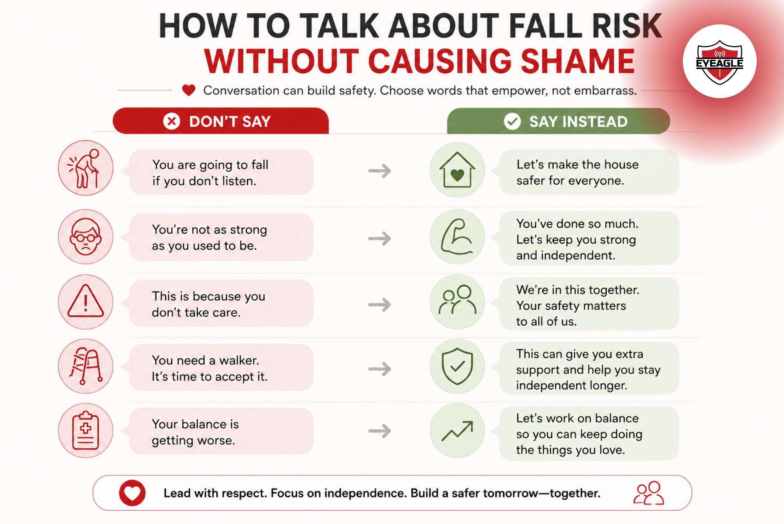

# The 'Why Not Me?' Mentality: Addressing Senior Denial About Fall Risk

Many seniors know that falls are a leading cause of injury among older adults, but rarely believe it applies to them. This mindset, often called the “Why Not Me?” mentality, is a form of denial that leads aging adults to underestimate their vulnerability. Understanding senior fall risk isn’t just about identifying physical hazards. It’s also about recognizing the emotional and psychological barriers that stop seniors from taking precautions. This blog explores why denial happens, how families can address it respectfully, and how fall prevention becomes easier when seniors feel empowered rather than judged.

## Understanding Fall Risk in Older Adults

Age brings gradual changes in muscle strength, balance, vision, reaction time, and joint stability. <a href="https://eyeagle.ai/blogs/senior-home-safety-india" style="color:#CC0000; text-decoration:none;" target="_blank" rel="noopener noreferrer">These changes increase the likelihood of falls</a>, especially on stairs, uneven surfaces, or in poorly lit areas. Studies consistently show that a significant percentage of <a href="https://eyeagle.ai/blogs/falls-kill-more-seniors-than-you-think" style="color:#CC0000; text-decoration:none;" target="_blank" rel="noopener noreferrer">seniors experience at least one fall each year</a>, and many of those falls lead to hospitalization or reduced mobility.

Yet awareness does not always translate into action. Even with the facts, many aging adults believe “It won’t happen to me.” This perception gap slows down preventive behaviour and makes fall prevention for seniors more challenging.

Falls are predictable. Falls are preventable. But only when the risk is acknowledged.

## Why Seniors Deny Their Fall Risk

To understand senior denial about fall risk, you first have to understand what’s at stake emotionally. Denial is rarely stubbornness; it’s a defense mechanism.

### 1. Fear of Losing Independence

For many seniors, admitting they are at risk feels like admitting they are becoming dependent. Precautions like grab bars, walkers, or monitoring tools can be misinterpreted as symbols of “old age.”

### 2. Stigma Around Weakness

Many older adults do not want to appear fragile. They’ve spent their lives being self-reliant, and acknowledging vulnerability feels like betraying that identity.

### 3. Overconfidence in Familiar Spaces

Because they’ve lived in the same home for years, seniors assume familiarity equals safety. Research shows that the majority of falls actually happen inside the home, proof that comfort can create a false sense of security.

### 4. Gradual Decline Goes Unnoticed

<a href="https://eyeagle.ai/blogs/balance-problems-in-elderly" style="color:#CC0000; text-decoration:none;" target="_blank" rel="noopener noreferrer">Changes in balance</a> or eyesight occur slowly. Seniors adapt without realizing how much stability they’ve lost over time.

### 5. Avoidance of Difficult Conversations

Discussing senior fall risk often opens conversations about aging, health, and independence, topics many would rather avoid. Avoidance becomes a psychological barrier to fall prevention.

These psychological barriers to fall prevention are often stronger than physical hazards. Until denial is addressed, safety improvements may be ignored or rejected.

## The Real Consequences of Denial

Denial delays action. And delayed action increases danger. Ignoring senior fall risk can lead to:

- Serious injuries such as fractures, hip damage, or head trauma
- Prolonged hospitalization and rehabilitation
- Reduced confidence in walking or moving independently
- Fear-based inactivity, which further weakens muscles
- Long-term loss of independence

The emotional consequences are just as significant. Research shows that seniors who experience a fall, even a minor one, often become anxious about walking, which leads to physical decline.

A fall that could have been prevented becomes a turning point that reshapes daily life.

## How Families Can Encourage Awareness Without Causing Shame

Addressing denial is delicate. The goal isn’t to prove a senior wrong; it’s to help them feel safe, respected, and in control. Here’s how families can support fall risk awareness in aging adults without triggering defensiveness.

### 1. Use Empathy Instead of Warnings

Avoid statements like “You are going to fall if you don’t listen.”  Say instead: “Let’s make the house safer for everyone.”

This shifts the conversation from blame to teamwork.

### 2. Normalize Safety Tools

Present grab bars, anti-slip treads, or motion lighting as <a href="https://eyeagle.ai/protection" style="color:#CC0000; text-decoration:none;" target="_blank" rel="noopener noreferrer">home upgrades</a>, not aging equipment. Language influences acceptance.

### 3. Involve Seniors in the Decision-Making

Ask them which safety improvements they prefer. Choice protects dignity and autonomy.

### 4. Share Real Examples

Instead of warnings, talk about someone they know who prevented a fall by making simple changes. Real-life stories increase acceptance.

### 5. Connect Prevention to Independence

Frame safety improvements as tools that help them stay independent longer. This reframes the conversation from “You are weak” to “You are proactive.”

## Practical Fall Prevention for Seniors

Once denial fades, seniors become more open to making changes. Below are practical steps for preventing falls in older adults while preserving comfort and independence.

### Improve Lighting

- Brighten hallways, stairs, and bathrooms.
- Install motion-sensor lights for nighttime movement.

### Remove Clutter

- Clear pathways in living rooms, entrances, and stairs.
- Even a misplaced shoe can cause a dangerous fall.

### Add Anti-Slip Support

- Non-slip treads
- Secure rugs
- Anti-skid mats in bathrooms
- Dual handrails on stairs offer double support.

### Encourage Strength and Balance Exercises

Simple routines like leg raises, heel-to-toe walking, or Tai Chi help improve stability.

### Prioritize Vision and Medication Checks

Vision changes and medication side effects can increase fall risk but often go unnoticed.

### Ensure Proper Footwear

Shoes with grip and ankle support significantly reduce slipping incidents.

These steps form the foundation of <a href="https://eyeagle.ai/" style="color:#CC0000; text-decoration:none;" target="_blank" rel="noopener noreferrer">senior fall risk safety and fall prevention</a>, practical, effective, and easy to implement.

### Enhance Bathroom Safety

Bathrooms are one of the most common places for slips and falls among seniors. Installing the right safety fittings can drastically reduce the risk.

<a href="https://eyeagle.ai/device" style="color:#CC0000; text-decoration:none;" target="_blank" rel="noopener noreferrer">EyEagle bathroom safety fittings</a>, such as anti-skid mats, grab bars, provide stability, comfort, and added confidence during everyday routines.

## Conclusion

The **“Why Not Me?”** mentality is natural, but it can be dangerous. Addressing denial isn’t about confronting seniors; it’s about guiding them toward awareness. When seniors understand their fall risk, they make better choices, adopt safer habits, and protect their independence.

Fall prevention does not begin with equipment or renovations. It begins with mindset, the willingness to acknowledge risk and take proactive steps.

By having respectful conversations, understanding emotional resistance, and encouraging practical safety measures, families can help aging adults stay confident, independent, and safe for years to come.
