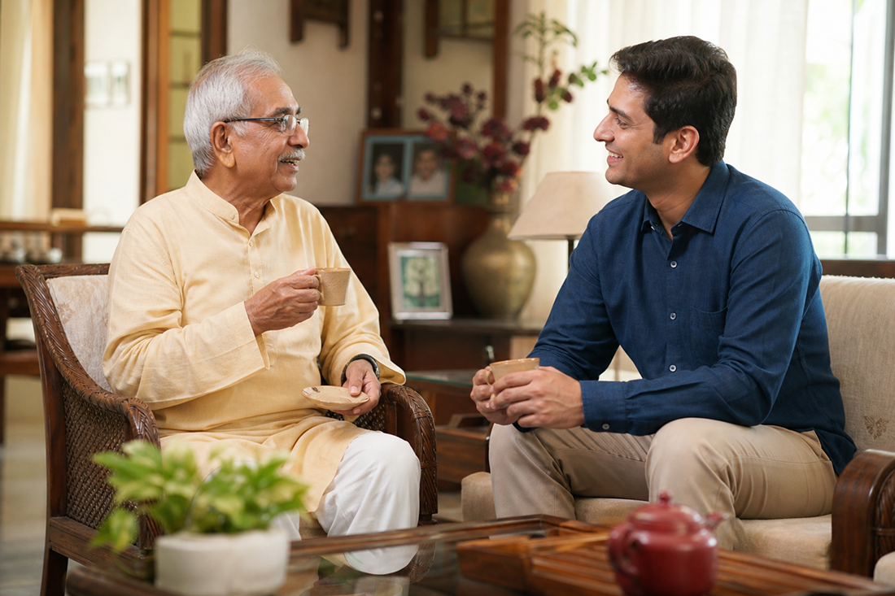
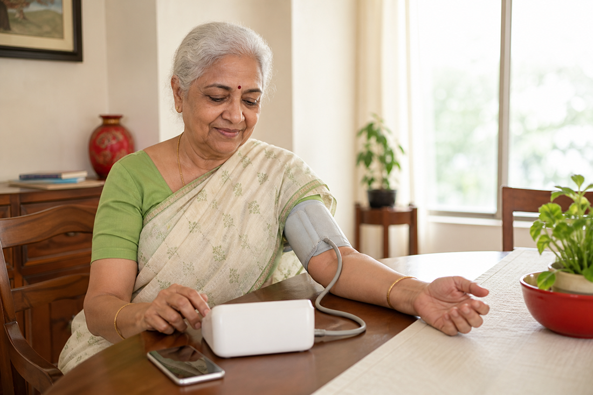

# When Distance Isn’t Distance: Caring for Elderly Parents While Working Abroad

There’s a unique kind of silence that hits when you end a video call with your parents and realize you’re thousands of miles away. For many living overseas, caring for elderly parents back home isn’t just a responsibility; it’s an emotional tug that never really goes away. You build your career, chase global opportunities, and create a life abroad…but your heart often stays rooted where your parents are.

If you’re managing elderly parents from abroad, you’re not alone. And more importantly, you’re not helpless. Distance doesn’t have to mean disconnection.

## The Emotional Reality of Long-Distance Caregiving

Long-distance caregiving for parents brings a mix of guilt, worry, and helplessness.

- “What if something happens and I’m not there?”
- “Are they really okay, or just saying they are?”
- “Am I doing enough?”

These thoughts are common, especially for NRIs caring for parents in India. Cultural expectations add another layer; we grow up believing children should physically be present for their aging parents. When life takes us elsewhere, that expectation can weigh heavily.

But here’s the truth: Care isn’t measured by geography. It’s measured by consistency, involvement, and thoughtful action.

<a href="https://eyeagle.ai/blogs/caring-from-distance" style="color:#CC0000; text-decoration:none;">Click here to see how an NRI managed his mother’s care while working in Singapore</a>

## The Practical Challenges of Managing Elderly Parents from Abroad

Supporting aging parents remotely involves more than an emotional connection. It includes:

- Monitoring their health
- Ensuring home safety
- Managing finances and paperwork
- Coordinating doctor visits
- Handling emergencies
- Preventing loneliness and isolation

When you’re in a different time zone, even small tasks can feel complicated. So how do you turn concern into structured support?

## Step 1: Build a Reliable Support Network on the Ground

No long-distance caregiving plan works without local support. This may include:

- Close relatives
- Trusted neighbors
- Family friends
- Professional caregivers
- Local medical contacts

Have clear communication with at least one dependable person nearby who can check in physically when needed. Share medical details, emergency contacts, and basic health history with them.

If family support isn’t available, consider elderly care solutions for working professionals abroad, including verified caregiving services and emergency response providers in India.

## Step 2: Use Technology as Your Care Partner

Technology has transformed how NRIs care for their parents in India.

Here’s how you can stay actively involved:

### 1. Regular Video Check-ins

Schedule fixed video calls, not random ones. Routine creates reassurance for both you and them.

### 2. Health Monitoring Devices

Smartwatches, blood pressure monitors, glucose monitors, and medication reminder apps help track health metrics in real time.

### 3. Emergency Alert Systems

<a href="https://eyeagle.ai/" style="color:#CC0000; text-decoration:none;">Modern elderly care systems include fall detection</a>, SOS buttons, and emergency dispatch services. If a parent falls or presses an alert button, help can be sent immediately, even if you’re abroad.

<a href="https://eyeagle.ai/device" style="color:#CC0000; text-decoration:none;">EyEagle’s SOS button</a> ensures instant emergency alerts, while the <a href="https://eyeagle.ai/app" style="color:#CC0000; text-decoration:none;">EyEagle App</a> notifies family members abroad in real time, so even from miles away, you stay informed, and your parents get immediate help from your circle.

## Step 3: Plan Financial and Medical Systems in Advance

Caring for elderly parents responsibly means planning before a crisis happens. Make sure you:

- Have digital access to their bank accounts (with consent)
- Set up automatic bill payments
- Maintain scanned copies of medical records
- Understand their insurance coverage
- Identify nearby hospitals and specialists

If you’re managing elderly parents from abroad, documentation and clarity are your biggest strengths. The goal is simple: no panic decisions during emergencies.

## Step 4: Prioritize Emotional Well-Being- Not Just Physical Health

Often, long-distance caregiving focuses only on medical needs.

But loneliness can affect seniors just as deeply as illness.

**Encourage:**

- Participation in local community groups
- Spiritual gatherings or temple visits
- Hobby classes
- Daily walks with neighbors
- Video calls with grandchildren

Supporting aging parents remotely means supporting their emotional world, too.

Sometimes, a consistent 15-minute daily call matters more than an expensive medical device.

## Step 5: Have the Difficult Conversations Early

It’s uncomfortable, but necessary.

Discuss:
- Emergency preferences
- Medical decisions
- Living arrangements
- Assisted care options if needed
- End-of-life wishes (handled sensitively)

Many NRIs delay these conversations because they feel heavy. But clarity reduces future stress for everyone.

It also empowers your parents; they remain decision-makers in their own lives.

## The Silent Weight of Guilt- And How to Handle It

If you’re caring for elderly parents while working abroad, guilt is almost inevitable. You may feel:

- You chose career over family
- You’re not physically present during health scares
- You’re missing everyday moments

Pause for a moment. Being abroad doesn’t mean abandonment. In many cases, your global career strengthens your ability to support them financially and medically. Instead of focusing on what you can’t control, focus on what you can:

- Structured systems
- Reliable monitoring
- Consistent communication
- Financial security
- Emergency preparedness

## When Professional Support Becomes Essential

There may come a time when independent living becomes difficult. This doesn’t mean failure. It means adapting. Options include:

- In-home nursing care
- Part-time attendants
- Full-time caregivers
- Assisted living facilities
- Remote monitoring with emergency response teams

Elderly care solutions for working professionals abroad are growing in India precisely because so many families face this reality. Seeking help does not replace your role. It’s strengthening it.

## Distance Isn’t the Opposite of Love

If you’re an NRI caring for parents in India, remember this: Your love isn’t measured in kilometers. It’s measured in effort, planning, consistency and in staying mentally present even when physically absent. Caring for elderly parents while living abroad requires emotional maturity and practical organization. It’s not easy, but it is possible. And sometimes, what aging parents need most is reassurance:

**That you are there. They matter. And they are not alone.**
