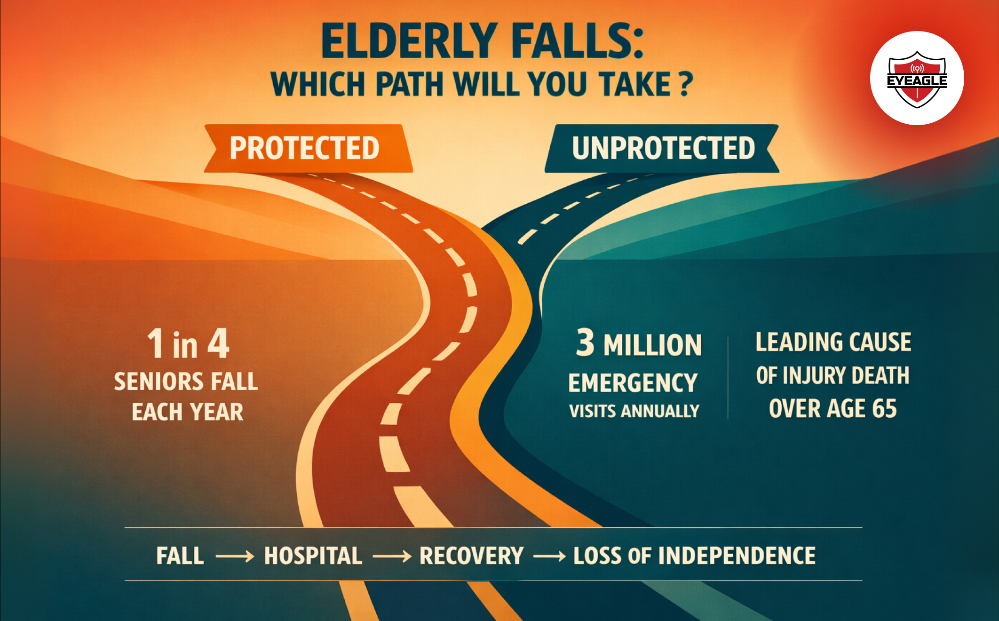

# Zindagi Na Milegi Dobara: Why Preventing Elderly Falls Should Be a Priority

In our youth, Zindagi Na Milegi Dobara feels like a promise to travel, chase dreams, and live fearlessly. But as we age, those same words take on a quieter meaning: every step, every breath, every moment becomes precious. For our parents and grandparents, life isn’t about racing ahead anymore; it’s about staying steady, safe, and strong in the years they’ve worked so hard to earn. Yet one of the most serious threats to that peace comes not from disease, but from something far simpler - a fall. A single misstep can break bones, confidence, and independence in seconds. That’s why elderly fall prevention isn’t a luxury or a safety add-on- it’s an act of love, responsibility, and respect.

According to the **World Health Organization**, falls are the second leading cause of accidental deaths worldwide, and <a href="https://eyeagle.ai/blogs/silver-tsunami-india-safer-future-for-seniors" style="color:#CC0000; text-decoration:none;" target="_blank" rel="noopener noreferrer">seniors are the most affected group</a>. In India, thousands of older adults end up in hospitals every year after home-related falls. And many never fully recover their mobility or freedom again.

But this story doesn’t have to end in fear.

It begins with awareness, recognizing that protecting our elders isn’t just about medical care; it’s about giving them the confidence to walk, move, and live without hesitation. Because for them too, Zindagi Na Milegi Dobara.

## The Hidden Epidemic: Why Falls Are So Dangerous for Seniors

Every year, millions of seniors experience a fall and <a href="https://eyeagle.ai/blogs/importance-of-open-conversations-about-aging" style="color:#CC0000; text-decoration:none;" target="_blank" rel="noopener noreferrer">most don’t talk about it</a>. Some feel embarrassed; others think it’s just “part of getting old.” But the truth is harsher: falls are the leading cause of serious injury and loss of independence among older adults, and in many cases, they can be prevented.

According to health studies, **one in three people over the age of 60 falls at least once a year**, and nearly **40 percent** of hospitalizations for seniors result from fall-related injuries. A single accident can cause hip fractures, head trauma, or long-term mobility loss, often setting off a cycle of fear and dependence that changes life forever.

Beyond physical pain, the emotional damage is deep. Many elders lose confidence, avoid walking alone, or stop participating in activities they once loved. This gradual withdrawal can lead to social isolation and even depression. What began as one fall slowly steals freedom, connection, and joy.

That’s why elderly fall prevention must become a household priority, not after an accident, but before it happens. It’s not simply about installing rails or mats; it’s about understanding that every senior deserves to feel safe in their own home and confident in their own movement.

## Understanding the Root Causes: Age, Health & Home

No fall happens “out of nowhere.” There’s always a chain of small causes behind every big accident, a weak muscle, a dim light, a misplaced rug, or simply overconfidence in old routines. When we understand these roots, <a href="https://eyeagle.ai/" style="color:#CC0000; text-decoration:none;" target="_blank" rel="noopener noreferrer">elderly fall prevention</a> becomes not a guessing game but a precise act of care.

### 1. Age-Related Balance Issues

As the body ages, reflexes slow and muscles lose strength. Even simple actions, like turning too quickly or standing up too fast, can cause dizziness. These balance and mobility issues in seniors often go unnoticed until they lead to a fall.

### 2. Health-Related Factors

- **Vision or hearing decline** blurs depth and distance.

- **Low blood pressure or diabetes** can trigger faintness.

- **Medications** that affect alertness or coordination silently increase fall risk in the elderly.

These internal changes, though invisible, can turn normal movements into hazards.

### 3. Environmental Triggers

The very home that once felt safe can quietly turn hostile. Loose carpets, cluttered hallways, uneven flooring, or slippery bathrooms are common fall hazards at home for seniors. Even lighting matters, shadows hide steps, and glare confuses vision.

### 4. Psychological Traps

After a minor slip, many elders develop a fear of falling, which makes them move more slowly and stiffly, ironically increasing the risk of another fall. Encouragement and gentle confidence-building are just as vital as physical safety measures.

Understanding these layers helps families act before an accident does. Once the “why” becomes clear, the “how” of prevention, <a href="https://eyeagle.ai/blogs/mobility-tips-for-seniors" style="color:#CC0000; text-decoration:none;" target="_blank" rel="noopener noreferrer">exercises</a>, <a href="https://eyeagle.ai/blogs/regular-health-checkups-for-seniors" style="color:#CC0000; text-decoration:none;" target="_blank" rel="noopener noreferrer">check-ups</a>, and <a href="https://eyeagle.ai/blogs/how-to-make-your-home-safe" style="color:#CC0000; text-decoration:none;" target="_blank" rel="noopener noreferrer">home modifications</a> falls naturally into place.

## High-Risk Zones: The Bathroom, Stairs & Kitchen

Every home hides silent danger zones, places we use every day but rarely think about. For seniors, these familiar spaces often become the stage for unexpected falls. Recognizing them early is the foundation of elderly fall prevention.

### 1. The Bathroom: The Most Dangerous Room at Home

The bathroom may be small, but it’s where **most household falls occur**. Wet tiles, narrow spaces, and low lighting make even routine tasks risky for seniors struggling with balance or weak joints.

That’s why adding simple safety features can save lives. Installing <a href="https://shop.eyeagle.ai/" style="color:#CC0000; text-decoration:none;" target="_blank" rel="noopener noreferrer">EyEagle bathroom safety fittings</a>, such as anti-slip mats & sturdy grab bars helps reduce accidents without taking away the comfort or dignity of daily routines. These subtle modifications turn an unsafe zone into a confident one.

### 2. Stairs: Every Step Counts

Stairs challenge balance, vision, and muscle control all at once. For older adults, even one missed step can lead to severe injury. Good lighting, handrails on both sides, and contrasting edge markings on steps make a world of difference.

### 3. Kitchen: The Overlooked Risk Zone

Slippery floors, low storage, and reaching for overhead shelves often cause minor but frequent falls. Keep essentials within arm’s reach, use non-slip mats, and encourage seated meal prep for seniors with mobility issues.

By recognizing where the real risks lie and acting before an accident happens, we protect both the home and the confidence that makes it feel like home.

## Simple Fall Prevention Strategies That Work

Preventing falls doesn’t always need big investments or medical devices -most solutions begin with small, consistent changes. These fall prevention strategies blend physical health, smart planning, and emotional support to create a safer home environment for seniors.

### 1. Strengthen Balance and Mobility

Encourage <a href="https://eyeagle.ai/blogs/mobility-tips-for-seniors" style="color:#CC0000; text-decoration:none;" target="_blank" rel="noopener noreferrer">light exercise routines</a> like yoga, tai chi, or simple chair stretches. These exercises for balance and strength in the elderly improve coordination and muscle tone, reducing hesitation during movement.

### 2. Declutter and Modify the Home

Clutter, loose cables, and uneven surfaces are silent traps. <a href="https://eyeagle.ai/blogs/how-to-make-your-home-safe" style="color:#CC0000; text-decoration:none;" target="_blank" rel="noopener noreferrer">Introduce home modifications</a> for senior safety, bright lighting, non-slip mats, and easy-reach storage. Even small rearrangements can drastically reduce accident chances.

### 3. Monitor Health Regularly

<a href="https://eyeagle.ai/blogs/regular-health-checkups-for-seniors" style="color:#CC0000; text-decoration:none;" target="_blank" rel="noopener noreferrer">Routine check-ups</a> for eyesight, blood pressure, and medication side effects help identify dizziness or weakness early. Prevention begins with awareness.

### 4. Choose Proper Footwear

Soft slippers and smooth soles are risky. Opt for firm, anti-slip shoes that support posture and grip well on tiles or polished floors.

### 5. Keep Hydration and Nutrition in Check

Dehydration and low blood sugar often lead to light-headedness.<a href="https://eyeagle.ai/blogs/diet-and-nutrition-in-healthy-aging" style="color:#CC0000; text-decoration:none;" target="_blank" rel="noopener noreferrer"> A balanced diet</a> rich in calcium, protein, and vitamin D supports bone strength.

### 6. Promote Confidence, Not Fear

Many elders stop moving because they fear falling, ironically making them weaker. Celebrate small milestones, walk beside them, and focus on restoring confidence.

## Empowering Seniors to Move with Confidence

Safety isn’t about stopping movement; it’s about restoring trust in it. The goal of every fall prevention strategy should be to help seniors walk with confidence, not fear. When they feel secure at home and supported by family, every step becomes an act of independence.

Encouraging regular activity, social connection, and positive reinforcement can transform how seniors see themselves. Instead of avoiding movement, they start reclaiming it, slowly, carefully, but proudly.

Families play a huge part in this transformation. Gentle reminders, shared evening walks, or even simple encouragement like “You’ve got this” can rebuild strength both physically and emotionally. The more they move, the more they heal.

Empowering elders to stay active, adapt their homes, and embrace technology is not about controlling their lives. It’s about giving them the tools, environment, and courage to live it fully, because like the film’s title reminds us, **“Zindagi Na Milegi Dobara.”**

## Final Thoughts: Prevention Is the Real Protection

In the film Zindagi Na Milegi Dobara, the message was simple: you only live once, so live without fear. But for our elders, that message takes on deeper meaning: you only live once, so live safely.

Every fall prevented is a life protected, a memory preserved, and a moment of dignity saved. The real tragedy isn’t just in the injury, it’s in the loss of confidence, movement, and independence that follows. And yet, the good news is clear: most of these falls are preventable.

Elderly fall prevention begins not in hospitals, but in homes, through awareness, understanding, and small, thoughtful changes. From stronger lighting and balanced meals to regular exercise and safer bathrooms, every effort counts.

Families don’t need to wait for an accident to act. Prevention is an act of love, quiet, consistent, and life-saving.
